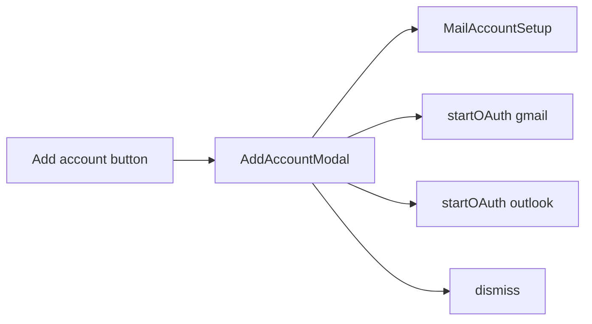

# Add account popup

## Change

On [`mobile/src/screens/mail/MailAccountsScreen.tsx`](mobile/src/screens/mail/MailAccountsScreen.tsx), replace the always-visible trio:

- Add manual account
- Link Gmail (OAuth)
- Link Outlook (OAuth)

with one primary **Add account** button. Tapping it opens a popup listing those three options. **Open inbox** stays on the screen as today.

## Approach

Add a small choice modal component modeled on [`PasswordModal`](mobile/src/components/PasswordModal.tsx) (centered fade `Modal`, dimmed overlay, `AppButton`s, Cancel):

**New file:** [`mobile/src/components/AddAccountModal.tsx`](mobile/src/components/AddAccountModal.tsx)

- Props: `visible`, `onCancel`, `onManual`, `onGmail`, `onOutlook`
- Title: “Add account”
- Three option buttons (same labels as today), then Cancel (secondary)
- Choosing an option closes the modal, then runs the existing handler

**Update:** [`MailAccountsScreen.tsx`](mobile/src/screens/mail/MailAccountsScreen.tsx)

- `useState` for modal visibility
- Remove `SectionTitle` “Add account” and the three inline buttons
- Render:

```tsx
<AppButton title="Add account" onPress={() => setAddAccountVisible(true)} />
<AddAccountModal
  visible={addAccountVisible}
  onCancel={() => setAddAccountVisible(false)}
  onManual={() => {
    setAddAccountVisible(false);
    navigation.navigate('MailAccountSetup', {});
  }}
  onGmail={() => {
    setAddAccountVisible(false);
    startOAuth('gmail');
  }}
  onOutlook={() => {
    setAddAccountVisible(false);
    startOAuth('outlook');
  }}
/>
<AppButton title="Open inbox" variant="secondary" ... />
```

Handlers (`startOAuth`, `navigate`) stay unchanged; only presentation moves into the modal.



## Out of scope

- OAuth / setup flow logic
- “Open inbox” placement or behavior
- Bottom sheets / ActionSheet libraries (not used in this app)