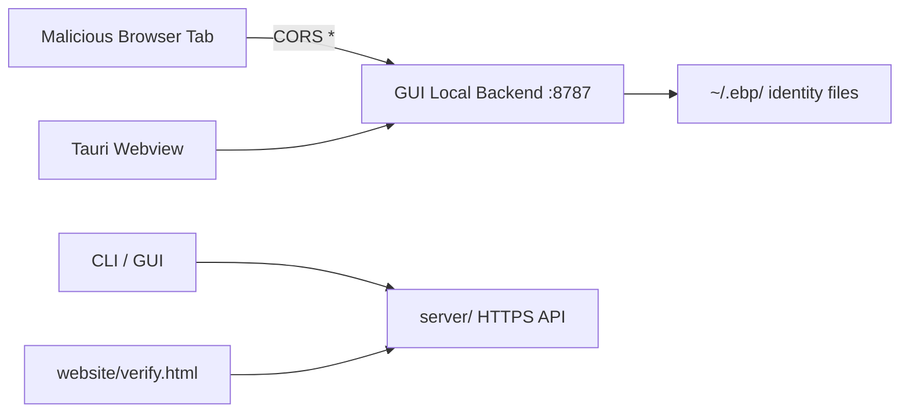

# EBP Security Audit — Top-12 Remediation Plan

Source: [wiki/security-audit-2026-04/report.md](wiki/security-audit-2026-04/report.md) (the "Top-12 prioritised remediation" list in the Executive Summary).

Phases are executed in order; do NOT skip ahead. After each phase: run `deno lint`, `deno test`, then commit behind a descriptive message before moving on. At the end of every phase, also update [wiki/security-audit-2026-04/findings.md](wiki/security-audit-2026-04/findings.md) and append a dated entry to [wiki/log.md](wiki/log.md) per the wiki-maintainer rules.

## Trust-boundary quick reference

---

## Phase 1 — F-GUI-01: Lock down the GUI local backend (Critical)

The local backend at [gui/local-backend/main.ts](gui/local-backend/main.ts) binds `127.0.0.1:8787` with `access-control-allow-origin: *`, no Host validation, and no CSRF token. Any web page in the same browser can read identities, write `~/Downloads`, and drive OAuth flows.

Sub-tasks:

1. **Generate a per-launch CSRF token.** In [gui/local-backend/main.ts](gui/local-backend/main.ts) (after env load, before `serve(...)` at lines 35–39), generate a 256-bit random token via `crypto.getRandomValues` and hold it in module state. Write it to a file readable only by the user (e.g. `~/.ebp/gui-backend.token`, mode `0o600`) so the Tauri webview and the Chrome email extension can read it locally.
2. **Require the token on every non-GET request.** Add a middleware check at the top of `handleRequest` in [gui/local-backend/routes.ts](gui/local-backend/routes.ts) (before line 101's `OPTIONS` branch): reject any `POST`/`DELETE`/`PUT` whose `x-ebp-csrf` header does not match. Exempt only `/api/v1/health`.
3. **Replace wildcard CORS.** In [gui/local-backend/http.ts](gui/local-backend/http.ts) lines 22–26 (`CORS_HEADERS`), replace `"access-control-allow-origin": "*"` with an echo of allowed origins: the Tauri webview origin (`tauri://localhost`, `https://tauri.localhost`) and, if the Chrome extension is a first-class client, its fixed extension origin. Also add `x-ebp-csrf` to `access-control-allow-headers`. Reject preflight for disallowed origins with 403.
4. **Validate the `Host` header.** In `handleRequest` add: reject if `req.headers.get("host")` is not in `{127.0.0.1:8787, localhost:8787}`. Blocks DNS-rebinding.
5. **Update in-process clients.** Frontend fetch calls in [gui/js/*.js](gui/js/) and Tauri bootstrap need to read the token file and attach `x-ebp-csrf` on every mutating request.
6. **Regression test.** Add [gui/local-backend/tests/csrf_test.ts](gui/local-backend/tests/csrf_test.ts) covering: missing header → 403, wrong token → 403, valid token → 200, bad Host → 403, disallowed origin preflight → 403. Keep the live PoC `wiki/security-audit-2026-04/pocs/F-GUI-01-cross-origin-csrf.html` as a red test — expect it to fail.

## Phase 2 — F-STORAGE-01 / F-STORAGE-04: Tighten on-disk permissions (High)

Every identity-file write in the repo is missing `mode:`, so Deno defaults produce `0o664` files and `0o775` dirs. The fix is mechanical.

Sub-tasks:

1. **Directory creation.** In [cli/utils.ts](cli/utils.ts) lines 113–118 (`ensureDir`) pass `{ recursive: true, mode: 0o700 }` to `Deno.mkdir`. Same for the identity/contacts dir creation in [cli/commands/identity.ts](cli/commands/identity.ts) lines 68–73.
2. **Identity file writes.** Add `{ mode: 0o600 }` to every `Deno.writeTextFile` / `Deno.writeFile` for identity data:
   - [cli/utils.ts](cli/utils.ts) lines 35–37 (`state.json`) and 213–219 (`saveIdentity`).
   - [gui/local-backend/identity.ts](gui/local-backend/identity.ts) lines 41–47 (`saveIdentity`).
3. **Sibling files under `~/.ebp/`.** Apply `0o600` to contacts/hierarchy/mail writes that the audit flagged: [gui/local-backend/routes.ts](gui/local-backend/routes.ts) lines 980, 1031, 1067, 2579, 2818–2820; [gui/local-backend/hierarchy-local.ts](gui/local-backend/hierarchy-local.ts) lines 79, 102; [gui/local-backend/mail-account.ts](gui/local-backend/mail-account.ts) line 96.
4. **Startup repair helper.** Add a one-shot `fixLegacyPerms()` in `cli/utils.ts` run on CLI/GUI start: if `~/.ebp/` exists with looser perms, `Deno.chmod` it to `0o700` and recursively tighten existing identity files to `0o600`. Log once. Skip on non-Unix.
5. **Test.** Extend the existing PoC `wiki/security-audit-2026-04/pocs/F-STORAGE-01-perms.ts` into a repo test in [cli/tests/perms_test.ts](cli/tests/perms_test.ts) that creates an identity in a tmp `HOME` and asserts mode bits.

## Phase 3 — F-SERVER-01: Fix reflected XSS in verify-email (High)

[server/verify-email.ts](server/verify-email.ts) interpolates user-controlled `token` and error `message` into HTML without escaping.

Sub-tasks:

1. Add a minimal `escapeHtml(s: string)` helper in [server/response.ts](server/response.ts) (or reuse an existing one if present) that escapes `& < > " '`.
2. In [server/verify-email.ts](server/verify-email.ts) `renderVerifyEmailPage` lines 101–116, escape `options.token`, `options.title`, and `options.message` at every interpolation site. Also escape `tokenCheck.error` at lines 204–206 before passing it as `message`.
3. Tighten the response CSP: `html()` at lines 83–92 currently emits only `buildSecurityHeaders()`. Add `content-security-policy: default-src 'none'; style-src 'unsafe-inline'; form-action 'self'`.
4. Convert the PoC `wiki/security-audit-2026-04/pocs/F-SERVER-01-verify-email-xss.sh` into a negative server test under [server/tests/](server/tests/).

## Phase 4 — F-SERVER-02: Require a signature on hierarchy reject (High)

`POST /api/v1/hierarchy/reject` in [server/handlers/hierarchy.ts](server/handlers/hierarchy.ts) lines 158–186 deletes pending proposals given only `{proposalId, fingerprint}`. Anyone can DoS any pending proposal.

Sub-tasks:

1. Extend `HierarchyRejectPayload` in [server/types.ts](server/types.ts) lines 54–57 with `signature: string` (and optionally `timestamp: number`).
2. In the handler (lines 158–186), fetch the rejecting party's public identity (same path `/api/v1/hierarchy/<fingerprint>` already uses), build the canonical message `{proposalId, fingerprint, action: "reject", timestamp}`, and call the existing `VerifySignature` used elsewhere in [core/](core/). Reject 401 if invalid, 400 if timestamp is >5 min skew.
3. Mirror the signing on every client that calls this endpoint: CLI reject command, GUI endpoint handler at [gui/local-backend/routes.ts](gui/local-backend/routes.ts) line 1365 (`/api/v1/hierarchy/reject`), mobile if it uses it.
4. Add a signed-rejection test and a red test based on the existing `pocs/F-SERVER-02-hierarchy-reject-dos.sh`.

## Phase 5 — F-CRYPTO-02: Bind recipient into signed payload (High, protocol change)

Today `signAndEncryptFor` in [core/Identity.ts](core/Identity.ts) lines 132–135 signs only the message plaintext (via `buildMessageHashEnvelope` in [core/MessageHash.ts](core/MessageHash.ts) lines 14–16). `recipientFingerprint` sits outside the signature → Don-Davis surreptitious forwarding.

Sub-tasks:

1. **Envelope redesign.** Change `buildMessageHashEnvelope` signature (or add a v2 function) so the signed string includes the recipient fingerprint, e.g. `ebp::messagehash::v2::${recipientFingerprint}::${sha256Hex(message)}::${salt ?? ""}`. Bump a protocol version constant.
2. **Producer.** Update `signAndEncryptFor` in [core/Identity.ts](core/Identity.ts) 132–135 to accept the recipient fingerprint and pass it into the envelope.
3. **Verifier.** Update `decryptAndVerify` in [core/Identity.ts](core/Identity.ts) 137–141 to reconstruct the envelope using the *local identity's* fingerprint and fail-closed if the signature does not bind it.
4. **Call sites.** Update CLI at [cli/commands/crypto.ts](cli/commands/crypto.ts) 182–195, GUI backend at [gui/local-backend/routes.ts](gui/local-backend/routes.ts) 1768–1789 (messages) and 2185–2198 (signed files), mobile at [mobile/src/services/encryptDecrypt.ts](mobile/src/services/encryptDecrypt.ts) 32–42 and 113–127.
5. **Backward compatibility.** Accept v1 envelopes on decrypt with a loud UI warning "unable to verify sender intended you as recipient"; refuse v1 on encrypt.
6. **UI indicator (F-GUI-07, co-located).** Add a small badge in the received-mail UI that reflects recipient-binding status from the verifier result.
7. **PoC regression.** Convert `pocs/F-CRYPTO-02-surreptitious-forwarding.ts` into a passing test that now fails to forward.

## Phase 6 — F-CRYPTO-01: Separate emergency-revocation nonce space (High)

[core/Identity.ts](core/Identity.ts) 396–407 issues emergency revocations with a hard-coded `nonce = 0`, identical to the first regular revocation nonce (line 96 and `createRevocationCertificate` call sites at 303–324 / 333–351). Server rule at [server/handlers/revocation.ts](server/handlers/revocation.ts) 70–78 accepts `nonce === 0` only once.

Sub-tasks:

1. Introduce an emergency nonce base `EMERGENCY_NONCE_BASE = 2 ** 31`. Update `createEmergencyCertificate` at [core/Identity.ts](core/Identity.ts) 396–407 to use that value (or `EMERGENCY_NONCE_BASE + counter` if multiple emergency certs ever ship).
2. Update [server/handlers/revocation.ts](server/handlers/revocation.ts) to track `maxRegularNonce` and `maxEmergencyNonce` independently — accept an emergency cert only if `nonce >= EMERGENCY_NONCE_BASE` and `> maxEmergencyNonce`; reject regular revocations with nonce `>= EMERGENCY_NONCE_BASE`.
3. Update the DB shape in [server/db/index.ts](server/db/index.ts) and the SQLite/Postgres adapters to distinguish the two counters (or a single field with namespacing).
4. Test with the existing `pocs/F-CRYPTO-01-emergency-nonce-collision.ts`: attacker issues regular revoke at nonce 0, then emergency cert should still be admissible.

## Phase 7 — F-DEP-02: Migrate desktop shell to Tauri 2.x (High, week-scale)

Resolves F-TAURI-01 (open-scheme abuse), F-TAURI-02, and the 2 RUSTSEC + 15 unmaintained-crate warnings surfaced by `cargo audit`.

Sub-tasks:

1. Upgrade crates: [desktop/src-tauri/Cargo.toml](desktop/src-tauri/Cargo.toml) lines 10 and 13 from `tauri-build 1.5` / `tauri 1.6` to Tauri 2 stable; replace the `shell-open` feature with the Tauri 2 `tauri-plugin-shell` dep. Run the official `npm run tauri migrate` scaffold.
2. Upgrade JS CLI: [desktop/package.json](desktop/package.json) `@tauri-apps/cli` from `^1.6.0` to `^2`; regenerate lockfile.
3. Convert `tauri.conf.json` allowlist to the Tauri 2 permissions/capabilities model. In particular, replace the current blanket `shell.open: true` ([desktop/src-tauri/tauri.conf.json](desktop/src-tauri/tauri.conf.json) lines 12–16) with a scoped capability: only `https:` and the OAuth-provider domains the product actually needs. This closes F-TAURI-01.
4. Adjust the JS call in [gui/js/mail.js](gui/js/mail.js) lines 109–111 to the Tauri 2 `@tauri-apps/plugin-shell` import.
5. Run `cargo audit` and `npm audit` in `desktop/`; both should be clean.
6. Rebuild all three desktop artifacts (`build_desktop_linux.sh`, macOS, Windows) and smoke-test installers.

## Phase 8 — F-CLI-01: Disable terminal echo on password prompt (High, one day)

[cli/utils.ts](cli/utils.ts) `readPassword` at lines 121–127 prints the prompt then reads stdin with echo enabled.

Sub-tasks:

1. Wrap the stdin read with `Deno.stdin.setRaw(true, { cbreak: true })` / `setRaw(false)`, draining CR/LF manually. Handle backspace and EOF. Fallback to unbuffered read if `setRaw` throws (non-TTY, e.g. piped test input).
2. Add a "Confirm password: " second prompt on identity generation in [cli/commands/identity.ts](cli/commands/identity.ts) 54–56 if not already present; reject on mismatch.
3. Test via `deno test` using a fake readable that injects bytes (avoid real TTY).

## Phase 9 — F-SERVER-03: Restrict X-Forwarded-For trust (High)

`getClientIp` in [server/rate-limit.ts](server/rate-limit.ts) lines 75–82 trusts `x-forwarded-for` unconditionally → rate-limit bypass.

Sub-tasks:

1. Read a new `TRUST_PROXY` env (boolean) at module init. If unset, `getClientIp` must return `req.headers.get("x-real-ip")`-free, socket-peer address only.
2. Thread the connection info into `handleRequest`. Deno's `serve` callback receives `ConnInfo`; propagate `remoteAddr.hostname` to `getClientIp` as the trusted fallback.
3. When `TRUST_PROXY=true`, keep current XFF parsing but only honour the *left-most untrusted* hop pattern, not arbitrary spoofed headers.
4. Update call sites in [server/main.ts](server/main.ts) line 106 and [server/response.ts](server/response.ts) line 36.
5. Add a rate-limit test that sends spoofed XFF headers and asserts the IP used for bucketing is the socket peer when `TRUST_PROXY` is off.

## Phase 10 — F-SERVER-05: Run server container as non-root (High, one line)

The [Dockerfile](Dockerfile) at repo root (15 lines) has no `USER` directive.

Sub-tasks:

1. Insert `USER deno` after the `COPY` / `RUN deno cache` block (between current lines 10 and 12). The `denoland/deno` base image already provisions a `deno` user.
2. Ensure `/app` is readable by `deno` (base image handles this; if not, `RUN chown -R deno:deno /app`).
3. Add a CI smoke test: build image, run `whoami` inside, assert `deno`.

## Phase 11 — F-STORAGE-02: Strengthen PBKDF2 (Medium)

[core/AES.ts](core/AES.ts) line 13 pins `PBKDF2_ITERATIONS = 310_000`; OWASP 2024 floor is 600,000 for SHA-256.

Sub-tasks:

1. Bump the constant to `600_000` in [core/AES.ts](core/AES.ts) line 13.
2. Add a storage-format version byte (or a top-level `v: 2` field) in the JSON envelope that `toStorageFormat` / `fromStorageFormat` write — [core/Identity.ts](core/Identity.ts) 592–597 and 656–657. Read path must accept v1 (310k) and v2 (600k), write path always emits v2.
3. On successful unlock of a v1 file, transparently re-encrypt at v2 and rewrite atomically (rename-over with `0o600`).
4. Do the same bump for the mail-account KDF in [gui/local-backend/mail-account.ts](gui/local-backend/mail-account.ts) around lines 242–247.
5. Leave a TODO pointing at the Quarter-1 Argon2id migration (already tracked in the audit roadmap); not in scope for this phase.
6. Test: encrypt with v1, decrypt, assert file on disk is v2 after the round-trip.

## Phase 12 — F-WEB-01: Client-side crypto verification in website verifier (Medium)

[website/verify.js](website/verify.js) lines 185–213 trusts `body.verified` returned by the server.

Sub-tasks:

1. Bundle the minimum subset of `@noble/post-quantum` and the bech32 decoder into the website's static assets. This is the same stack used by [core/](core/), so factor out a browser-safe entrypoint (e.g. `core/browser.ts`) that exports only `verifySignature`, `verifyDetailProof`, and fingerprint helpers — nothing that touches `Deno.*`.
2. Replace the `/api/v1/verify-signature` call at lines 185–192 with two calls: (a) `/api/v1/identity/<fingerprint>` to fetch the published public identity (server trusted only for availability), (b) local verification of the provided signature+message against the fetched public key. The server's `verified` field is then only a consistency hint.
3. Render the signer panel strictly from client-verified data.
4. Add a CSP to [website/verify.html](website/verify.html) (`default-src 'none'; script-src 'self'; connect-src <server>; style-src 'self'`) — co-located with F-WEB-03 from the roadmap.
5. End-to-end test: run the server locally, submit a valid signature → success; flip the server to return `verified: true` for a bad signature → client still shows invalid.

---

## Cross-cutting test/verification after all phases

- `deno lint && deno test && deno check` across the whole tree.
- `npm audit` (expect clean), `cargo audit` inside `desktop/src-tauri/` (expect clean after Phase 7).
- Re-run every PoC under [wiki/security-audit-2026-04/pocs/](wiki/security-audit-2026-04/pocs/) and confirm each one now fails to exploit.
- Update [wiki/security-audit-2026-04/findings.md](wiki/security-audit-2026-04/findings.md) to mark the 12 items `status: fixed` with a commit SHA; append a single "remediation complete" entry to [wiki/log.md](wiki/log.md).