# Top-10 Audit Remediation Plan

Each phase = one open finding from [analysis-top-open-security-issues](wiki/analysis-top-open-security-issues.md). Ordered by leverage: smallest, highest-yield fixes first; biggest migrations last. Each phase ends in its own PR with tests and a findings-register status flip.

## Sequencing rationale

```mermaid
flowchart LR
  P1[P1 STORAGE-06 chmod] --> P2[P2 TAURI-02 CSP]
  P2 --> P3[P3 SERVER-04 headers]
  P3 --> P4[P4 SERVER-09 token POST]
  P4 --> P5[P5 CRYPTO-05 canonical JSON]
  P5 --> P6[P6 CRYPTO-03 domain sep]
  P6 --> P7[P7 GUI-06 dialog.ask]
  P7 --> P8[P8 STORAGE-02 Argon2id]
  P8 --> P9[P9 GUI-05 mail sandbox]
  P9 --> P10[P10 DEP-02 Tauri 2.x]
```

Phases 5+6 share the same `core/MessageHash.ts` envelope and bump the same payload-format version, so they can ship as paired PRs.
Phase 10 structurally subsumes parts of P2 and P9 once Tauri 2's permissions/capabilities model is in place.

## Per-phase scope

### Phase 1 — F-STORAGE-06: emergency revocation cert `0o600`
- **Files:** `core/Revocation.ts`, `cli/commands/identity.ts`, `cli/commands/details.ts`, `gui/local-backend/routes.ts` (anywhere emergency-cert export hits disk).
- **Change:** at every `Deno.writeFile`/`Deno.writeTextFile` for the emergency cert, pass `{ mode: 0o600 }`. Mirror the F-STORAGE-01 fix.
- **Tests:** new perms test under `core/tests/` or `cli/tests/` asserting `(stat.mode & 0o777) === 0o600`.
- **Done when:** finding flipped to `fixed` in [findings.md](wiki/security-audit-2026-04/findings.md); register row updated; analysis page top-10 list refreshed.

### Phase 2 — F-TAURI-02: CSP on Tauri webview
- **Files:** `desktop/src-tauri/tauri.conf.json` (`tauri.security.csp`), and the GUI HTML entrypoints `gui/index.html` / `website/index.html` if any inline-style/script needs hashing.
- **Change:** restrictive CSP — `default-src 'self'`, `connect-src 'self' http://127.0.0.1:8787`, `img-src 'self' data:`, `style-src 'self' 'unsafe-inline'` only if unavoidable, `script-src 'self'`, `frame-src 'self'`, `object-src 'none'`. Keep the existing mail-iframe sandbox/CSP intact.
- **Tests:** Tauri smoke run + a Playwright/manual check that the webview loads and the local-backend XHR succeeds; CI grep test that `tauri.conf.json` `security.csp` is non-empty.

### Phase 3 — F-SERVER-04: server CORS default + security headers
- **Files:** `server/cors.ts`, `server/response.ts`, `server/main.ts`.
- **Changes:**
  - Change default `ALLOWED_ORIGINS` from `*` to a strict allowlist; require explicit env var to relax.
  - New middleware (or extend `response.ts`) injecting `X-Content-Type-Options: nosniff`, `Referrer-Policy: no-referrer`, `Strict-Transport-Security` (when TLS), and a server-side CSP for HTML responses.
  - Add Host-header validation gated on env-supplied `EXPECTED_HOST`.
- **Tests:** extend `server/tests/security_test.ts` to cover header presence, default-origin rejection, and Host-mismatch rejection.

### Phase 4 — F-SERVER-09: move email-verification token out of URL
- **Files:** `server/verify-email.ts`, `server/main.ts` (route), and the email template emitting the verification link.
- **Change:** switch verification to a `POST /api/v1/verify-email` body or `Authorization: Bearer <token>` header; the link in the email opens a tiny landing page that submits the token via fetch. Eliminate the token from any logged URL.
- **Tests:** extend `server/tests/verify_email_xss_test.ts` (or a new `verify_email_test.ts`) to assert the token is no longer accepted via query string and that the new transport works.

### Phase 5 — F-CRYPTO-05: canonical JSON for signed payloads
- **Files:** `core/MessageHash.ts`, `core/DetailProof.ts`, `core/Revocation.ts`, `core/HierarchyCertificate.ts`, plus any `JSON.stringify` site that feeds into a signature.
- **Change:** introduce `core/CanonicalJson.ts` (RFC 8785 / JCS-style: sorted keys, no whitespace, deterministic number form). Replace `JSON.stringify` in signing/verification paths.
- **Compat:** bump `PROTOCOL_VERSION` (currently `0.0.1` per F-CRYPTO-11) minor; verifier must accept both old and new envelopes during a deprecation window.
- **Tests:** golden-vector tests for canonicalization; cross-check a known-signed payload still verifies post-migration.

### Phase 6 — F-CRYPTO-03: per-purpose signature domain separation
- **Files:** same set as Phase 5 (`core/MessageHash.ts` and the four signing call sites).
- **Change:** replace single `ebp::messagehash::` prefix with `ebp::message::v1::`, `ebp::detail-proof::v1::`, `ebp::revocation::v1::`, `ebp::hierarchy::v1::`.
- **Compat:** ride the same protocol-version bump as Phase 5; verifier accepts old prefix for legacy artifacts within deprecation window.
- **Tests:** unit tests asserting cross-purpose signatures fail to verify under the new envelope.

### Phase 7 — F-GUI-06: per-action OS confirmation for `/api/v1/sign`
- **Files:** `gui/local-backend/routes.ts` (the `/api/v1/sign` handler), Tauri shell IPC bridge in `desktop/src-tauri/src/`, and the GUI frontend caller.
- **Change:** before signing, call Tauri `dialog.ask` showing the truncated payload + caller intent; reject if user denies. For non-Tauri runs (dev), require an explicit env opt-out.
- **Tests:** extend `gui/local-backend/tests/main_test.ts` with a mock confirm hook; e2e smoke under Tauri.

### Phase 8 — F-STORAGE-02: Argon2id KDF migration
- **Files:** `core/AES.ts`, `core/Identity.ts`, `core/tests/AES_kdf_upgrade_test.ts`.
- **Change:** add Argon2id (via vetted JS lib or Rust sidecar) alongside PBKDF2; storage-format version bump; on load with old format, decrypt-then-re-encrypt with Argon2id; OWASP 2024 baseline params (m=64MiB, t=3, p=1) tuned per platform.
- **Tests:** round-trip migration test reading an old PBKDF2 blob and writing an Argon2id one; perf budget test.

### Phase 9 — F-GUI-05: sandbox `mailparser`/`imapflow`
- **Files:** `gui/local-backend/mail-imap.ts`, `gui/local-backend/routes.ts`, plus a new worker entrypoint (e.g. `gui/local-backend/mail-worker.ts`).
- **Change:** move MIME parsing and IMAP fetch handling into a Deno Web Worker (or Tauri sidecar process post-P10) with restricted permissions; cap message size and CPU time; pin `mailparser`/`imapflow` versions and add a renovate/dependabot rule with a rapid-CVE response policy.
- **Tests:** worker round-trip test for malformed MIME (truncated headers, deeply nested multipart, oversized parts) producing an error rather than crashing the host.

### Phase 10 — F-DEP-02: Tauri 2.x migration
- **Files:** entire `desktop/src-tauri/` tree (`Cargo.toml`, `tauri.conf.json` -> `tauri.conf.json` v2 schema, capabilities files), GUI bridge code, build scripts `build_desktop_*.sh`.
- **Change:** follow Tauri 2.x migration guide; convert allowlist to capabilities; re-validate sidecar resolution (closes/refines F-TAURI-03); re-apply Phase-2 CSP under v2 semantics; re-run `cargo audit` to confirm RUSTSEC-2026-0067/0068 + `rand` unsoundness gone.
- **Tests:** full desktop smoke (Linux AppImage build via `build_desktop_linux.sh`, mac/win build paths); CI gate on `cargo audit` clean.

## Cross-cutting bookkeeping (every phase)

- Update [wiki/security-audit-2026-04/findings.md](wiki/security-audit-2026-04/findings.md) row from `open` -> `fixed (YYYY-MM-DD)`.
- Update [wiki/analysis-top-open-security-issues.md](wiki/analysis-top-open-security-issues.md) top-10 table; promote next item from "Honourable mentions" if a slot opens.
- Append a `## [YYYY-MM-DD] remediation | F-XXX-NN` entry at the top of [wiki/log.md](wiki/log.md).
- Note PoC re-run results under `wiki/security-audit-2026-04/tooling-output/` where a PoC exists (e.g. `pocs/F-STORAGE-01-perms.ts` style for P1).