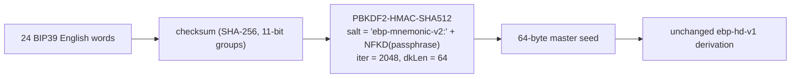

## Design

- **Wordlist**: vendor the canonical BIP39 English list (2048 words, NFKD, lowercase) as a TypeScript module with a SHA-256 integrity assertion so the file cannot drift.
- **Mechanics**: keep BIP39's 11-bit grouping, `SHA-256(entropy)[0..ENT/32]` checksum, 12/15/18/21/24-word lengths.
- **Seed extraction (intentionally diverges from BIP39)**: keep PBKDF2-HMAC-SHA512, 2048 iterations, 64-byte output, but with EBP-domain-separated salt `"ebp-mnemonic-v2:" + NFKD(passphrase)`. This is the explicit reason the version constant bumps to `v2` — an EBP mnemonic and a Bitcoin mnemonic of the same words produce *different* master seeds.
- **HD math**: unchanged. `ebp-hd-v1` HKDF labels, path namespace, and `hdProvenance.version: "ebp-hd-v1"` stay as-is because only the mnemonic layer is changing.
- **Hard replacement**: no dual decode, no v1 fixture retained, no `ebp###` text anywhere in the shipped surface.

## Files to change

### Core crypto + wordlist
- New: `core/bip39-english.ts` — exports `BIP39_ENGLISH_WORDLIST: readonly string[]` (length 2048) and `BIP39_ENGLISH_SHA256` constant. Module-load assertion (or first-call lazy assertion) that `sha256(words.join("\n") + "\n")` matches the canonical digest. Cite source in a file header comment.
- Rewrite [core/Mnemonic.ts](core/Mnemonic.ts):
  - Drop `EBP_MNEMONIC_WORDLIST`, drop the `ebp${i.toString(16)…}` generator.
  - Bump `EBP_MNEMONIC_VERSION` from `"ebp-mnemonic-v1"` to `"ebp-mnemonic-v2"`.
  - Import `BIP39_ENGLISH_WORDLIST` and use it directly in `entropyToMnemonic`, `mnemonicToEntropy`, and the `WORD_TO_INDEX` map.
  - Apply NFKD normalization to the mnemonic password input (`mnemonic.normalize("NFKD")`) per BIP39 §"From mnemonic to seed", then trim/collapse whitespace.
  - Keep iteration count (2048), `dkLen` (64), and salt prefix structure; salt becomes `"ebp-mnemonic-v2:" + NFKD(passphrase)`.

### Test vectors and tests
- Rewrite [core/tests/fixtures/ebp-hd/test-vectors.json](core/tests/fixtures/ebp-hd/test-vectors.json):
  - `mnemonicVersion: "ebp-mnemonic-v2"`.
  - Use deterministic input `entropyHex = "0000…0001"` (32 bytes) and regenerate the matching BIP39 24-word phrase from that entropy (first 23 words = `abandon`, 24th word = checksum word from `SHA-256(entropy)` first 8 bits).
  - Regenerate `seedHex` under the new v2 salt with `passphrase: "test-passphrase"`.
  - Regenerate both `dilithium` and `sphincs` fingerprints under the new seed (HD math unchanged, but seed differs so fingerprints differ).
- Rewrite [core/Hd.test.ts](core/Hd.test.ts) `VECTOR` block to mirror the new JSON fixture verbatim. Add one extra assertion that the mnemonic words are all from `BIP39_ENGLISH_WORDLIST`.
- New test: `core/Mnemonic.test.ts` covering
  - SHA-256 integrity of the bundled wordlist matches canonical digest.
  - Round-trip `entropy → mnemonic → entropy` for 128- and 256-bit cases.
  - Rejection of an `ebp###` token (regression guard against accidental v1 fallback).
  - Rejection of an unknown English word, wrong word count, and bad checksum.
  - NFKD normalization sanity for a non-ASCII passphrase.

### Spec
- Rewrite the "Mnemonic Layer" section of [docs/ebp-hd-spec.md](docs/ebp-hd-spec.md):
  - Version: `ebp-mnemonic-v2`.
  - Wordlist: canonical BIP39 English list, cite `wiki/raw/bip-0039.mediawiki` and the upstream `bip-0039/english.txt` source.
  - Salt formula changes to `"ebp-mnemonic-v2:" || NFKD(passphrase)`; call out explicitly that this is the intentional incompatibility with BIP39 seed extraction.
  - Add a short "Compatibility" subsection: same wordlist, *different* seed than Bitcoin wallets, no BIP32 secp256k1 derivation.
- Keep the "Path Namespace", "Node Derivation", and "Leaf Expansion" sections untouched (HD layer is unchanged).

### CLI and GUI surfaces
- [cli/commands/hd.ts](cli/commands/hd.ts): update `usage()` strings if they reference `ebp###`; replace any sample/help text that shows the old shape. Behavior of `generate-mnemonic`, `verify-mnemonic`, `derive`, `new-identity`, `discover` is unchanged because they all flow through `core/Mnemonic.ts`.
- [cli/main.ts](cli/main.ts): no API change; only adjust help text if it shows an example phrase.
- [gui/index.html](gui/index.html): update placeholder/help copy on the HD card (e.g. `placeholder="Generated or pasted EBP-HD mnemonic"` is fine; adjust any copy that mentions "ebp index words").
- [gui/app.js](gui/app.js): re-check the mnemonic confirm/typeahead logic if any tokenization assumes the `ebp###` shape (it shouldn't, but a grep pass is required).
- [gui/local-backend/routes.ts](gui/local-backend/routes.ts): no logic change — the `/api/v1/hd/*` endpoints delegate to `core/Mnemonic.ts`. Audit only.

### Docs and wiki (per `.cursor/rules/wiki-maintainer.mdc`)
- [ReadMe.md](ReadMe.md): update any prose/example that shows `ebp36b …` style phrases to a generic BIP39 sample (or just say "24 BIP39 English words").
- Edit [wiki/ebp-hd.md](wiki/ebp-hd.md):
  - Replace the `ebp-mnemonic-v1` / `ebp000…ebp7ff` description with: "BIP39 English wordlist (2048 words), `ebp-mnemonic-v2` PBKDF2 salt for explicit Bitcoin-seed separation."
  - Bump `last_updated`, bump `source_count` if a new source row is added.
  - Add `wiki/raw/bip-0039.mediawiki` to Sources.
- Edit [wiki/analysis-bip-patterns-for-ebp.md](wiki/analysis-bip-patterns-for-ebp.md):
  - Resolve the "English wordlist vs EBP-specific list" open question to "English wordlist adopted in v2".
  - Remove or update the open-design-question bullet that still asks whether to reuse BIP39 wordlists.
- Append a top entry to [wiki/log.md](wiki/log.md) using the `## [YYYY-MM-DD] ingest | ...` format the rule prescribes — e.g. `## [2026-05-24] change | mnemonic layer switched to BIP39 English wordlist (ebp-mnemonic-v2)`.
- Update [wiki/index.md](wiki/index.md) `last_updated` line.
- Optional: spot-check [wiki/security-audit-2026-04/threat-model.md](wiki/security-audit-2026-04/threat-model.md) for any `ebp-mnemonic-v1` reference and update to v2.

### Plan archive (informational only)
- Add a short "Update 2026-05-24" footnote to [.cursor/plans/ebp-hd-derivation_33ea5cfc.plan.md](.cursor/plans/ebp-hd-derivation_33ea5cfc.plan.md) noting the v2 wordlist swap so the plan history stays coherent.

## Risks and mitigations

- **Stale fingerprint references elsewhere**: a grep for the v1 vector fingerprints (`ebpdk1ngdumuv4gle…`, `ebpsk1tj69utzntz…`) is required before merge; replace any matches with the regenerated values.
- **Wordlist drift**: the SHA-256 integrity test in `core/Mnemonic.test.ts` guarantees CI fails if anyone edits a single word.
- **User confusion ("is this a Bitcoin phrase?")**: README and GUI copy must explicitly state "BIP39 English words; not interchangeable with a Bitcoin seed because EBP uses a different PBKDF2 salt."
- **No backward compatibility**: per the chosen migration path, any local EBP-HD identity created during the v1 test window will not be reproducible from its mnemonic after this change. Acceptable per user's "hard replace" choice; note in the log entry.

## Acceptance checks

- `deno task test:core` passes with the new vectors.
- `deno task cli hd generate-mnemonic` prints 24 BIP39 English words (no `ebp###` tokens).
- `deno task cli hd verify-mnemonic` accepts the new sample phrase and rejects an old `ebp000 … ebp1ec` phrase.
- The new spec, wiki page, and log entry render correctly and cross-link.
- Repository-wide `rg "ebp-mnemonic-v1"` and `rg "ebp\d{3}"` (excluding `wiki/raw/`, `wiki/log.md` history entry, and the archived plan footnote) return no hits.
