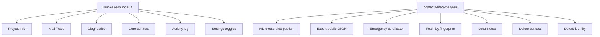

# Cheap mobile Maestro E2E (ranks 1–12)

Two flows, as chosen: expand [`mobile/e2e/smoke.yaml`](mobile/e2e/smoke.yaml), add [`mobile/e2e/contacts-lifecycle.yaml`](mobile/e2e/contacts-lifecycle.yaml). Reuse [`scripts/mobile-e2e.sh`](scripts/mobile-e2e.sh) and helpers; do not touch file pickers, Share, or mail.

## 1. Stamp missing `testID`s

Only IDs the new steps will tap or wait on.

- [`MoreScreen.tsx`](mobile/src/screens/MoreScreen.tsx): `more-self-test`, `more-mail-trace`, `more-diagnostics`
- [`SettingsScreen.tsx`](mobile/src/screens/SettingsScreen.tsx): `settings-enforce-password-policy`, `settings-mail-render-html`, `settings-mail-include-public-keys`
- [`DiagnosticsScreen.tsx`](mobile/src/screens/DiagnosticsScreen.tsx): `diagnostics-argon2`, `diagnostics-pbkdf2`
- [`ActivityLogScreen.tsx`](mobile/src/screens/ActivityLogScreen.tsx): `activity-log-clear` (optional; assert log text)
- [`MailTraceScreen.tsx`](mobile/src/screens/mail/MailTraceScreen.tsx): `mail-trace-refresh`, `mail-trace-clear`
- [`ProjectInfoScreen.tsx`](mobile/src/screens/ProjectInfoScreen.tsx): `project-info-body` on the intro paragraph (assert copy; **do not** tap GitHub/website — those open the system browser)
- [`IdentityDetailScreen.tsx`](mobile/src/screens/IdentityDetailScreen.tsx): `identity-export-public`, `identity-emergency-cert`, `identity-export-public-output`, `identity-delete`
- [`FetchContactModal.tsx`](mobile/src/components/FetchContactModal.tsx): `contacts-fetch-save-as` on the optional name field
- [`ContactDetailScreen.tsx`](mobile/src/screens/ContactDetailScreen.tsx): `contact-notes-alias`, `contact-notes-save`, `contact-delete`
- [`ContactListRow.tsx`](mobile/src/components/ContactListRow.tsx) + [`ContactsScreen.tsx`](mobile/src/screens/ContactsScreen.tsx): pass `testID={`contact-row-${item.name}`}` so Maestro can open the fetched contact

Do **not** add IDs for “Export identity file” (Share sheet).

## 2. Expand `smoke.yaml`

Keep launch + Identities, then walk More (use `id:` not title text for Developer rows). Suggested order so Activity log has something to show:

1. More → About EBP → assert “Even Better Privacy” / How It Works → `back`
2. Mail trace → assert “No mail stubs recorded yet.” → tap Refresh → `back`
3. Diagnostics → Argon2 → wait `status-banner-text` for `Argon2 parity OK` (timeout ~60s) → PBKDF2 → `Mail PBKDF2 parity OK` → `back`
4. Core self-test → tap Run on the `Alert` → wait for `Core OK` on the More status banner (timeout **120s**; this generates one Dilithium+Kyber identity)
5. Activity log → assert `Argon2 parity OK` (or `Core OK`) appears
6. Settings → tap the three switches → Save → assert `Saved` (existing `settings-save`)

Existing Settings visit at the end of smoke can merge with step 6 so we do not open Settings twice.

## 3. New `contacts-lifecycle.yaml`

Same env/password as identity flows (`Smoke-test-password1`). Sequence:

1. `helpers/clear-and-launch.yaml` + `helpers/set-server.yaml` + `helpers/create-hd-identity.yaml`
2. Fill `identity-password`, Publish, wait `Published.*` (same as [`identity.yaml`](mobile/e2e/identity.yaml))
3. `copyTextFrom` `identity-fingerprint` → `evalScript` store `output.fp`
4. `scrollUntilVisible` `identity-export-public` → tap → assert `Public identity exported` and `identity-export-public-output`
5. `scrollUntilVisible` `identity-emergency-cert` → tap (uses the on-screen password field, **not** PasswordModal) → assert `Emergency certificate generated`
6. Contacts tab → `contacts-fetch` → paste `${output.fp}` → save-as `e2e-fetched` → Fetch → wait `Contact fetched`
7. Tap `contact-row-e2e-fetched` → alias `e2e-alias` → Save notes → `Local notes saved`
8. `contact-delete` (no confirm dialog today) → assert `No contacts yet.`
9. Identities → open the HD row → `identity-delete` → Alert **Delete** → assert `identities-empty` or row gone

Pitfalls already documented: `hideKeyboard` after a focused field; do not `hideKeyboard` when no IME is up. Fingerprint paste via `copyTextFrom` / `inputText` like [`hierarchy.yaml`](mobile/e2e/hierarchy.yaml), not `pasteText`.

## 4. Runner + docs

- Default list in [`scripts/mobile-e2e.sh`](scripts/mobile-e2e.sh): `smoke` → `identity` → `details` → **`contacts-lifecycle`** → `sign-verify` → `hierarchy`
- [`deno.json`](deno.json): `test:e2e:mobile:fast` stays smoke + identity (smoke is longer but still no HD)
- [`mobile/e2e/README.md`](mobile/e2e/README.md) flow table
- Wiki: [`wiki/analysis-mobile-e2e-framework.md`](wiki/analysis-mobile-e2e-framework.md), [`wiki/analysis-mobile-testing-and-gui-gaps.md`](wiki/analysis-mobile-testing-and-gui-gaps.md), append [`wiki/log.md`](wiki/log.md)

## Out of scope

Ranks 13+ (Discover, revoke, import JSON, fingerprint tool, encrypt, files, mail). GitHub/website buttons. iOS. Re-running the full 6-flow suite in one sitting is optional after both new flows pass independently.