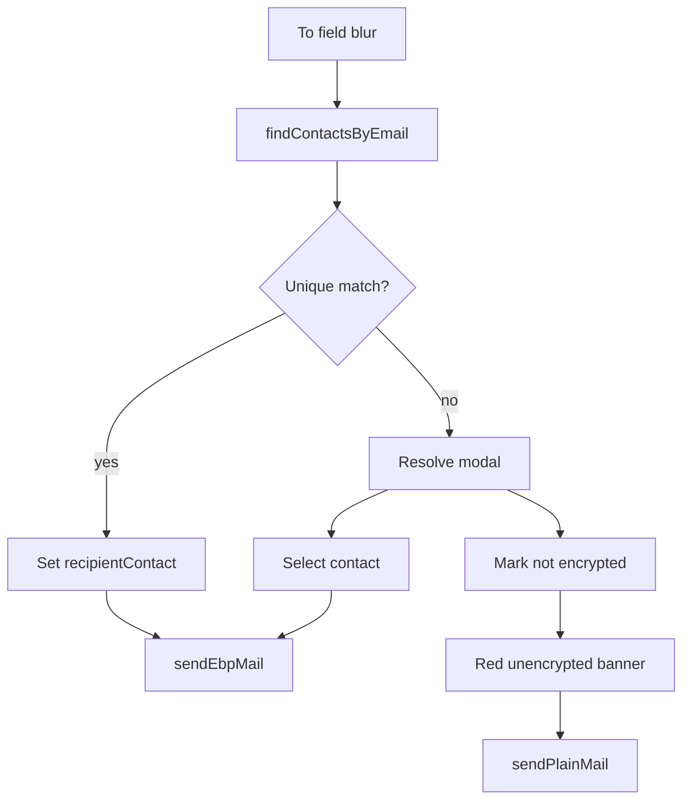

# Mobile compose: recipient contact resolve + unencrypted warning

## Wiki context

- Identities attach signed **details**; **opaque details** store `SHA-256(value)` under paths like `opaque::email` ([[identity-model]]).
- Mobile already supports opaque resolve + local notes ([[component-mobile]], [[analysis-gui-mobile-parity-deltas]]), but compose does not use them for To-address matching.
- GUI compose (`gui/js/mail.js` `findContactForComposeRecipient`) matches cleartext email / `localEmail` only — **not** opaque. This plan improves on GUI for opaque, and stays scoped to mobile.

**Match scope (chosen):** `details.email` and `opaque::email` (resolved cleartext **or** hash match via `sha256Hex`). Do **not** auto-match `localEmail` unless we later decide to mirror GUI.

## Current gaps

[`MailComposeScreen.tsx`](mobile/src/screens/mail/MailComposeScreen.tsx) keeps `to` and `recipientContact` independent; send always goes through [`sendEbpMail`](mobile/src/services/mail/ebpMail.ts) → `encryptMessage`. There is no find-by-email helper. Plaintext MIME already exists as [`buildSimpleMimeMessage`](mobile/src/services/mail/mime.ts).

## Implementation

### 1. Contact lookup helper — [`mobile/src/services/contacts.ts`](mobile/src/services/contacts.ts)

Add `findContactsByEmail(email: string): Promise<StoredContact[]>`:

- Normalize email: trim + lowercase for cleartext compares.
- For each `listContacts()` entry, match if any of:
  - `getDetailValue(details, 'email')` equals normalized email (case-insensitive)
  - `resolvedOpaqueDetails['opaque::email']` equals normalized email
  - `opaque::email` detail exists and `sha256Hex(typedEmail) === getDetailValue(details, 'opaque::email')` (hash is hex of the raw typed value — use the same casing the user typed for hash, or hash the trimmed original; pick **trim only, preserve case for hash** to match how opaque values were published; also try lowercase if first fails only if we document that — prefer **exact trimmed string** to match CLI opaque semantics)
- Return all matches (0, 1, or many).

Optional nicety on successful opaque hash match: call existing `resolveOpaqueDetail` so the cleartext is stored for later UI (same as Contact Detail resolve).

### 2. Plaintext send path — [`mobile/src/services/mail/ebpMail.ts`](mobile/src/services/mail/ebpMail.ts)

Add `sendPlainMail({ identityName, to, subject, message })`:

- `resolveSelectedAccount`, build From like EBP path
- `buildSimpleMimeMessage({ from, to, subject, body: message })`
- `sendMimeMessage(...)`
- No password / encrypt / armor

### 3. Resolve modal UI

New small component, e.g. [`mobile/src/components/RecipientResolveModal.tsx`](mobile/src/components/RecipientResolveModal.tsx), patterned on [`PasswordModal`](mobile/src/components/PasswordModal.tsx):

- Title explaining no EBP contact matched the email
- Searchable contact list (reuse filter pattern from [`ContactPicker`](mobile/src/components/ContactPicker.tsx); extend filter to name + fingerprint + detail email + resolved opaque email for usability)
- Primary actions:
  - Select a contact → `onSelectContact(name)`
  - “This email is not intended to be encrypted” → `onMarkUnencrypted()`
- Cancel dismisses without changing encryption intent (user can edit To and retry)

### 4. Wire compose screen — [`MailComposeScreen.tsx`](mobile/src/screens/mail/MailComposeScreen.tsx)

State:

- `recipientContact` (existing)
- `encryptionIntent: 'pending' | 'encrypted' | 'unencrypted'`
- modal open flag

Behavior:

1. On **To** `onBlur` (when value looks like an email, e.g. contains `@`): run `findContactsByEmail`.
2. **Exactly one match** → set `recipientContact`, `encryptionIntent = 'encrypted'`, close modal.
3. **Zero or multiple matches** → open resolve modal (pre-filter list for multiple).
4. Manual contact select (modal or existing `ContactPicker`) → `encryptionIntent = 'encrypted'`.
5. Mark unencrypted → clear `recipientContact`, `encryptionIntent = 'unencrypted'`.
6. Changing `to` after resolve → reset to `pending` and re-run lookup on next blur.

Red indication (when `encryptionIntent === 'unencrypted'`, or when To is set, blur resolved with no contact, and intent is unencrypted):

- Persistent red text / [`StatusBanner`](mobile/src/components/StatusBanner.tsx) `kind="error"`: message will not be encrypted because no EBP recipient identity was found or specified.
- Keep identity password field + “Send EBP encrypted mail” only when encrypted; when unencrypted, button becomes “Send unencrypted mail” and calls `sendPlainMail`.
- Block send if `encryptionIntent === 'pending'` with a clear status (“Resolve recipient encryption first”) so users cannot silently send wrong mode.

Existing `ContactPicker` stays as a secondary control for power users who already know the contact.

### 5. Docs / wiki (on execute, not just plan)

- Brief note in [`mobile/MAIL.md`](mobile/MAIL.md) under compose.
- Per wiki-query skill: file [`wiki/analysis-mobile-compose-recipient-resolve.md`](wiki/analysis-mobile-compose-recipient-resolve.md), link from [[component-mobile]], index + log entry.

## Out of scope

- GUI opaque matching parity
- Multi-recipient compose
- Matching `localEmail` (explicitly excluded here)
- Server directory lookup for unknown emails

## Verify

1. Contact with `email` detail matching To → auto-selects; encrypted send works.
2. Contact with only `opaque::email` whose hash matches typed address → auto-selects.
3. Unknown email → modal; pick contact → encrypted; or mark unencrypted → red banner + plaintext send.
4. Ambiguous two contacts with same email detail → modal, not silent pick.
