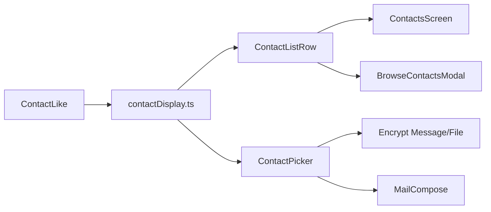

# Shared mobile contact display labels

Based on [[analysis-mobile-contact-display-component]].

## Approach

Three layers: pure label math, presentational row, existing picker chrome. Selection value stays storage `name`; only visible labels and search change.

**Display rules** (locked):

- Primary: `localAlias` → published `name` → email (published or resolved opaque) → condensed fp
- Secondary: email if present and not already primary, else condensed fp
- Condensed fp: first 12 + `…` + last 12 (full string if length &lt; 25)
- Storage `name` is not a display signal (search-only)

**Out of scope:** Contact Detail header, authenticity screen, Identities home, GUI, decrypt/verify sender fields.

## 1. Resolver module

Add [`mobile/src/services/contactDisplay.ts`](mobile/src/services/contactDisplay.ts):

- `ContactLike` — `fingerprint`, optional `localAlias`, `details`, `resolvedOpaqueEmail`, `storageName` (search only)
- `condenseFingerprint(fp)`
- `resolveContactLabels(like)` → `{ primary, secondary, condensedFingerprint }`
- `contactSearchHaystack(like)` — lowercased join of alias, name detail, email, opaque email, fingerprint, storageName
- Adapters: `storedContactToLike(StoredContact)`, `serverIdentityToLike(ServerIdentitySummary)`

Reuse [`getDetailValue`](mobile/src/services/contacts.ts) for `name` / `email`.

## 2. Jest coverage

Add [`mobile/src/services/__tests__/contactDisplay.test.ts`](mobile/src/services/__tests__/contactDisplay.test.ts) covering: alias wins; name detail; email-as-primary with fp secondary; email secondary when name primary; short fp unchanged; haystack includes alias/email.

## 3. ContactListRow

Add [`mobile/src/components/ContactListRow.tsx`](mobile/src/components/ContactListRow.tsx) wrapping [`ListRow`](mobile/src/components/ListRow.tsx):

- Props: `contact: ContactLike` (or precomputed labels), plus `onPress`, `showChevron`, `badge`, `right`, `showAvatar` (default true), `subtitleExtra?: string` (appended after secondary with ` · ` for browse meta)

## 4. Wire call sites

| File | Change |
|------|--------|
| [`ContactPicker.tsx`](mobile/src/components/ContactPicker.tsx) | Filter via `contactSearchHaystack`; list + dropdown trigger show `primary` / `secondary` (`showAvatar={false}`); value still `item.name` |
| [`ContactsScreen.tsx`](mobile/src/screens/ContactsScreen.tsx) | Delete local `truncateFp` / `contactDisplayTitle` / `contactSubtitle`; render `ContactListRow` |
| [`RecipientResolveModal.tsx`](mobile/src/components/RecipientResolveModal.tsx) | Same labels + haystack; keep modal shell |
| [`BrowseContactsModal.tsx`](mobile/src/components/BrowseContactsModal.tsx) | `ContactListRow` with `serverIdentityToLike`; `subtitleExtra` = key types · createdAt; keep Import / badge |

Encrypt Message/File and Mail compose pick up labels automatically via ContactPicker — no screen edits required.

## 5. Wiki touch (after implement)

Append a short note to [[analysis-mobile-contact-display-component]] that the resolver + row shipped, and a log line under `wiki/log.md`.
