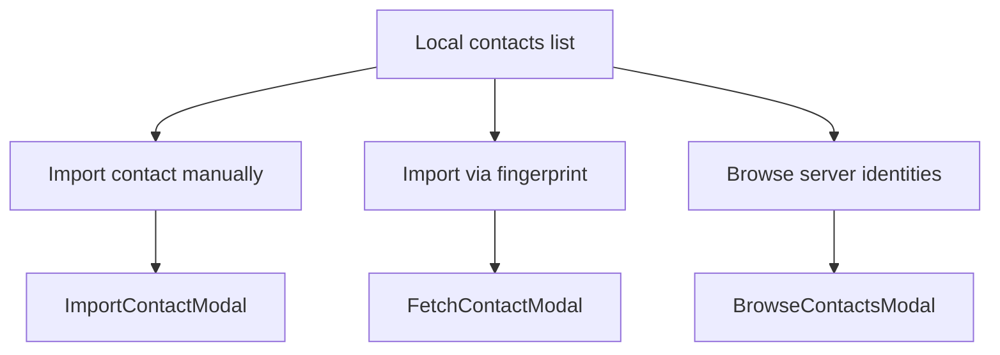

# Contacts UI cleanup

## Goals

1. Local contact rows show a human-readable **name** when one exists, instead of a fingerprint stub as the title.
2. Collapse the always-visible Import / Fetch / Browse forms into three buttons that each open a centered modal (same overlay pattern as [`AddAccountModal`](mobile/src/components/AddAccountModal.tsx) / [`PasswordModal`](mobile/src/components/PasswordModal.tsx)).

Main change surface: [`mobile/src/screens/ContactsScreen.tsx`](mobile/src/screens/ContactsScreen.tsx).

## 1. Friendly list titles

Today each row uses `item.name` (storage filename). When no name was supplied on import/fetch, that is `fingerprint.slice(0, 16)` — which is why the list looks like truncated fingerprints.

**Display title priority** (first non-empty wins):

1. `localAlias` (local notes from Contact Detail)
2. Published `details['name']` via existing `getDetailValue`
3. Storage `name` when it is **not** the auto stub (`fingerprint.slice(0, 16)`)
4. Else `truncateFp(fingerprint)`

**Subtitle** stays as today: email if present, else truncated fingerprint.

**Avatar** uses the display title (same as list title).

To support (1), extend [`StoredContact`](mobile/src/services/contacts.ts) with optional `localAlias` and populate it in `listContacts` when the JSON has a string `localAlias` (same cast pattern as [`ContactDetailScreen`](mobile/src/screens/ContactDetailScreen.tsx)). Add a small `contactDisplayTitle(item)` helper next to the existing `contactSubtitle` in `ContactsScreen` (or shared in `contacts.ts` if preferred for reuse).

Navigation to detail still uses storage `name` as the route param — only the **label** changes.

## 2. Three action buttons + modals

Replace the inline Import / Fetch / Browse sections with three secondary/primary buttons under the Local list:

| Button label | Opens |
|---|---|
| Import contact manually | JSON + optional name + Import |
| Import via fingerprint | Fingerprint + optional save-as + Fetch |
| Browse server identities | Search + results + pagination + Import |

Wire each with `useState` visibility flags. On successful import/fetch, dismiss the modal, clear fields, refresh the list, and keep using the existing `StatusBanner` / `BusyOverlay` on the main screen.

### New components (PasswordModal-style shell)

Reuse overlay/modal tokens from `AddAccountModal` / `PasswordModal` (`colors`, `spacing`, `radius`, fade `Modal`, Cancel).

- [`mobile/src/components/ImportContactModal.tsx`](mobile/src/components/ImportContactModal.tsx) — multiline Contact JSON + Name (optional) + Import / Cancel. Props: `visible`, `onCancel`, `onImport(json, name?)`.
- [`mobile/src/components/FetchContactModal.tsx`](mobile/src/components/FetchContactModal.tsx) — Fingerprint + Save as (optional) + Fetch / Cancel. Props: `visible`, `onCancel`, `onFetch(fingerprint, name?)`, `busy?`.
- [`mobile/src/components/BrowseContactsModal.tsx`](mobile/src/components/BrowseContactsModal.tsx) — taller modal (`maxHeight: '85%'`, scrollable body like [`RecipientResolveModal`](mobile/src/components/RecipientResolveModal.tsx)) containing the current browse UI (search field, Browse button, `InlineBusy`, result `ListRow`s with Import, pagination). Move browse state into this modal (or pass it as controlled props from `ContactsScreen`); keep `fetchContactFromServer` / `browseServerIdentities` handlers as today.

`ContactsScreen` after cleanup:

```tsx
<SectionTitle>Local</SectionTitle>
{/* list with contactDisplayTitle */}
<AppButton title="Import contact manually" onPress={...} />
<AppButton title="Import via fingerprint" variant="secondary" onPress={...} />
<AppButton title="Browse server identities" variant="secondary" onPress={...} />
{/* three modals */}
```



## 3. Out of scope

- Contact Detail title / rename UX
- ContactPicker display labels (still keyed by storage `name`)
- Changing import/fetch persistence or filename rules
- Bottom sheets / ActionSheet libraries
