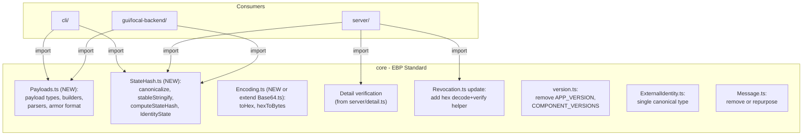

# Core Module Audit and Consolidation

## Summary of Findings

After a thorough review, **core already captures most of the fundamental EBP standard**: key types, fingerprint computation, signing/encryption, revocation, AES, base64, message hashing, file payloads, and versioning are all correctly in core. However, there are several pieces of standard-defining logic scattered across `server/`, `cli/`, and `gui/local-backend/` that should be consolidated into core, plus one thing in core that arguably should not be.

---

## 1. Things That Should Be Moved INTO Core

### 1a. Message/Payload Format Types and Builders

The EBP standard defines several payload formats (`ebp-signed-message`, `ebp-signature`, `ebp-encrypted-message`, `ebp-encrypted-signed-message`, `ebp-encrypted-file`, `ebp-encrypted-signed-file`). These are constructed ad-hoc in at least three places:

- [cli/main.ts](cli/main.ts) (lines 379-414 for signing, 526-542 for encrypt)
- [gui/local-backend/main.ts](gui/local-backend/main.ts) (lines 1886-1906 for signing, 2080-2095 for encrypt)
- [gui/local-backend/tests/test_handler.ts](gui/local-backend/tests/test_handler.ts) (duplicated logic)

**Proposal**: Create a new `core/Payloads.ts` (or similar) that defines:

- TypeScript types for each payload format (e.g., `EbpSignedMessage`, `EbpSignature`, `EbpEncryptedMessage`, `EbpEncryptedSignedMessage`)
- Builder functions that construct these payloads (e.g., `buildSignedMessagePayload(...)`, `buildDetachedSignaturePayload(...)`, `buildEncryptedMessagePayload(...)`)
- Parser/validator functions that decode and validate incoming payloads

This would also include the armor format markers (`-----BEGIN EBP MESSAGE-----` / `-----END EBP MESSAGE-----`) and the `extractEbpPayload` function, which is currently duplicated in [gui/local-backend/main.ts](gui/local-backend/main.ts) (line 845) and [gui/app.js](gui/app.js) (line 1598).

### 1b. Detail Proof Verification

[server/detail.ts](server/detail.ts) contains `verifyDetailProof()` -- a pure cryptographic verification function that decodes a hex-encoded proof, reconstructs the signed payload, and verifies the signature. This is part of the EBP standard (how details are authenticated). The core `Identity.ts` has `VerifyDetails()` and `getDetail()` which do similar things but in a different shape.

**Proposal**: Move the standalone `verifyDetailProof` logic into core so that both the server and any other consumer can use the same authoritative implementation. The server would then import from core instead of having its own.

### 1c. Revocation Certificate Verification (Server's Version)

[server/revocation.ts](server/revocation.ts) has its own `verifyRevocationCertificate()` which is similar but not identical to [core/Revocation.ts](core/Revocation.ts)'s `verifyRevocationCertificate()`. The server version takes an `IdentityRow` (a DB-shaped object) and an encoded hex certificate, while core takes already-decoded types.

**Proposal**: The core version is the right canonical one. Make it also expose a convenience function that takes a hex-encoded certificate string (decode + verify in one step) so the server can use core's implementation directly rather than maintaining its own. This eliminates the duplicated verification logic in `server/revocation.ts`.

### 1d. State Hashing and Canonicalization

`canonicalize()`, `stableStringify()`, and `computeStateHash()` are duplicated across:

- [cli/utils.ts](cli/utils.ts) (lines 155-179)
- [server/crypto.ts](server/crypto.ts) (lines 58-81)
- [scripts/generate_test_identities.ts](scripts/generate_test_identities.ts) (lines 26-50)

These define how an identity's state is hashed for server publish operations -- this is part of the EBP protocol (the state transition signing mechanism).

**Proposal**: Move `canonicalize`, `stableStringify`, and `computeStateHash` into core (perhaps `core/StateHash.ts` or added to `core/MessageHash.ts`). Also move the `IdentityState` type, which is currently duplicated in [cli/utils.ts](cli/utils.ts) (line 17) and [server/types.ts](server/types.ts) (line 38).

### 1e. Hex/Bytes Utilities (`toHex`, `hexToBytes`)

`toHex()` is duplicated in 5 places and `hexToBytes()` appears in server/crypto.ts. These are used in standard operations (fingerprinting, hashing, proof encoding). Currently `core/MessageHash.ts` has a private `toHex` function.

**Proposal**: Export `toHex` and add `hexToBytes` to core (perhaps via a `core/Hex.ts` or by exporting from `core/Base64.ts` renamed to `core/Encoding.ts`).

### 1f. Fingerprint Computation from ExternalIdentity

`computeExternalFingerprint()` in [gui/local-backend/main.ts](gui/local-backend/main.ts) (line 1002) creates a shell Identity just to call `toFingerprint()`. This is a roundabout way to do something that core's `Fingerprint.ts` already supports via `computeIdentityFingerprint()`. The fact that the local backend had to write this workaround suggests the core API could be more convenient.

This is not so much "move into core" as "make the existing core API easier to use for this case" -- the function already exists in core, consumers just need to use it directly.

---

## 2. Things That Should Be Moved OUT OF Core

### 2a. `APP_VERSION` and `COMPONENT_VERSIONS` in [core/version.ts](core/version.ts)

Lines 19-26 define application-level version constants (`APP_VERSION`, `COMPONENT_VERSIONS` with keys like `server`, `cli`, `gui`, `guiLocalBackend`, `emailPlugin`). These are not part of the EBP standard -- they are deployment/application concerns. Only `PROTOCOL_VERSION`, `FILE_FORMAT_VERSIONS`, `MIN_SUPPORTED_PROTOCOL_VERSION`, and the version comparison/support functions belong in core.

**Proposal**: Move `APP_VERSION` and `COMPONENT_VERSIONS` out of `core/version.ts` and into a separate top-level `app-version.ts` or similar. The protocol/format versions stay in core.

### 2b. Duplicate `ExternalIdentity` type definition

`ExternalIdentity` is defined in both [core/ExternalIdentity.ts](core/ExternalIdentity.ts) and [core/Identity.ts](core/Identity.ts) (line 55). The one in `Identity.ts` has extra optional fields (`detailsMeta`, `revoked`, `revokedDetails`). Only `Kyber.ts` imports from `ExternalIdentity.ts`. This is confusing.

**Proposal**: Keep a single `ExternalIdentity` definition. The canonical one in `core/ExternalIdentity.ts` should be the source of truth. Remove the duplicate from `Identity.ts` and re-export from `ExternalIdentity.ts`, merging any missing fields.

### 2c. `Message.ts` is essentially empty

[core/Message.ts](core/Message.ts) contains only a stub class with an empty `toJSON()`. If message formats are added to core via the new Payloads module (item 1a), this file should either be repurposed or removed.

---

## 3. Summary of Proposed Changes

The overall goal is: **if it defines how EBP works (formats, verification, hashing), it belongs in core. If it defines how a particular application uses EBP (UI, filesystem, HTTP, email), it does not.**