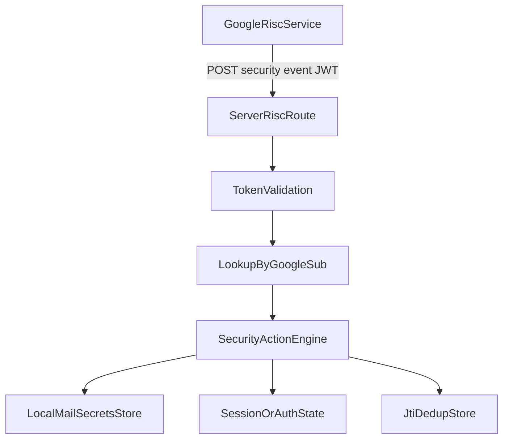

# Cross-Account Protection Plan for EBP

## Goal
Implement Google RISC event ingestion and response in EBP so Gmail-linked accounts can be proactively protected (session/token invalidation) when Google emits security events, then provide a final operator runbook for your external setup tasks.

## Scope and Success Criteria
- Add a production-ready server endpoint for Google RISC events.
- Validate RISC JWTs correctly against Google discovery/JWKS and configured OAuth client IDs.
- Map events to local accounts using persisted Google `sub`.
- Apply idempotent security actions (dedup by `jti`).
- Add tests and docs.
- Deliver a final "Your Part" checklist (GCP + deployment + stream registration/verification).

## Implementation Phases

### Phase 1: Server webhook entrypoint and wiring
- Add a dedicated handler module for Google RISC requests at [server/handlers/google-risc.ts](/home/william/projects/even-better-privacy/server/handlers/google-risc.ts).
- Wire route in [server/main.ts](/home/william/projects/even-better-privacy/server/main.ts) for `POST /api/v1/webhooks/google/risc`.
- Add explicit route throttling in [server/rate-limit.ts](/home/william/projects/even-better-privacy/server/rate-limit.ts) (current defaults risk leaving unmatched POST routes unthrottled).
- Reuse existing response/error utilities from [server/response.ts](/home/william/projects/even-better-privacy/server/response.ts).

### Phase 2: RISC token validation and parsing
- In [server/handlers/google-risc.ts](/home/william/projects/even-better-privacy/server/handlers/google-risc.ts), implement:
  - raw token extraction from body,
  - Google RISC discovery fetch (`issuer`, `jwks_uri`),
  - `kid`-based key lookup from JWKS,
  - signature + `iss` + `aud` validation,
  - acceptance behavior aligned with Google guidance (successful validation => `202`, invalid => `400`; no strict expiration rejection for historical events).
- Add environment-driven configuration for expected audiences/client IDs and optional fail-safe toggles in [server/env.ts](/home/william/projects/even-better-privacy/server/env.ts) and [docs/server-configuration.md](/home/william/projects/even-better-privacy/docs/server-configuration.md).

### Phase 3: Persist Google `sub` in OAuth linking flow
- Extend server OAuth exchange output in [server/mail-oauth.ts](/home/william/projects/even-better-privacy/server/mail-oauth.ts) to include Google `sub` (from ID token payload) alongside email/tokens.
- Propagate through local backend flow:
  - [gui/local-backend/mail-oauth.ts](/home/william/projects/even-better-privacy/gui/local-backend/mail-oauth.ts) (types + validation),
  - [gui/local-backend/routes.ts](/home/william/projects/even-better-privacy/gui/local-backend/routes.ts) (`start/callback/poll/complete` state and persistence).
- Persist `sub` in mail secret model in [gui/local-backend/mail-account.ts](/home/william/projects/even-better-privacy/gui/local-backend/mail-account.ts) (`MailAuthSecrets`) with backward-compatible parsing.

### Phase 4: Event-to-account mapping and security actions
- Implement lookup from RISC subject (`sub`) to affected local mail account secret entries.
- Handle priority event types first:
  - sessions revoked,
  - token(s) revoked,
  - account disabled.
- Security actions:
  - clear/disable refresh tokens for impacted account,
  - invalidate active sessions/tokens where available,
  - mark account requiring re-link/re-auth.
- Ensure idempotency and replay safety via `jti` dedup store (lightweight persistent file or existing DB path, whichever aligns best with server persistence conventions).

### Phase 5: Tests and observability
- Add tests under [server/tests](/home/william/projects/even-better-privacy/server/tests):
  - route method/path behavior,
  - valid/invalid JWT handling,
  - audience/issuer mismatch,
  - duplicate `jti` suppression,
  - core event action side effects.
- Add structured logging for accepted/rejected events and action outcomes in [server/main.ts](/home/william/projects/even-better-privacy/server/main.ts) / handler.
- Confirm no new lint issues in touched files.

### Phase 6: Documentation and operator handoff
- Add implementation + ops docs:
  - RISC endpoint config and env vars in [docs/server-configuration.md](/home/william/projects/even-better-privacy/docs/server-configuration.md),
  - optional deep-dive in [wiki/source-google-cross-account-protection-risc.md](/home/william/projects/even-better-privacy/wiki/source-google-cross-account-protection-risc.md) if we want repo-internal reference updates.
- End deliverable includes a concise "Your Part" runbook with:
  - GCP setup,
  - service account + API enablement,
  - authorized domain and HTTPS deployment,
  - `stream:update` and `stream:verify` steps,
  - verification checklist and rollback notes.

## Architecture Sketch

## Risks and Mitigations
- `sub` not currently persisted: addressed in Phase 3 before enabling enforcement.
- JWKS/discovery fetch failures: add caching and fail-closed behavior for acceptance path.
- Event duplicates: enforce `jti` dedup and idempotent handlers.
- Local-only environments: document requirement for externally reachable HTTPS endpoint for real Google delivery.

## Deliverables
- New RISC handler and route.
- OAuth data-path updates to retain Google `sub`.
- Event processing + dedup.
- Tests.
- Final operator instructions for all out-of-repo actions.