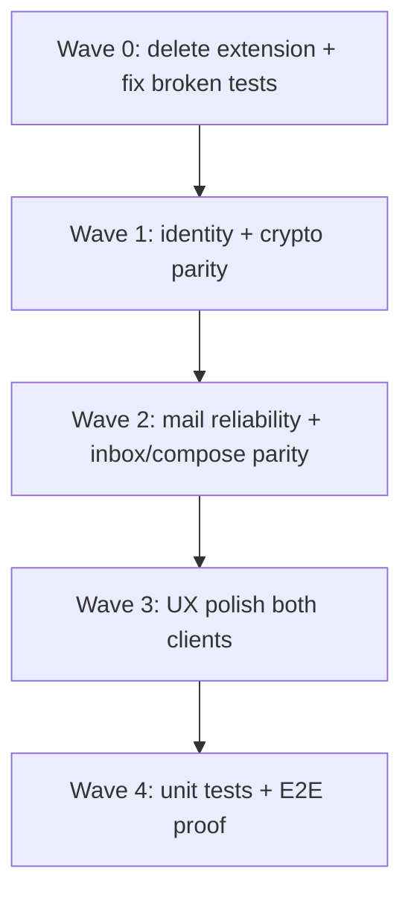

# Finish Line: Desktop/Mobile Parity, UX, and Proof

## What “finished” means

- **Android + desktop GUI only.** iOS stays debug/Metro. No Play Store / TestFlight work.
- **Parity = every desktop GUI capability that belongs on a phone**, except documented desktop-only items (Tauri, `~/.ebp/` shared with CLI, save-to-`~/Downloads`, OAuth email). Manual IMAP/SMTP on mobile is enough.
- **Delete the Chrome extension** (`email/chrome-extension/`, `build_chrome_extension.sh`, ReadMe/wiki/component pages). Native mail on GUI + mobile replaces it.
- **Out of scope:** FN-DSA, ENS, identity expiry, Google RISC, Outlook OAuth, DB/core refactors, CI/GitHub Actions, production Android signing.
- **Help channel:** Phonebox SMS from `+12362438512` to contact **William (iPhone)** (`+13825776267`). Do not text `+15196701426` — that handset will be USB-attached for Android testing.

## What already works

April 2026 audit: **0 open findings** (mobile/extension were out of scope). Interop drift and Parity v1 wallet/HD/mail/hierarchy **shipped**. GUI mail-load hang and mobile MIME decrypt JSON bugs are **closed**.

**Tests I ran (2026-09-09):**

- `deno test ./core ./core/tests`: **34 passed**
- `deno task test:core`: **113 passed, 2 failed** — `interop-fixtures_test.ts` needs `--allow-read` (task is under-permissioned, not a product bug)
- `deno task test:cli-utils`: **22 passed, 7 failed** — Deno `NotCapable` (tests pledge extra perms the task does not grant)
- `deno task test:gui-backend`: **68 passed, 2 failed** — `/api/v1/mail/decrypt-attachment` returns **404** (real regression)
- Server, Playwright, mobile Jest, Maestro: **not run yet** (server needs DB; Maestro needs the emulator)

**Android devices:** Prefer the USB-plugged phone (`adb devices`) for Maestro when it is attached. Fallback AVD `Medium_Phone_API_36.0` is installed (`/dev/kvm`, `DISPLAY=:0.0`, Maestro at `~/.maestro/bin/maestro`). Set `ANDROID_HOME`/`ANDROID_SDK_ROOT` before launching the emulator.

## Inventory: remaining gaps

Wiki [analysis-mobile-testing-and-gui-gaps.md](wiki/analysis-mobile-testing-and-gui-gaps.md) is still accurate against current source. Existing plans already break the work up: [mobile_identity_parity_4807ee28](.cursor/plans/mobile_identity_parity_4807ee28.plan.md), [mobile_crypto_parity_012c70e4](.cursor/plans/mobile_crypto_parity_012c70e4.plan.md), [mobile_mail_parity_e2a6c4a0](.cursor/plans/mobile_mail_parity_e2a6c4a0.plan.md).

### Mobile missing desktop controls (must-have)

**Identity** ([IdentitiesHomeScreen.tsx](mobile/src/screens/IdentitiesHomeScreen.tsx), [HdCreateScreen.tsx](mobile/src/screens/HdCreateScreen.tsx), [IdentityDetailScreen.tsx](mobile/src/screens/IdentityDetailScreen.tsx))

- Non-HD random create (GUI `#generate-form`; mobile Create is HD-only)
- HD change chain (`external`/`internal`) and overwrite-if-exists (services already accept these)
- Selective public export (core `toPublicExport` exists)
- Opaque add-detail checkbox (today: type `opaque::` yourself)
- Per-action server URL on publish / fetch / browse

**Crypto** ([SignMessageScreen.tsx](mobile/src/screens/crypto/SignMessageScreen.tsx), [SignFileScreen.tsx](mobile/src/screens/crypto/SignFileScreen.tsx), [VerifyMessageScreen.tsx](mobile/src/screens/crypto/VerifyMessageScreen.tsx))

- Include-salt toggles (services already take `includeSalt`)
- Verify with pasted/imported public keys
- Decrypt-file save via Share (not a base64 dump)
- Paste buttons on decrypt / fingerprint screens

**Mail** (no OAuth)

- Honor `imapSecure`/`smtpSecure`; add STARTTLS so port 587/143 works ([imap.ts](mobile/src/services/mail/imap.ts), [smtp.ts](mobile/src/services/mail/smtp.ts))
- Inbox: folders, search, pagination, limit 1–100 (today: INBOX, hard-coded 40)
- Compose: attachments + multi-recipient (`signAndEncryptForMany` already in core)
- Distinguish empty inbox vs load error; unlock-secrets affordance
- Mail help screen + sandboxed HTML WebView when “Render HTML” is on

### Mobile UX that is not yet “easy”

- [IdentityDetailScreen.tsx](mobile/src/screens/IdentityDetailScreen.tsx): password + add-detail fields in a confusing order; revoke-detail is a free-text path; identity revoke has no double confirm
- File crypto screens expose raw `file://` URI fields
- Certificates expiry is a raw millisecond timestamp
- No contact → hierarchy shortcut; revoked contacts are weakly badged
- Inbox “No messages loaded.” even on failure

### Desktop UX (parity the other way, only where it is a real user job)

- HD Discover on server (mobile has it)
- Identity import / export / delete on device (mobile has it; desktop relies on `~/.ebp/` files — add GUI controls so non-CLI users can do it)
- Do **not** port Diagnostics / Mail Trace / Fingerprint tool unless they stay useful after a UX pass; they are mobile-only utilities today

### Proof gaps

- `test:core` does not run `core/*.test.ts` / `core/tests/`
- Mobile Jest covers ~7 helpers; crypto, storage, contacts, HD, publish, IMAP/SMTP, hierarchy services are mostly untested
- GUI backend: no dedicated tests for `hierarchy-local.ts`, `sender-context.ts`, mail worker/account
- Playwright [gui/e2e/mail.spec.ts](gui/e2e/mail.spec.ts): **all 5 skipped**
- Maestro: 6 flows, no mail/crypto-file/revoke/import; 12 of 29 screens unhit
- No GUI↔mobile interop E2E (acceptable if Deno interop + both E2E suites pass)

## Wave 0 — Clean house and make existing tests green

1. **Delete the extension:** remove `email/chrome-extension/`, `build_chrome_extension.sh`, ReadMe install section, [wiki/component-email-extension.md](wiki/component-email-extension.md). Strip `EBP_GUI_BACKEND_EXTENSION_ORIGIN` from [gui/local-backend/security.ts](gui/local-backend/security.ts) and [deno.json](deno.json) if nothing else uses it.
2. **Fix runners:** `test:core` → `deno test --allow-read ./test ./core`; `test:cli-utils` → grant the perms the tests pledge (`--allow-run` / `--allow-env` as needed, not `--no-verify`).
3. **Fix GUI backend 404** on `POST /api/v1/mail/decrypt-attachment` ([gui/local-backend/tests/main_test.ts](gui/local-backend/tests/main_test.ts) ~1270–1378) — route missing or renamed.
4. Run `deno task test:server` and `cd mobile && npm test`; fix anything that fails.
5. Add `test:mobile` in [deno.json](deno.json) wrapping Jest.

## Wave 1 — Identity + crypto parity

Follow the existing identity/crypto plans. Service APIs already exist; work is UI + tests.

- Random-create screen + HD change/overwrite
- Selective export, opaque switch, per-action server fields
- Salt toggles + verify-with-public-keys
- Deno tests in `test/mobile-parity_test.ts` / new `test/mobile-signVerify_parity_test.ts`
- Maestro: `create-random.yaml`, extend `sign-verify.yaml`, `verify-public-keys.yaml`

## Wave 2 — Mail reliability then inbox/compose parity

Reliability first (otherwise inbox/compose will keep failing on real providers):

- Implicit TLS vs STARTTLS from the stored secure flags
- Inbox empty vs error; Test-connection step labels
- Then folder/search/page/limit, help, HTML WebView, attachments, multi-To
- Jest against mocked IMAP/SMTP (pattern in [mobile/__tests__/imapFetchLiteral-test.ts](mobile/__tests__/imapFetchLiteral-test.ts))
- Un-skip Playwright mail tests when `TEST_EMAIL_*` is present; SMS you if those env vars are missing
- Maestro mail help only unless live mailbox creds exist (do not invent a mailbox)

## Wave 3 — Easy UX on both clients

Mobile: reorder Identity Detail; revoke-detail dropdown; double-confirm identity revoke; hide URI fields behind the picker; date expiry on certificates; contact → hierarchy; revoked badges; decrypt/fingerprint paste; Share for decrypted files.

Desktop: Discover + import/export/delete; keep the existing toast/nav model; do not restyle the whole GUI.

Success test: the same user jobs (create identity, publish, add contact, sign/verify, encrypt/decrypt, send/read EBP mail, hierarchy) are completable on both without reading a wiki page.

## Wave 4 — Proof

**Unit tests (required):**

- Mobile services: `encryptDecrypt`, `signVerify`, `hd`, `contacts`, `details`, `revocation`, `storage`, `publish`, `hierarchy`, `mail/ebpMail`, `mail/imap`, `mail/smtp`, `mail/accountStore`
- GUI backend: hierarchy-local, sender-context, decrypt-attachment (already intended)
- Wire `deno task test:core` to include `./core`

**E2E:**

- Playwright: keep smoke/identity/hierarchy; restore mail when creds exist
- Maestro on the USB Android when attached, else AVD `Medium_Phone_API_36.0`: existing 6 flows plus identity/crypto additions; file-picker flows stay mocked/skipped (wiki ranks 25–28)
- Manual GUI↔mobile interop checklist in [test/fixtures/interop/](test/fixtures/interop/) stays the interop proof unless we later add one automated fixture round-trip

**Exit criteria (all must be true):**

- `deno task test:core`, `test:cli-utils`, `test:server`, `test:gui-backend`, `test:mobile` all green
- Playwright non-mail suite green; mail suite green **or** documented skip only for missing `TEST_EMAIL_*`
- Maestro default suite green on the local AVD
- Chrome extension gone from tree and docs
- Capability matrix in the wiki updated: every desktop feature that belongs on Android is present
- One walkthrough of the six user jobs on GUI and on the emulator

## Notes for execution

- Do not launch the emulator until Wave 4 / Maestro work (or Wave 1 if a screen needs a screenshot).
- If the USB phone is missing, KVM/display fails, or `TEST_EMAIL_*` is unset, SMS **William (iPhone)** via Phonebox (`POST /send` to `+13825776267`).
- Wiki updates: incrementally update [analysis-gui-mobile-parity-deltas.md](wiki/analysis-gui-mobile-parity-deltas.md), [analysis-mobile-testing-and-gui-gaps.md](wiki/analysis-mobile-testing-and-gui-gaps.md), [component-mobile.md](wiki/component-mobile.md), [index.md](wiki/index.md), [log.md](wiki/log.md).
