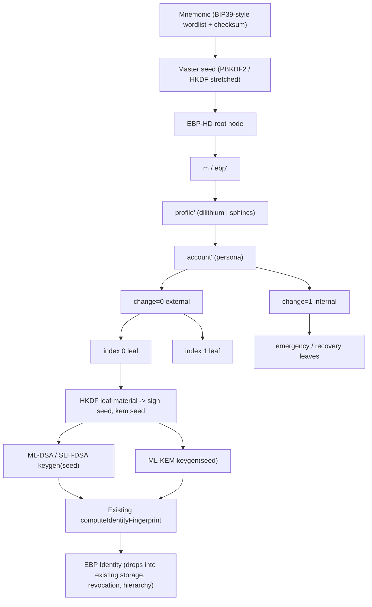

# EBP-HD: Deterministic Hierarchical Identities

Adopt BIP32/39/43/44 **structural** patterns (HD tree, mnemonic backup, purpose namespace, multi-account layout) on top of EBP's PQ dual-key identity model. Each derived leaf is a normal first-class EBP identity (ML-DSA/SLH-DSA + ML-KEM), with its own bech32 fingerprint, details, and revocation surface.

Reference: [[analysis-bip-patterns-for-ebp]] for the design rationale; [[source-bip-hd-wallet-standards]] for the source BIPs.

## Guiding constraints

- **Additive**: existing `~/.ebp/<name>.identity.json` files are never imported into the HD tree, never re-derived, never modified. HD is a parallel opt-in path that creates **new** identities from a mnemonic.
- **PQ leaves only**: Bitcoin's secp256k1 CKD math is not reused. HD derivation produces **seeds**, which are fed into noble's PQ `keygen(seed)` functions in [core/Kyber.ts](core/Kyber.ts), [core/Dilithium.ts](core/Dilithium.ts), [core/Sphincs.ts](core/Sphincs.ts).
- **Documented namespace**: an EBP-specific purpose constant, not Bitcoin `44'`.
- **Spec-first**: every phase that touches crypto produces test vectors before code review.

## Architecture

## Key code surfaces

- [core/Identity.ts](core/Identity.ts) — current constructor calls each key class which internally generates entropy; needs an alternate path that accepts pre-derived seeds.
- [core/Kyber.ts](core/Kyber.ts) — `this.seed = randomBytes(64)` (line 46) is the only seed source; HD must inject a seed instead.
- [core/Dilithium.ts](core/Dilithium.ts), [core/Sphincs.ts](core/Sphincs.ts) — same pattern; noble's `keygen(seed)` accepts deterministic input.
- [core/Fingerprint.ts](core/Fingerprint.ts) — unchanged; fingerprints HD leaves identically.
- [cli/commands/identity.ts](cli/commands/identity.ts) — entry point for new `ebp hd-*` commands.
- [gui/local-backend/](gui/local-backend/) — GUI parity in later phase.
- New files: `core/Hd.ts`, `core/Mnemonic.ts`, `core/HdPath.ts`, plus tests.

## Phasing (each phase shippable independently)

### Phase 0 — Specification and test vectors (no code yet)

Produce `docs/ebp-hd-spec.md` covering:

- Mnemonic encoding (wordlist choice: reuse BIP39 English wordlist or define `ebp-mnemonic-v1`).
- Mnemonic to seed function (PBKDF2-HMAC-SHA512 with EBP-domain-separated salt, e.g. `salt = "ebp-mnemonic" || passphrase`).
- HD tree node format: 32-byte key + 32-byte chain code, parallel to BIP32 extended key shape, but with PQ-agnostic domain tags.
- Child key derivation: `HKDF-SHA512(parent_key || chain_code, info = "ebp-hd-v1" || index_be32, salt = chain_code)`.
- Hardened index range (>= 2^31) — only hardened derivation supported in v1 to avoid xpub-leakage class of bugs; non-hardened derivation deferred to a future spec revision.
- Leaf material expansion: from a leaf node derive two seeds via HKDF-Expand with labels `"sign-seed"` and `"kem-seed"`, sized for the noble keygen functions (typically 32 or 64 bytes).
- Test vectors: deterministic mnemonic -> seed -> path -> two PQ public keys -> bech32 fingerprint, for both `dilithium` and `sphincs` profiles.

Deliverable: spec doc + JSON test-vector file under `core/tests/fixtures/ebp-hd/`.

### Phase 1 — Mnemonic and master seed (core + CLI)

Implement `core/Mnemonic.ts`:

- `generateMnemonic(strength = 256): string` (CSPRNG entropy + checksum word).
- `mnemonicToSeed(mnemonic, passphrase = ""): Uint8Array` (PBKDF2-HMAC-SHA512, EBP-domain salt).
- `validateMnemonic(mnemonic): boolean`.

CLI commands in [cli/commands/identity.ts](cli/commands/identity.ts):

- `ebp hd generate-mnemonic` — print a fresh mnemonic.
- `ebp hd verify-mnemonic` — accept input, validate checksum.

No identity creation yet — Phase 1 only proves backup encoding and seed extraction. Tests cover round-trip and checksum failure modes.

### Phase 2 — HD tree and deterministic identity generation

Implement `core/Hd.ts` and `core/HdPath.ts`:

- `parsePath("m/ebp'/dilithium'/0'/0/0"): HdPath`.
- `deriveNode(seed, path): HdNode` returning `{key, chainCode}`.
- `deriveIdentitySeeds(node): {signSeed, kemSeed}` via HKDF-Expand.

Wire deterministic seeds into the existing key classes:

- Extend [core/Kyber.ts](core/Kyber.ts), [core/Dilithium.ts](core/Dilithium.ts), [core/Sphincs.ts](core/Sphincs.ts) constructors to accept an optional `{seed: Uint8Array}` option that bypasses `randomBytes`.
- Add `Identity.fromHdNode(node, profile)` in [core/Identity.ts](core/Identity.ts) that produces a private identity ready to drop into existing storage via the unchanged storage path.

CLI:

- `ebp hd derive --mnemonic <stdin> --path "m/ebp'/dilithium'/0'/0/0" --out <name>.identity.json` — creates a new identity file in the existing format.

Tests: replay test vectors, confirm same mnemonic + path produces identical fingerprint, confirm HD-derived identities behave identically to randomly generated ones in [core/Identity.test.ts](core/Identity.test.ts) flows (sign, encrypt, revoke).

### Phase 3 — Purpose namespace and multi-account paths

- Reserve EBP purpose constant. Document choice in spec; either claim a SLIP-0044-style number with the registry or use an EBP-private constant. Default: EBP-private until/unless registered.
- Codify path template: `m / ebp' / profile' / account' / change / index`.
- Add `Identity.fromAccount(seed, {profile, account, change, index})` helper that wraps path construction.
- CLI: `ebp hd new-identity --account 0 --profile dilithium --change external` (defaults to next unused index).

Storage: new optional `hdProvenance` field on `IdentityPublicData` in [core/Identity.ts](core/Identity.ts) capturing the path the identity was derived at (so users can re-derive after backup restore without renaming guesswork). Field is **optional** to preserve compatibility with existing identities; absence means non-HD.

### Phase 4 — Discovery, gap limits, hierarchy linkage

- Local discovery: scan accounts/indices up to a gap limit (default 20) against the local identities directory.
- Server discovery: optionally query [component-server](wiki/component-server.md) to find which derived fingerprints have been published; never publish the path, only the fingerprint.
- Emergency/recovery leaves on internal chain: generate pre-signed revocation certificates from internal-chain identities and store separately (composes with [revocation-system](wiki/revocation-system.md)).
- Hierarchy certificates: optional convenience that issues a signed hierarchy certificate from a parent HD identity (e.g. cold root) to a child (e.g. hot daily) when derived; uses existing flows in [core/HierarchyCertificate.ts](core/HierarchyCertificate.ts) — no protocol change.

### Phase 5 — GUI and mobile parity

- GUI: add HD onboarding flow under [gui/local-backend/](gui/local-backend/) and the corresponding frontend module: show mnemonic, confirm, persist seed only in memory long enough to derive, then derive identities through the same REST surface.
- Mobile: mirror GUI flow in [component-mobile](wiki/component-mobile.md); explicitly out of scope for first ship if mobile blocking other work.
- Onboarding UX rules: never display mnemonic on web servers, never log seed, allow optional passphrase, force user to retype mnemonic before any identity can be derived.

### Phase 6 — Audit, hardening, documentation

- Cryptographic review of: PBKDF2 iteration count, HKDF labels and domain separation, lack of non-hardened derivation in v1, leaf-seed sizing for noble's PQ keygens.
- Threat model addition to [security-audit-2026-04/threat-model](wiki/security-audit-2026-04/threat-model.md) follow-ups: master seed at rest, mnemonic clipboard exposure, passphrase loss vs identity loss.
- Update [identity-model](wiki/identity-model.md), [key-management](wiki/key-management.md), [overview](wiki/overview.md) to describe HD as an active feature once shipped (until then they stay as roadmap).
- ReadMe + CLI help + GUI tooltips.

## Decisions deferred (intentionally)

- Non-hardened (public-only) derivation: deferred to v2 of the spec; v1 only supports hardened to keep audit surface small.
- BIP39 English wordlist vs custom: defer until Phase 0 review; default lean is to reuse BIP39 English wordlist for tooling familiarity.
- Whether the master seed itself is stored encrypted on disk or only re-derived from the mnemonic on demand: Phase 0 to recommend; default lean is on-demand re-derivation, never persisted.

## Risks and mitigations

- **Seed-size mismatch with PQ keygens**: noble's keygens may require different seed sizes per scheme. Mitigation: Phase 0 audits each `keygen(seed)` signature and defines per-profile leaf-seed sizes.
- **User mnemonic loss**: same risk as any HD wallet. Mitigation: explicit UX warnings, no "remember" UI, encourage paper backup.
- **Tree silent-fork**: two clients deriving differently from the same mnemonic. Mitigation: spec + JSON test vectors gated in CI before any Phase 2 implementation merges.
- **Confusion with existing hierarchy certificates**: HD is generation, hierarchy is trust delegation. Mitigation: clear docs and naming (`hd` CLI subcommand vs existing `hierarchy` subcommand).

## Acceptance checks per phase

- Phase 0: spec PR merged; test vectors checked in; no code dependencies.
- Phase 1: mnemonic generate/validate round-trip tests pass; deterministic seed from fixed mnemonic + passphrase matches test vectors.
- Phase 2: `Identity.fromHdNode` produces a fingerprint matching test vector; resulting identity passes existing sign/encrypt/revoke test suites.
- Phase 3: derived identity stores `hdProvenance`; non-HD identities still load (no schema break).
- Phase 4: gap-limit scan finds known-published derived fingerprints within 20 unused slots.
- Phase 5: GUI onboarding produces same fingerprint as CLI for identical mnemonic + path.
- Phase 6: audit findings closed or tracked; wiki pages updated.

## Wiki updates after each implementation phase

- Promote [analysis-bip-patterns-for-ebp](wiki/analysis-bip-patterns-for-ebp.md) sections from "could apply" to "applies" as code lands.
- Add `ebp-hd` as an active concept page if scope grows beyond a single analysis.
- Append phase milestones to [wiki/log.md](wiki/log.md).
