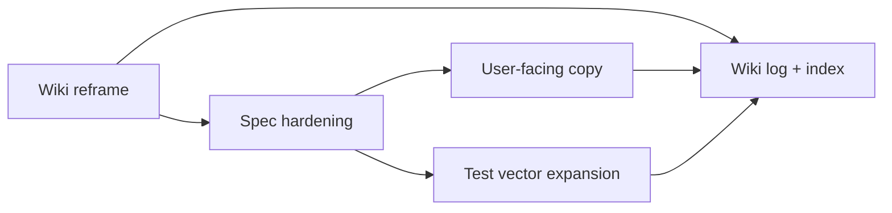

## Goal

Reframe EBP-HD so:

- `ebp-hd-v1` is the named conformance target (testable, versioned).
- BIP39 wordlist + checksum is the only narrow compatibility claim.
- BIP32 secp256k1 CKD / xpub-xprv, BIP39 seed extraction, and BIP44 wallet semantics are explicitly listed as permanent structural non-goals.
- BIP43 purpose-namespace and BIP44 path layout are described as "BIP-inspired" with `ebp-hd-v1` as the authoritative spec.

## Scope

## 1. Wiki reframe

- [wiki/analysis-ebp-hd-bip-compliance.md](wiki/analysis-ebp-hd-bip-compliance.md): add a "Permanent vs addressable gaps" section that splits the table into structural non-goals (BIP32 secp256k1 / xpub-xprv, BIP39 seed-compatibility, BIP44 wallet semantics) and addressable items (test vectors, purpose-namespace versioning, discovery defaults). Add an explicit "Conformance target: `ebp-hd-v1`" verdict.
- [wiki/ebp-hd.md](wiki/ebp-hd.md): add a short "Conformance" subsection naming `ebp-hd-v1` as the spec, citing [docs/ebp-hd-spec.md](docs/ebp-hd-spec.md) and the canonical test vectors. Restate that only BIP39 wordlist + checksum is claimed compatible.
- [wiki/source-bip-hd-wallet-standards.md](wiki/source-bip-hd-wallet-standards.md): add a one-line note that EBP's authoritative spec is `ebp-hd-v1`; this page stays comparison material.
- [wiki/analysis-bip-patterns-for-ebp.md](wiki/analysis-bip-patterns-for-ebp.md): add a short header line linking to `ebp-hd-v1` as the conformance target so the analysis is positioned as design background, not a spec.
- [wiki/key-management.md](wiki/key-management.md): adjust the blockchain-adjacent paragraph to say "EBP-HD conforms to `ebp-hd-v1`, which is BIP-inspired".

## 2. Spec hardening

Edit [docs/ebp-hd-spec.md](docs/ebp-hd-spec.md):

- Add a top-level "Conformance" section listing the testable requirements:
  - BIP39 English wordlist (canonical, SHA-256-pinned).
  - Mnemonic checksum, 11-bit grouping, 12/15/18/21/24-word lengths.
  - Seed extraction with PBKDF2-HMAC-SHA512, 2048 iterations, 64-byte output, salt `ebp-mnemonic-v2:` + NFKD(passphrase).
  - HKDF-SHA512 master/child node derivation with the EBP domain tags.
  - Path namespace `m/ebp'/profile'/account'/change/index` with `ebp'` = `0x454250`.
  - Leaf seed lengths per profile.
  - Matching the canonical test vectors at `core/tests/fixtures/ebp-hd/test-vectors.json`.
- Add an explicit "Non-goals / structural non-compatibility" section enumerating BIP32 secp256k1 CKD, xpub/xprv, BIP39 seed compatibility, and BIP44 wallet semantics (coin_type, on-chain discovery).
- Add a "Purpose namespace versioning" note: the spec version is `ebp-hd-v1`; any change to purpose constant, profiles, or HKDF tags requires bumping to `ebp-hd-v2`.

## 3. User-facing copy sync

- [ReadMe.md](ReadMe.md) (around lines 422-446): replace the EBP-HD intro paragraph with the agreed wording -- "BIP39 English mnemonic format; not a Bitcoin wallet seed; conforms to `ebp-hd-v1`". Keep example commands.
- [gui/index.html](gui/index.html) (Create HD Identity section near line 2246): update the help paragraph to the same wording and link conceptually to `ebp-hd-v1`.
- [gui/app.js](gui/app.js) (the `setStatus` near line 550): tweak the generated-mnemonic toast to say "BIP39 English words; this is an `ebp-hd-v1` mnemonic, not a Bitcoin wallet seed."
- [cli/main.ts](cli/main.ts) (HD help text near lines 132-146): say "`ebp-hd-v1` mnemonic using BIP39 English words" in the help summaries; leave commands unchanged.

## 4. Test vector expansion

Edit [core/tests/fixtures/ebp-hd/test-vectors.json](core/tests/fixtures/ebp-hd/test-vectors.json) and [core/Hd.test.ts](core/Hd.test.ts) / [core/Mnemonic.test.ts](core/Mnemonic.test.ts):

- Keep the existing 24-word `abandon ... diesel` vector for backwards parity.
- Add canonical vectors for:
  - A 12-word mnemonic (smallest valid length).
  - Empty-passphrase seed extraction (proves the salt path).
  - A non-zero `account` (e.g. `m/ebp'/dilithium'/3'/0/0`).
  - A non-zero `index` (e.g. `m/ebp'/sphincs'/0'/0/5`).
  - `change = internal` (`m/ebp'/dilithium'/0'/1/0`).
- Generate these by running the existing implementation once (out of plan-mode), then pin the resulting `seedHex` and `fingerprint` values into the JSON so any future change to derivation or wordlist trips the tests.
- Update [core/Hd.test.ts](core/Hd.test.ts) to iterate the expanded `cases` array instead of the current two hard-coded cases.
- Update [core/Mnemonic.test.ts](core/Mnemonic.test.ts) to load `entropyHex` / `mnemonic` / `seedHex` from the JSON fixture so the file is the single source of truth for `ebp-hd-v1` conformance.

## 5. Wiki log + index

- Prepend a `## [2026-05-25] change | EBP-HD reframed as ebp-hd-v1 conformance` entry to [wiki/log.md](wiki/log.md) listing the updated pages, spec, copy surfaces, and expanded test vectors.
- Bump the `Last updated` line in [wiki/index.md](wiki/index.md) accordingly.

## Out of scope

- Public-only / xpub-style derivation (would force `ebp-hd-v2`).
- Registering an external SLIP-44-like number for `ebp'` (EBP has no blockchain registry context; the `0x454250` constant stays private).
- Mobile parity for the HD UI (tracked separately under [[component-mobile]]).
- Changing the existing mnemonic salt or HKDF tags (these are the `ebp-hd-v1` constants).

## Verification

- `deno task test` passes with the expanded vectors.
- `ReadLints` shows no new diagnostics on edited files.
- `wiki/index.md` and `wiki/log.md` reflect the new analysis page links and changelog entry.
- Manual scan: README, GUI copy, and CLI help all say "BIP39 English mnemonic format" + "`ebp-hd-v1`" and never claim BIP32 / BIP44 compliance.
