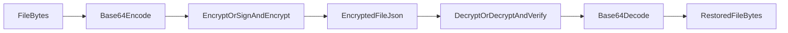

# Plan: Support File Encryption in EBP

## Goal

Implement file-byte encryption/decryption (not just file-hash signing) for the selected baseline surfaces:

- CLI
- GUI web app
- GUI local backend API

The design should reuse existing `Identity.EncryptFor` / `identity.encryptionKey.decrypt` behavior and ship a new versioned JSON payload specifically for encrypted files.

## Proposed Payload + Flow

- Add new payload types in `core` versions:
  - `ebp-encrypted-file`
  - `ebp-encrypted-signed-file`
- Envelope fields (minimum): `type`, `version`, `recipientFingerprint`, optional `senderFingerprint`, `fileName`, `mimeType`, `fileSize`, `ciphertext`.
- Encode raw file bytes as base64 before encryption; decrypt back to bytes for download/write.
- Keep message encryption behavior untouched and backward-compatible.

## Implementation Steps

1. **Core format/version extension**

   - Update [`/home/william/projects/even-better-privacy/core/version.ts`](/home/william/projects/even-better-privacy/core/version.ts) with file-payload format versions.
   - Add light shared helpers (likely in `core` or local modules) for binary/base64 envelope conversion to avoid duplicating fragile byte handling.

2. **CLI file encryption commands**

   - Extend [`/home/william/projects/even-better-privacy/cli/main.ts`](/home/william/projects/even-better-privacy/cli/main.ts) with file-focused commands/options (e.g. `encrypt-file`, `decrypt-file` or equivalent flags on existing commands).
   - Support:
     - input file path required for file mode
     - output JSON payload path for encryption
     - decrypt from payload JSON to output file path
     - optional signing with password parity to current message flow
   - Keep current `encrypt/decrypt` message behavior unchanged.

3. **Local backend API support**

   - Extend [`/home/william/projects/even-better-privacy/gui/local-backend/main.ts`](/home/william/projects/even-better-privacy/gui/local-backend/main.ts) with file payload endpoints (or mode flags on existing endpoints) handling binary <-> base64 conversion.
   - Validate metadata and payload type strictly; preserve current message API contract.

4. **GUI file encryption UX**

   - Add Encrypt File / Decrypt File sections in [`/home/william/projects/even-better-privacy/gui/index.html`](/home/william/projects/even-better-privacy/gui/index.html).
   - Wire handlers in [`/home/william/projects/even-better-privacy/gui/app.js`](/home/william/projects/even-better-privacy/gui/app.js):
     - file picker + recipient + optional sign
     - payload import/export (JSON)
     - decrypted file download with safe filename handling
   - Reuse existing JSON import/download helpers where possible.

5. **Tests**

   - Add/extend core tests in [`/home/william/projects/even-better-privacy/test/MessageExchange_test.ts`](/home/william/projects/even-better-privacy/test/MessageExchange_test.ts) (and/or dedicated new test file) for binary round-trip and signed verification outcomes.
   - Extend backend API tests in [`/home/william/projects/even-better-privacy/gui/local-backend/tests/main_test.ts`](/home/william/projects/even-better-privacy/gui/local-backend/tests/main_test.ts) for file encrypt/decrypt happy path + malformed payload cases.
   - Add/adjust GUI e2e coverage in [`/home/william/projects/even-better-privacy/gui/e2e/identity.spec.ts`](/home/william/projects/even-better-privacy/gui/e2e/identity.spec.ts) for one end-to-end file round-trip.

6. **Docs + help text**

   - Update CLI help + examples in [`/home/william/projects/even-better-privacy/cli/main.ts`](/home/william/projects/even-better-privacy/cli/main.ts).
   - Update user docs in [`/home/william/projects/even-better-privacy/ReadMe.md`](/home/william/projects/even-better-privacy/ReadMe.md) to describe file encryption payloads and workflows.

## Compatibility & Safety Notes

- Treat this as additive: existing message payloads and APIs remain valid.
- Enforce explicit payload `type` checks to prevent file/message confusion.
- Bound maximum accepted payload/file sizes in backend and UI to avoid memory abuse.
- Preserve existing signature verification semantics for signed encrypted payloads.