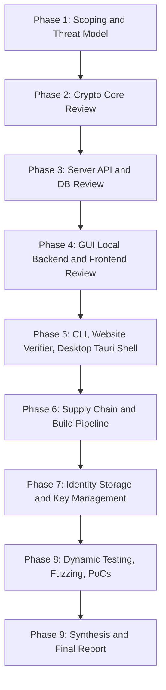

# EBP Security Audit Plan

## Scope

**In scope:** [core/](core/), [cli/](cli/), [server/](server/), [gui/](gui/) (frontend + [gui/local-backend/](gui/local-backend/)), [desktop/](desktop/) (Tauri shell), [website/](website/), [scripts/](scripts/), [Dockerfile](Dockerfile), [deno.json](deno.json) / [deno.lock](deno.lock), [package.json](package.json) / [package-lock.json](package-lock.json), [build_*.sh](build_chrome_extension.sh) build scripts, identity storage on disk (`~/.ebp/`), and the wire formats in [core/Payloads.ts](core/Payloads.ts).

**Out of scope (per user):** [mobile/](mobile/), [email/](email/) (chrome extension). Note: although the extension is excluded, the attack surface it exposes on the GUI local backend (`http://127.0.0.1:8787`) IS in scope, since any local origin can hit it.

## Methodology Overview

Industry-standard security audits combine four lenses; this plan applies all four:

1. **Threat modeling first** (STRIDE per component + adversary capability matrix) so every finding ties to a concrete threat.
2. **Code review** for design + implementation flaws (manual, prioritized by trust boundary).
3. **Tooling** for known-CVE / secret / lint coverage (`deno lint`, `npm audit`, `cargo audit`, `gitleaks`, etc.).
4. **Dynamic testing**: run the system locally, fuzz endpoints, and produce reproducible PoCs for confirmed issues.

Findings use the standard severity rubric **Critical / High / Medium / Low / Informational**, scored with **CVSS 3.1** plus contextual notes on exploitability for EBP's threat model.

Each phase is gated. After each phase I will pause, summarize findings so far, and wait for your approval before continuing.

## Audit Artifacts (created in Phase 1, updated continuously)

- `wiki/security-audit-2026-04/README.md` — index page (linked from `wiki/index.md`).
- `wiki/security-audit-2026-04/threat-model.md` — assets, adversaries, trust boundaries, STRIDE per component.
- `wiki/security-audit-2026-04/findings.md` — running list of findings (id, severity, status, location, PoC link, recommendation).
- `wiki/security-audit-2026-04/phase-NN-<area>.md` — one notes page per phase.
- `wiki/security-audit-2026-04/pocs/` — runnable PoC scripts for confirmed vulnerabilities.
- `wiki/security-audit-2026-04/tooling-output/` — raw scanner output, archived per run.
- Final report appended to `wiki/log.md` per the wiki-maintainer rule.

## Phase Details

### Phase 1 — Scoping, threat model, audit scaffolding

- Build the audit folder + index above.
- Produce per-component threat models (STRIDE) for: crypto core, server, local backend, desktop shell, CLI, website verifier.
- Define adversaries and capabilities:
  - **Network attacker** (between client and `server/main.ts`): MITM, replay, malformed payloads.
  - **Malicious server operator**: silent key-substitution, detail tampering, revocation suppression.
  - **Co-tenant local process / malicious browser tab**: attacks on `127.0.0.1:8787` ([gui/local-backend/main.ts](gui/local-backend/main.ts)) — DNS rebinding, CSRF, drive-by.
  - **Malicious contact / payload author**: crafted signed/encrypted messages, malicious file payloads, oversize / parser bombs.
  - **Local attacker with disk read** of `~/.ebp/`: offline brute-force of AES-encrypted private keys.
  - **Compromised dependency** (supply chain): `@noble/*`, `bech32`, `imapflow`, `mailparser`, `nodemailer`, `postgres`, `sqlite`, Tauri/Rust crates, Playwright.
  - **Malicious extension** abusing `tauri.allowlist.shell.open=true` ([desktop/src-tauri/tauri.conf.json](desktop/src-tauri/tauri.conf.json)).
- Map all trust boundaries on a single diagram.

### Phase 2 — Cryptographic core ([core/](core/))

Highest blast-radius surface (~2.0k LOC). Files: [Identity.ts](core/Identity.ts) (708 lines), [HierarchyCertificate.ts](core/HierarchyCertificate.ts), [Revocation.ts](core/Revocation.ts), [Payloads.ts](core/Payloads.ts), [Fingerprint.ts](core/Fingerprint.ts), [AES.ts](core/AES.ts), [Kyber.ts](core/Kyber.ts), [Dilithium.ts](core/Dilithium.ts), [Sphincs.ts](core/Sphincs.ts), [DetailProof.ts](core/DetailProof.ts), [StateHash.ts](core/StateHash.ts), [MessageHash.ts](core/MessageHash.ts), [FilePayload.ts](core/FilePayload.ts).

Review checklist:
- **Algorithm usage** vs. NIST FIPS 203/204/205 requirements (variant selection, key sizes, domain separation).
- **Random number generation** — confirm only `crypto.getRandomValues` / Deno's CSPRNG is used; no `Math.random` in security-sensitive paths.
- **AES key derivation** ([core/AES.ts](core/AES.ts)): KDF (PBKDF2 iteration count, salt handling, IV/nonce reuse, AEAD vs. CTR, authenticated encryption for private-key blobs).
- **Signature envelope** (CLI doc says hash + optional salt): verify domain separation across detached/attached/file/message/state/detail/hierarchy/revocation contexts. Look for cross-protocol confusion (e.g. a detail proof verifying as a message signature).
- **Fingerprint construction** ([core/Fingerprint.ts](core/Fingerprint.ts)): merkle-tree second-preimage resistance, leaf-vs-internal-node domain separation, HRP confusion (`ebpdk` vs `ebpsk`).
- **Nonce / timestamp logic** in [Identity.ts](core/Identity.ts) details and [Revocation.ts](core/Revocation.ts): replay protection, monotonic enforcement, clock-skew attacks, the special **emergency cert nonce-0** handling.
- **State signatures**: bypass, downgrade, or rollback of identity state.
- **Hierarchy certificates** ([HierarchyCertificate.ts](core/HierarchyCertificate.ts)): signing-cycle / orphan attacks, master-key spoofing.
- **Encrypt-then-sign vs sign-then-encrypt** semantics in [Payloads.ts](core/Payloads.ts); identity-binding of ciphertext (KCI/UKS resistance).
- **Constant-time** comparisons for tags, signatures, password verification.
- **Storage v2 format** parsing — malformed-input handling, type confusion across `Identity.fromStorageFormat`.
- **File payload size limits** (`MAX_ENCRYPTED_FILE_BYTES`) — DoS / decompression bombs.
- Cross-check claims in [wiki/identity-model.md](wiki/identity-model.md) and [wiki/revocation-system.md](wiki/revocation-system.md) against actual code.

Tooling: `deno lint`, custom grep for forbidden patterns (`Math.random`, `==` on signature bytes, missing `try/catch` around verify).

### Phase 3 — Server ([server/](server/))

~3.0k LOC. Public-internet-facing component (deployed on Render). Highest external attack surface.

Files: [main.ts](server/main.ts), [handlers/](server/handlers/) (identity 312 LOC, verify 326 LOC, hierarchy 242 LOC, discovery 249 LOC, revocation 126 LOC), [db/](server/db/) (index.ts 556 LOC, postgres, sqlite), [body.ts](server/body.ts), [cors.ts](server/cors.ts), [crypto.ts](server/crypto.ts), [rate-limit.ts](server/rate-limit.ts), [response.ts](server/response.ts), [verify-email.ts](server/verify-email.ts), [mail-oauth.ts](server/mail-oauth.ts), [hierarchy.ts](server/hierarchy.ts).

Review checklist:
- **Routing & dispatch** in [server/main.ts](server/main.ts): path traversal in route params, ambiguous matching, method confusion.
- **Input validation** per handler: bech32 fingerprint validation, base64/hex bounds, JSON depth/key-count limits in [body.ts](server/body.ts).
- **Authn/authz model**: state-signature + proof-signature flow on every mutation. Look for missing checks where the server trusts client-supplied identity data (e.g. accepting a publish without re-verifying every detail proof).
- **Detail uniqueness** (`409 Conflict` logic) and revoke-then-re-add race conditions.
- **Revocation handler** ([handlers/revocation.ts](server/handlers/revocation.ts)): nonce validation including emergency nonce-0 special case; ensure no off-by-one allowing replay.
- **Hierarchy handler** ([handlers/hierarchy.ts](server/handlers/hierarchy.ts)): cycles, unauthorized parent claims, propose/accept/reject auth, IDOR on `/hierarchy/pending/:fingerprint`.
- **OAuth proxy** ([mail-oauth.ts](server/mail-oauth.ts)): open-redirect, token leakage in logs, scope validation, CSRF state param, refresh-token storage.
- **Email verification** ([verify-email.ts](server/verify-email.ts)): token entropy/lifetime, replay, GET vs POST consistency, SSRF in mail sending.
- **SQL** ([db/postgres.ts](server/db/postgres.ts), [db/sqlite.ts](server/db/sqlite.ts)): parameterized queries everywhere, no string concat, transaction scope correctness.
- **CORS** ([cors.ts](server/cors.ts)): wildcard misuse, credential reflection, preflight handling.
- **Rate limiting** ([rate-limit.ts](server/rate-limit.ts)): bypass via header spoofing (`X-Forwarded-For`), per-IP vs per-account skew, memory exhaustion of the limiter.
- **Body size & length limits** ([body.ts](server/body.ts)): consistent enforcement, JSON parse before size check, gzip-bomb resistance.
- **Headers**: HSTS preload, COOP/COEP/CSP for the verifier, `X-Content-Type-Options`, `Referrer-Policy`.
- **Information disclosure** in error responses, stack traces, version banners on `/api/v1/health`.
- **Deno permissions** in `tasks.server`: `--allow-sys`, `--allow-read`, `--allow-write`, `--allow-env`, `--allow-net` — verify each is needed; recommend tightest scopes.
- **Dockerfile** ([Dockerfile](Dockerfile)): non-root user, pinned base, secrets handling, image surface.

### Phase 4 — GUI local backend & frontend ([gui/local-backend/](gui/local-backend/), [gui/](gui/))

`gui/local-backend/routes.ts` is **2,835 lines** — the largest single file in the project and a high-risk surface because it runs as the user (full filesystem access via `--allow-read --allow-write --allow-run --allow-sys`) and listens on localhost.

Review checklist:
- **DNS rebinding** protection on `127.0.0.1:8787` — `Host`-header validation, listening interface binding.
- **CSRF**: any browser tab can `fetch('http://127.0.0.1:8787/...')`. Need same-origin or token-based protection. Audit every state-changing route in [routes.ts](gui/local-backend/routes.ts).
- **`POST /api/v1/save-file`**: arbitrary write to `~/Downloads/` — path traversal, symlink attack, filename sanitization, overwrite of existing files.
- **`--allow-run`**: which subprocesses can be invoked, with what arguments? Argument-injection review.
- **IMAP/SMTP/OAuth flow** in [mail-imap.ts](gui/local-backend/mail-imap.ts), [mail-account.ts](gui/local-backend/mail-account.ts), [mail-oauth.ts](gui/local-backend/mail-oauth.ts): TLS verification, credential storage at rest, [mailparser](https://www.npmjs.com/package/mailparser) prototype-pollution / parser DoS.
- **Frontend XSS** in [gui/js/render.js](gui/js/render.js), [modals.js](gui/js/modals.js), [contact-search.js](gui/js/contact-search.js): are contact details / mail bodies / signed-message contents rendered with `innerHTML`? Audit every DOM sink.
- **Sandbox / iframe** for rendering received mail; HTML-mail XSS / pixel tracker / SSRF.
- **Toast-based status** disclosing sensitive paths (file save returns full home path).
- **State persistence** in [state.js](gui/js/state.js) — sensitive material in `localStorage` / `sessionStorage`?
- **Hierarchy SVG** ([hierarchy.js](gui/js/hierarchy.js)): SVG-injection / `<foreignObject>` script execution.

### Phase 5 — CLI, website verifier, Desktop Tauri shell

**CLI** ([cli/](cli/), ~1.5k LOC across [commands/](cli/commands/)):
- Argument parsing (`@std/cli/parse-args`) — option injection, unknown-flag handling.
- File-path arguments — symlink / TOCTOU on read/write.
- Password prompt UX — terminal echo, scrollback leakage, env-var fallbacks.
- `--push` flow: server URL trust, TLS pinning, downgrade.
- Confirm `cli/utils.ts` server-URL persistence cannot be hijacked by a malicious file in `~/.ebp/`.

**Website verifier** ([website/verify.html](website/verify.html), [website/verify.js](website/verify.js)):
- Default server `https://ebp-cqyo.onrender.com` is hardcoded — supply-chain risk if domain lapses.
- Client-side `crypto.subtle` SHA-256 path — compare-then-send race; ensure no signature acceptance without server confirmation.
- File upload handling: size limits, large-file DoS in browser.
- Loading images from `raw.githubusercontent.com` — third-party content trust, CSP.
- Public identity JSON paste — JSON-bomb, prototype-pollution via `JSON.parse` of attacker-controlled keys.

**Desktop / Tauri** ([desktop/src-tauri/](desktop/src-tauri/)):
- [tauri.conf.json](desktop/src-tauri/tauri.conf.json): `allowlist.shell.open=true` — URL-handler abuse, `file://`, `javascript:`, custom scheme handlers.
- `devPath: http://127.0.0.1:8787/` and `externalBin: bin/ebp-gui-backend` — sidecar process trust, signature, update channel.
- Loader-page polling design from [wiki/analysis-linux-build.md](wiki/analysis-linux-build.md): race on first-boot redirect, ability for malicious local server on `:8787` to MITM the loader.
- Rust [main.rs](desktop/src-tauri/src/main.rs) review: IPC commands, capability scope, code-signing posture.

### Phase 6 — Supply chain & build pipeline

- **Deno deps** ([deno.json](deno.json), [deno.lock](deno.lock)): pin verification, `jsr:` integrity, mixed `https://deno.land/x/...` (no integrity) — flag postgres/sqlite/std at unlocked URLs.
- **npm deps** ([package.json](package.json), [package-lock.json](package-lock.json), [node_modules/](node_modules/)): run `npm audit`, `npx better-npm-audit`, check Playwright.
- **Rust deps** ([desktop/src-tauri/Cargo.lock](desktop/src-tauri/Cargo.lock)): run `cargo audit`, review Tauri version for advisories.
- **Build scripts**: [build_chrome_extension.sh](build_chrome_extension.sh), [build_desktop_linux.sh](build_desktop_linux.sh), [build_desktop_mac.sh](build_desktop_mac.sh), [build_desktop_windows.sh](build_desktop_windows.sh), [scripts/](scripts/) — unsafe `curl | sh`, missing `set -euo pipefail`, untrusted env.
- **Dockerfile** posture (root user, base pin, multi-stage, .dockerignore).
- **Secret scan** with `gitleaks` / `trufflehog` over the full repo + git history (note: `ebp.sqlite` and `test_identities/` may contain test material — treat as informational).
- **Reproducibility**: can a third party reproduce a release binary byte-for-byte? Document gap.
- **Release distribution**: AppImage / DMG / MSI signing, update channel, GitHub release-asset integrity.

### Phase 7 — Identity storage & key management

- `~/.ebp/<name>.identity.json` v2 format: confirm private-key blob is AEAD-encrypted (not unauthenticated CTR), KDF parameters meet OWASP 2024 guidance, salt is per-identity and ≥128 bits.
- Permissions on `~/.ebp/` directory and files (0700 / 0600?).
- Backup / export flows leak plaintext keys?
- Emergency revocation cert handling: cleartext on disk, secure-delete semantics.
- `test_identities/` and `ebp.sqlite` in repo — confirm no real keys; document any test-fixture risks.
- Multi-identity isolation: switching identities, cache leakage, residual sensitive data in process memory / temp files.

### Phase 8 — Dynamic testing, fuzzing, PoC development

- **Set up isolated test env**: `deno task postgres` + `deno task server` on a throwaway DB; `deno task gui`; `cargo build` Tauri shell.
- **Endpoint fuzzing**: differential / property fuzzing of server handlers (custom Deno harness; consider [deno-fuzz](https://deno.land/x/fuzz) or [radamsa](https://gitlab.com/akihe/radamsa) corpus generation against `POST /api/v1/identity`, `/detail`, `/revoke`, `/hierarchy/*`, `/verify-signature`).
- **Crypto property tests**: random vs. tampered signatures, malleability of revocation certs, fingerprint collision search (bounded), state-rollback attacks.
- **HTTP attack suite**: ZAP / nikto / `httpx` headers; manual CSRF / DNS-rebinding PoCs against the local backend.
- **Web pentest of [website/verify.html](website/verify.html)** with Burp / browser DevTools.
- **Filesystem attacks**: path-traversal / symlink PoCs against `/api/v1/save-file`.
- **Concurrency** PoCs: race on detail revoke + re-add, double-spend of emergency nonce-0.
- Each confirmed issue gets a runnable script under `wiki/security-audit-2026-04/pocs/`.

### Phase 9 — Synthesis & final report

Deliverable: `wiki/security-audit-2026-04/report.md`, structured as:
- Executive summary (1 page).
- Scope, methodology, threat model recap.
- Findings table sorted by severity, each linking to a detailed write-up with: description, affected files/lines, impact, CVSS, PoC, recommended fix, references.
- Aggregate risk posture and prioritized remediation roadmap.
- Residual risk (out-of-scope items, accepted risks).
- Appendices: tool outputs, fuzzing corpus, raw notes.

Final step per wiki rules: append to [wiki/log.md](wiki/log.md), update [wiki/index.md](wiki/index.md) under a new "Security Audits" section, and link the report from [wiki/overview.md](wiki/overview.md).

## Approval Gates

I will pause at the end of each phase and present:
1. New / updated findings (severity + one-line summary).
2. Tooling output highlights.
3. Open questions.
4. Proposed scope adjustments for the next phase.

You explicitly confirm before I proceed to the next phase.
