# Findings At-or-Above Foo (y >= 8) — Round 2

## Scope and target set

`foo(x) = 8` is the green horizontal line in [plot_remaining_findings.py](plot_remaining_findings.py). Tracing the script against [findings.md](wiki/security-audit-2026-04/findings.md), nine open findings sit at-or-above foo (per user choice to include the on-line one):

- F-WEB-03 (Medium, website) — score 10.00 — No CSP set on `verify.html`
- F-SERVER-08 (Medium, server) — score 9.75 — Identity-existence enumeration via registration response codes
- F-GUI-03 (Medium, gui-local-backend) — score 9.50 — Deno permissions in `tasks.gui` are unconstrained
- F-STORAGE-09 (Low, storage) — score 9.25 — Password floor 8 chars; no complexity policy; no strength meter
- F-SERVER-13 (Low, server) — score 9.00 — `server/main.ts` references non-existent `./db.ts`
- F-CLI-04 (Low, cli) — score 8.75 — `safeFileName` does not cap length
- F-CLI-06 (Low, cli) — score 8.50 — Wrong-password and corruption errors are conflated
- F-STORAGE-11 (Informational, storage) — score 8.25 — `test_identities/` and `ebp.sqlite` shipped with documented passwords
- F-CRYPTO-11 (Informational, core) — score 8.00 — `PROTOCOL_VERSION` is `0.0.1`, `isProtocolVersionSupported` ignores patch

Two findings appear partially fixed at the source level already; the plan calls those out and just lands the bookkeeping + any remaining gap.

## Sequencing rationale

Trivial verifications and isolated 1-file changes first, then surface-area changes (UI/permissions/policies), then any bookkeeping-only items, ending with the script prune and plot regen.

```mermaid
flowchart LR
  P1[P1 SERVER-13 verify build] --> P2[P2 CLI-04 cap length]
  P2 --> P3[P3 CRYPTO-11 patch compat]
  P3 --> P4[P4 CLI-06 typed decrypt errors]
  P4 --> P5[P5 WEB-03 CSP coverage]
  P5 --> P6[P6 GUI-03 scoped Deno perms]
  P6 --> P7[P7 STORAGE-09 password policy]
  P7 --> P8[P8 SERVER-08 close enumeration]
  P8 --> P9[P9 STORAGE-11 fixture banner]
  P9 --> P10[P10 prune script + rerun plot]
```



## Per-phase scope

### Phase 1 — F-SERVER-13: confirm `server/main.ts` build
- **Files:** [server/main.ts](server/main.ts), [server/db/index.ts](server/db/index.ts).
- **Status:** the import is already `./db/index.ts` (not `./db.ts`); finding looks code-level resolved.
- **Change:** run `deno check server/main.ts` and `deno task test:server`; if green, no code change. If anything still references `./db.ts`, repoint to `./db/index.ts`.
- **Tests:** `deno check server/main.ts` exits 0; existing `server/tests/` suite via `psql_test_runner.ts` remains green.

### Phase 2 — F-CLI-04: cap `safeFileName` length
- **Files:** [cli/utils.ts](cli/utils.ts), call sites in [cli/commands/files.ts](cli/commands/files.ts).
- **Change:** in `safeFileName`, after stripping control chars and `..`, truncate the basename to a reasonable max (suggest 200 bytes UTF-8, leaving room for extensions on common filesystems). Preserve a final extension if present. Current code:

```340:345:cli/utils.ts
export function safeFileName(fileName: string): string {
  return baseName(fileName).replace(/[\u0000-\u001F\u007F]/g, "").replace(
    /\.\./g,
    "_",
  );
}
```

- **Tests:** new cases in `cli/tests/` (extend `utils_test.ts` if present, otherwise add `cli/tests/safe_file_name_test.ts`): long input is truncated; extension is preserved; multibyte UTF-8 boundary is respected.

### Phase 3 — F-CRYPTO-11: respect patch in `isProtocolVersionSupported`
- **Files:** `core/version.ts` (or wherever `PROTOCOL_VERSION` and `isProtocolVersionSupported` are defined — confirm via `grep -R isProtocolVersionSupported core/`).
- **Change:** keep semver semantics — major must match exactly, minor must be `>=` ours, patch is informational. Add explicit handling so the patch field is parsed and stored, and define forward/backward compatibility intent in a doc comment. Bump `PROTOCOL_VERSION` to `0.0.2` to mark the policy fix.
- **Tests:** unit tests in `test/` (or `core/tests/`) covering: patch-only difference accepted, minor-newer accepted, minor-older rejected, major mismatch rejected.

### Phase 4 — F-CLI-06: distinguish wrong-password from corruption
- **Files:** [core/AES.ts](core/AES.ts) (`AES.decrypt` failure path), `core/Identity.ts` (`Identity.fromStorageFormat`), [cli/utils.ts](cli/utils.ts) (the catch-all in identity-load), [gui/local-backend/identity.ts](gui/local-backend/identity.ts) (parallel path).
- **Change:**
  - Define typed errors in `core/AES.ts`: `class DecryptionAuthError extends Error` (GCM tag failure → wrong password OR tampering — keep ambiguous in this layer) and `class StorageFormatError extends Error` for pre-decrypt JSON / version / shape problems.
  - In `Identity.fromStorageFormat`, catch JSON-parse / shape / version errors as `StorageFormatError("identity file is corrupted or unsupported format")` BEFORE the decrypt attempt; let GCM failures bubble as `DecryptionAuthError("wrong password or tampered data")`; treat post-decrypt JSON failures as `StorageFormatError("decrypted payload is corrupted")`.
  - Update CLI `loadIdentityWithPassword` (around `cli/utils.ts:362`) to print distinct messages and exit codes for each error class.

```362:369:cli/utils.ts
  try {
    identity = Identity.fromStorageFormat(storageData, pwd);
  } catch {
    console.error("Failed to decrypt identity. Wrong password?");
    Deno.exit(1);
  }
```

- **Tests:** `test/AES_test.ts` add a "tampered ciphertext" case asserting `DecryptionAuthError`; `cli/tests/` add tests asserting different stderr strings for wrong-password vs malformed-file inputs; mirror in `gui/local-backend/tests/main_test.ts`.

### Phase 5 — F-WEB-03: CSP coverage across the static site
- **Files:** [website/verify.html](website/verify.html), [website/index.html](website/index.html), `website/privacy.html`, plus any host-config artifact (e.g. `website/_headers`, `website/netlify.toml`, GitHub Pages config).
- **Status:** `verify.html` already has a strict `<meta http-equiv="Content-Security-Policy" ...>`. `index.html` and `privacy.html` do not.
- **Change:**
  - Add a strict `<meta>` CSP to `index.html` and `privacy.html` that mirrors `verify.html`'s allowlist minus connectors they don't need (most likely `default-src 'none'; script-src 'self'; style-src 'self'; img-src 'self'; base-uri 'none'; form-action 'self'`).
  - If the site is hosted on a platform that supports custom HTTP headers (Netlify / Cloudflare Pages / GitHub Actions deploy + S3), add a `_headers` (or equivalent) file that emits `Content-Security-Policy`, `X-Content-Type-Options: nosniff`, and `Referrer-Policy: no-referrer` at the HTTP layer too. Document the chosen hosting target in a one-line comment in the file.
- **Tests:** no `website/` runner exists; add a small `deno task lint:website-csp` (Deno script under `scripts/`) that asserts every `website/*.html` file contains a `Content-Security-Policy` meta tag with `default-src 'none'`. Reference the existing pattern in [server/tests/verify_email_xss_test.ts](server/tests/verify_email_xss_test.ts).

### Phase 6 — F-GUI-03: scope Deno permissions for the GUI tasks
- **Files:** [deno.json](deno.json) (root), specifically `tasks.gui` and `tasks["gui:local-backend"]`.

```26:33:deno.json
  "tasks": {
    "gui:local-backend": "deno run --allow-read --allow-write --allow-env --allow-net --allow-run ./gui/local-backend/main.ts",
    "gui": "deno run --unstable-worker-options --allow-read --allow-write --allow-env --allow-net --allow-run --allow-sys ./gui/local-backend/main.ts",
```

- **Change:**
  - `--allow-net=127.0.0.1:8787,localhost:8787,esm.sh,<server origin>,<oauth providers>` (enumerate from `gui/local-backend/mail-oauth*.ts` + `gui/local-backend/routes.ts`).
  - `--allow-read=$HOME/.ebp,$HOME/Downloads,<repo absolute path for assets>` (use `$HOME` substitution or pass via env in the task).
  - `--allow-write=$HOME/.ebp,$HOME/Downloads`.
  - `--allow-env=EBP_*,HOME,XDG_*` (whitelist only the env vars the backend reads — audit `Deno.env.get` usages first).
  - Drop `--allow-sys` if practical; if any worker requires it, narrow with `--allow-sys=hostname,osRelease,...`.
  - Drop `--allow-run` if no exec is needed; if email OAuth's "open browser" path uses it, scope to the platform launcher (`xdg-open`, `open`, `cmd.exe`).
- **Tests:** `gui/local-backend/tests/main_test.ts` already smoke-tests routes — extend it to cover the OAuth open-browser path under the narrowed permission set. Manual Tauri smoke (run `deno task gui` and exercise identity create + mail OAuth).

### Phase 7 — F-STORAGE-09: password floor + complexity policy + strength signal
- **Files:** new `core/PasswordPolicy.ts` (single source of truth), [cli/commands/identity.ts](cli/commands/identity.ts) (line ~64), [gui/local-backend/routes.ts](gui/local-backend/routes.ts) (line ~1687).

```64:67:cli/commands/identity.ts
	if (password.length < 8) {
		console.error("Password must be at least 8 characters.");
		Deno.exit(1);
	}
```

- **Change:**
  - In `core/PasswordPolicy.ts` export `validatePassword(pwd: string): { ok: true } | { ok: false; reason: string; suggestions: string[] }`. Rules: minimum 12 chars; require at least 3 of 4 of {lowercase, uppercase, digit, symbol}; reject if found in a small embedded common-password list (top 100 from public lists is enough — keep ASCII, no new dep).
  - Optional strength score 0..4 using a simple entropy approximation (`log2(charsetSize) * length` bucketed) — no zxcvbn dependency.
  - Wire into both CLI `generate` and GUI POST identity-create. Show the failure reason and suggestions on the CLI; return a structured `400 { error, reason, suggestions }` from the GUI route.
- **Tests:** new `test/PasswordPolicy_test.ts`; update `cli/tests` and `gui/local-backend/tests/main_test.ts` to use a long compliant password (e.g. `"Correct-Horse-Battery-Staple-9!"`) and assert that `password123` is now rejected.

### Phase 8 — F-SERVER-08: close registration enumeration oracle
- **Files:** [server/handlers/identity.ts](server/handlers/identity.ts) (`handlePostIdentity`, `handleGetIdentity`, `handlePostDetail`), associated rate-limit middleware in `server/`, and `server/tests/main_handlers_test.ts`.
- **Change (in priority):**
  - `handlePostIdentity`: collapse all valid-input outcomes (new vs idempotent-replay) to a single uniform 200 response shape (already returns `{ fingerprint }` in both — verify response timing is also normalized; consider an explicit `await sleep(jitter)` or unify the DB write path so the work is the same).
  - Replace per-validation 400s that leak preimage knowledge (e.g. fingerprint-derived-from-key mismatch when the key already exists) with a single generic `400 { error: "invalid identity submission" }`.
  - `handleGetIdentity`: restrict to authenticated lookups OR add per-IP rate-limiting that makes enumeration economically infeasible (same approach as for password reset). If the GET is part of a deliberate public lookup feature, keep 404 but document the residual risk.
  - `handlePostDetail`: change the missing-identity 404 to a generic 400 (`"unknown subject"`) so it does not differ in code from the proof-format errors.
- **Tests:** `server/tests/main_handlers_test.ts` add cases asserting (a) POST-register response is byte-identical for new vs already-existing fingerprint, (b) GET unknown fingerprint either requires auth or returns the same shape as a known-not-permitted lookup, (c) POST detail with unknown subject returns 400, not 404.

### Phase 9 — F-STORAGE-11: fixture banner + non-prod gate
- **Files:** new `test_identities/README.md`; [scripts/generate_test_identities.ts](scripts/generate_test_identities.ts); CLI/GUI identity-load paths to refuse loading any identity file from `test_identities/` when `NODE_ENV=production` or `EBP_PROD=1`.
- **Change:**
  - `test_identities/README.md` — explicit warning that all 7 identities use password `"password"` and must never be uploaded to a real server or installed in `~/.ebp/`. Cross-link [F-SECRETS-02](wiki/security-audit-2026-04/findings.md).
  - In `scripts/generate_test_identities.ts`, gate execution behind `EBP_TEST_FIXTURES=1` and refuse if `EBP_SERVER_URL` is not loopback / localhost.
  - Confirm `.gitignore` already excludes `*.sqlite` and `~/.ebp/` runtime data (it does).
  - Add a one-time runtime warning in `cli/utils.ts` `loadIdentityWithPassword` if the file path resolves under a `test_identities/` directory.
- **Tests:** add a CLI test that the test-fixture path triggers the warning; lint-style test that `test_identities/README.md` exists.

### Phase 10 — Cross-cutting bookkeeping, script prune, and plot regen

For each of the 9 phases above, on landing:
- Flip the row in [wiki/security-audit-2026-04/findings.md](wiki/security-audit-2026-04/findings.md) from `open` to `fixed (YYYY-MM-DD)`.
- Append a `## [YYYY-MM-DD] remediation | F-XXX-NN` entry at the top of `wiki/log.md`.
- Update any affected analysis pages (`wiki/analysis-top-open-security-issues.md` if it still lists any of these).

Then prune the now-obsolete heuristic patterns from [plot_remaining_findings.py](plot_remaining_findings.py). Per-pattern impact analysis (only remove patterns whose only open match was in this plan's set):

- Remove `r"\benumeration\b"` from `high_impact_patterns` (sole match was F-SERVER-08).
- Remove `r"\bcsp\b"` from `high_impact_patterns` AND from `medium_patterns` (sole remaining open match was F-WEB-03; F-TAURI-02 already fixed).
- Remove `r"\bpolicy\b"` from `medium_patterns` (sole match was F-STORAGE-09).
- Keep `r"\bpermissions?\b"` in both lists (F-TAURI-05 still open).
- Keep `r"\blength cap\b"`, `r"\bdefault\b"`, etc. unchanged (still potentially relevant for remaining findings).

Optionally, while editing the script, also delete patterns whose only matches are findings already fixed in earlier rounds (`\bhttp://\b`, `\bforeign_keys\b`, `\bwildcards?\b`, `\bconstant-time\b`, `\bworld-readable\b`, `\bscheme-checked\b`, `\bescape\b`, `\bwarning\b`, `\bunknown flags\b`, `\bversion/type tag\b`, `\bhtml escaping\b`) for cleanliness — flag this to the user before doing it since it changes the ranking model slightly.

Final action:
- Run `python3 plot_remaining_findings.py` and confirm:
  - `wiki/security-audit-2026-04/remaining-findings-plot.png` regenerates.
  - No finding has `ease_score >= 8.0` after this round (the foo line should be empty above it).
  - The printed `(severity, ease)` table no longer mentions any of the 9 finding IDs.

## Per-finding bookkeeping pointers (cheat sheet)

- F-WEB-03 → flip in `findings.md` line 73; verify `website/verify.html` already has CSP meta; ensure `index.html`/`privacy.html` now do too.
- F-SERVER-08 → flip line 48; mention which oracles were closed and which were rate-limited.
- F-GUI-03 → flip line 55; record the final scoped permission strings in the wiki page `phase-04-gui.md`.
- F-STORAGE-09 → flip line 102; reference the new `core/PasswordPolicy.ts`.
- F-SERVER-13 → flip line 52; note that the import was already `./db/index.ts`.
- F-CLI-04 → flip line 68.
- F-CLI-06 → flip line 70; reference the new `DecryptionAuthError` / `StorageFormatError` classes.
- F-STORAGE-11 → flip line 104; cross-link F-SECRETS-02 (line 92) which remains open.
- F-CRYPTO-11 → flip line 40; record new `PROTOCOL_VERSION` value.
