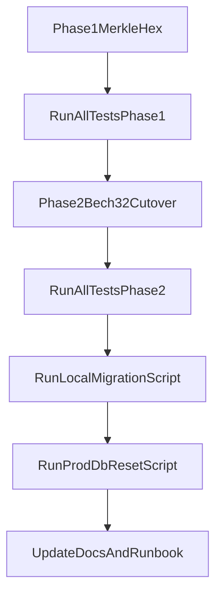

# Fingerprint Upgrade Plan (Merkle Root, then Bech32)

## Scope and Decisions

- Merkle definition: keep current-style leaf hashing (`SHA-256(signingKeyBytes)` and `SHA-256(encryptionKeyBytes)`) with ordered concatenation by key role.
- Bech32 rollout: **hard cutover** (no legacy hex support after phase 2).
- Cardano/CIP alignment to enforce in implementation: canonical lowercase bech32, checksum validation, and strict HRP-based format handling inspired by CIP-19 conventions ([CIP-19](https://cips.cardano.org/cip/CIP-19), [CIP-5](https://cips.cardano.org/cip/CIP-5)).

## Phase 1: Merkle Root Fingerprints (Hex only)

1. Centralize fingerprint computation in a shared utility module and remove duplicated formula logic.

   - Primary targets: [`core/Identity.ts`](core/Identity.ts), [`server/crypto.ts`](server/crypto.ts), [`gui/local-backend/main.ts`](gui/local-backend/main.ts), [`server/tests/helpers.ts`](server/tests/helpers.ts).

2. Update identity/public summary/state-signature flows to use the new merkle-root calculation everywhere fingerprints are produced or recomputed.

   - Touchpoints include publish/verify/revocation paths in [`cli/main.ts`](cli/main.ts), [`gui/local-backend/main.ts`](gui/local-backend/main.ts), and [`server/main.ts`](server/main.ts).

3. Update and expand tests for merkle behavior.

   - Update existing expectations in [`test/Identity_test.ts`](test/Identity_test.ts), [`server/tests/crypto_test.ts`](server/tests/crypto_test.ts), and related server handler tests.
   - Add explicit tests for:
     - deterministic root generation,
     - ordering by key role,
     - mutation sensitivity (changing either key changes root),
     - parity between core/server/gui-local-backend computations.

4. Run test gates after phase 1:

   - `deno task test:core`
   - `deno task test:cli-utils`
   - `deno task test:gui-backend`
   - `deno task test:server`
   - `deno task test:e2e`

## Phase 2: Bech32 Hard Cutover (custom prefixes)

1. Add bech32 encode/decode/validate utility using a vetted library (prefer ecosystem-maintained implementation over custom codec code).

   - Integrate via `deno.json` imports and use one canonical helper from core + server.

2. Introduce and enforce EBP HRPs from your README mapping (e.g., `ebpdk1`, `ebpsk1`, `ebpfk1` semantics), and make fingerprint format be bech32 everywhere.

   - Update serialization and public payloads in [`core/Identity.ts`](core/Identity.ts) and all API/GUI/CLI consumers.

3. Update all fingerprint comparisons/search paths to use bech32 strings (including prefix lookups by UI/CLI).

   - Key files: [`cli/main.ts`](cli/main.ts), [`gui/app.js`](gui/app.js), [`gui/local-backend/main.ts`](gui/local-backend/main.ts), [`server/main.ts`](server/main.ts), [`server/db.ts`](server/db.ts).

4. Add targeted bech32+merkle tests:

   - round-trip encode/decode,
   - checksum rejection,
   - mixed-case rejection/canonical lowercase,
   - wrong-HRP rejection,
   - interop checks between core/server/local-backend.

5. Re-run full suites (same command set as phase 1, including e2e).

## Data/File Migration and Production Reset

1. **Local migration script** (new script under `scripts/`):

   - scan `~/.ebp/*.identity.json` + contacts,
   - recompute fingerprints in new format,
   - rewrite files atomically,
   - rename contact files currently keyed by old fingerprint prefixes if needed,
   - emit before/after report.

2. **Production DB reset script** (since low record count):

   - explicit backup/export step first,
   - truncate/reset `details`, `revocations`, `identities`,
   - optional reseed helper for smoke identities.
   - place alongside existing DB tooling in [`scripts/postgres/`](scripts/postgres/).

3. Document operator runbook updates in [`ReadMe.md`](ReadMe.md) and [`scripts/postgres/README.md`](scripts/postgres/README.md):

   - upgrade order,
   - rollback notes,
   - commands for local migration and production reset.

## Execution Flow

