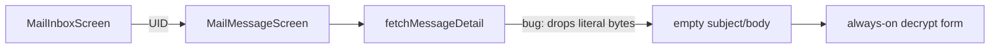

# Fix mobile mail message body loading

## Diagnosis

The inbox list works because it only fetches small headers. Opening a message calls [`fetchMessageDetail`](mobile/src/services/mail/imap.ts), which mishandles IMAP `BODY[] {n}` literals.

When the server responds:

```text
* 1 FETCH (UID 42 BODY[] {5432}
<5432 bytes of RFC822>
)
b3 OK ...
```

the current loop only appends lines that start with `* ` into `raw`, then — because it sees `BODY[] {n}` — uses that incomplete `raw` as the message source:

```129:145:mobile/src/services/mail/imap.ts
    while (true) {
      const line = await client.readLine();
      lines.push(line);
      if (line.startsWith(`${fetchTag} `)) { /* ... */ break; }
      if (line.startsWith('* ')) {
        raw += `${line}\n`;
      }
    }
    const bodyMatch = raw.match(/BODY\[\] \{(\d+)\}/);
    const source = bodyMatch ? raw : lines.join('\n');
```

Result: empty subject → `(no subject)`, empty body card (the blank white block in your screenshot), no EBP detection banner, and the always-visible “Identity password / Decrypt EBP body” chrome makes it look like decryption is the only path.



## Approach

### 1. Literal-aware IMAP body fetch (root fix)

In [`mobile/src/services/mail/tcpClient.ts`](mobile/src/services/mail/tcpClient.ts):

- Add `readBytes(n: number): Promise<string>` on `TcpLineClient` (consume exactly `n` bytes from the same buffer used by `readLine`, with the same timeout behavior).

In [`mobile/src/services/mail/imap.ts`](mobile/src/services/mail/imap.ts) `fetchMessageDetail`:

- After `UID FETCH … (BODY.PEEK[])`, read the response until the tagged OK.
- When a line ends with `BODY[] {n}` / `BODY.PEEK[] {n}`, call `readBytes(n)` and treat that blob as the RFC822 source.
- Also handle the uncommon quoted-string form `BODY[] "..."` for tiny messages.
- Parse subject/from/to/date and MIME/EBP from that RFC822 source only (not from the FETCH envelope line).
- Drop the broken `bodyMatch ? raw : lines.join('\n')` branch and the `\r\n\r\n`-only `extractBodyFromFetch` helper (MIME parsing already lives in [`mime.ts`](mobile/src/services/mail/mime.ts) and handles `\r?\n`).

### 2. Message screen UX (matches what you saw)

In [`mobile/src/screens/mail/MailMessageScreen.tsx`](mobile/src/screens/mail/MailMessageScreen.tsx):

- Add loading / error status while `fetchMessageDetail` runs (today failures only set status; success-with-empty looks identical to “still loading”).
- Keep `ebpPayload` (or a boolean) in state.
- Show subject + plaintext/HTML body when present.
- Show decrypt only when an EBP payload was found: tap **Decrypt** → [`useSecretPrompt`](mobile/src/hooks/useSecretPrompt.tsx) modal (same pattern as crypto screens / mail PIN), then `decryptMailBody`.
- Remove the permanent inline identity-password `TextField`.

### 3. Lightweight regression coverage

Add a pure helper test (e.g. under `mobile/` or existing Deno/Jest mail tests if present) that feeds a synthetic FETCH transcript with a `{n}` literal and asserts subject/body/EBP extraction — so the “drop everything after `* `” bug cannot return unnoticed.

## Out of scope

- Attachment decrypt (GUI has it; not needed to fix open-message loading)
- Changing IMAP auth / account unlock
- Wiki updates unless you ask after the fix lands

## Acceptance

- Opening an inbox row shows the real subject and body for plaintext mail.
- EBP mail shows a clear “encrypted” state and decrypts via password modal into readable plaintext.
- No empty password field on every message detail screen.