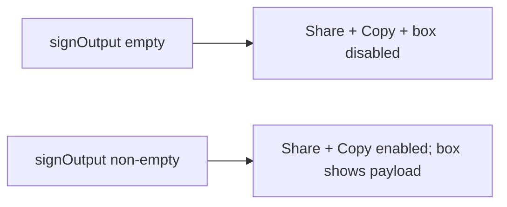

# Gate share/copy until output exists

## Problem

On [SignMessageScreen.tsx](mobile/src/screens/crypto/SignMessageScreen.tsx), Share Output stays tappable (silent no-op when empty), Copy always works (can copy `''`), and the output field looks active even before signing. The same pattern exists on Sign File / Encrypt Message / Encrypt File. [AppButton](mobile/src/components/AppButton.tsx) disabled styling is only `opacity: 0.55`, which is easy to miss.

## Approach

Treat “has output” (`Boolean(outputString)`) as the gate — for Sign Message that means “message has been signed.” Apply the same gate on every crypto screen that has Share Output + `CopyableOutput`, and strengthen disabled button visuals in `AppButton` so all screens benefit.

## 1. Stronger disabled look on `AppButton`

In [mobile/src/components/AppButton.tsx](mobile/src/components/AppButton.tsx):

- Replace opacity-only `disabled` with a clearer treatment:
  - Background → `colors.segmentTrack` (or similar muted fill)
  - Border → `colors.border` (secondary)
  - Label → `colors.muted` for all variants when disabled
  - Keep a modest opacity reduction if needed, but do not rely on opacity alone
- Apply muted label styles when `isDisabled` so primary/danger do not keep bright white/accent text on a faded button

This covers Share Output once it uses `disabled={!output}` and every other disabled `AppButton` in the app.

## 2. Disable Copy + mute output box in `CopyableOutput`

In [mobile/src/components/CopyableOutput.tsx](mobile/src/components/CopyableOutput.tsx):

- Derive `hasValue = value.trim().length > 0` (or simply `Boolean(value)`)
- Swap RN `Button` for `AppButton` (`variant="secondary"`) with `disabled={!hasValue}` so Copy matches app button styling and the new disabled look
- Style the read-only `TextInput` when empty: muted background (`colors.page`), muted border/text/placeholder; when filled, keep current readable contrast (align colors with [tokens.ts](mobile/src/theme/tokens.ts))
- Only call `Clipboard.setString` when `hasValue`

No new prop required unless a screen needs to force-disable with content present; empty value is the correct signal for “not ready yet.”

## 3. Wire Share Output `disabled` on crypto screens

Pass `disabled={!output}` and drop the inner `if (output)` guard (disabled prevents press) on:

- [SignMessageScreen.tsx](mobile/src/screens/crypto/SignMessageScreen.tsx) — `signOutput`
- [SignFileScreen.tsx](mobile/src/screens/crypto/SignFileScreen.tsx) — `fileSignOutput`
- [EncryptMessageScreen.tsx](mobile/src/screens/crypto/EncryptMessageScreen.tsx) — `encryptOutput`
- [EncryptFileScreen.tsx](mobile/src/screens/crypto/EncryptFileScreen.tsx) — `encryptFileOutput`

`CopyableOutput` consumers with no Share button (Decrypt/Verify) automatically get the empty-state disabled Copy + muted box from step 2.

## Out of scope

- Clearing output when the user edits the message after signing
- Changing signing/encryption services
- Non-crypto screens that use `AppButton` beyond inheriting the clearer disabled style
