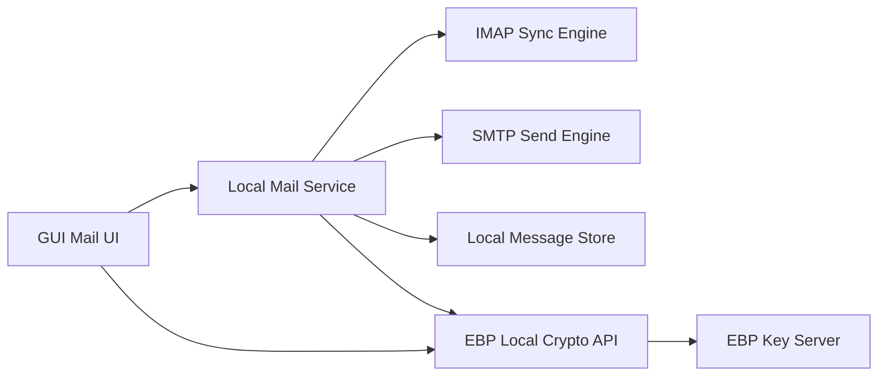

# Plan: Native GUI Email Client (Generic IMAP/SMTP)

## What We Can Reuse vs. What Is Missing

- Reuse from automated verification email in [`/home/william/projects/even-better-privacy/server/main.ts`](/home/william/projects/even-better-privacy/server/main.ts): SMTP transport/env pattern and send error handling (`SMTP_*`, `sendMail`) as a **sending primitive**.
- Reuse from local crypto backend in [`/home/william/projects/even-better-privacy/gui/local-backend/main.ts`](/home/william/projects/even-better-privacy/gui/local-backend/main.ts): `/api/v1/encrypt`, `/api/v1/decrypt`, `/api/v1/sign`, `/api/v1/verify`, contacts/identity context.
- Reuse UX behavior from extension in [`/home/william/projects/even-better-privacy/email/chrome-extension/content.js`](/home/william/projects/even-better-privacy/email/chrome-extension/content.js) and [`/home/william/projects/even-better-privacy/email/chrome-extension/background.js`](/home/william/projects/even-better-privacy/email/chrome-extension/background.js): payload marker conventions, recipient checks, sign/encrypt/decrypt flows.
- Missing for a real client: IMAP mailbox sync, MIME parsing, local message index/storage, folders/flags/search, account auth lifecycle, draft/send queue, and attachment handling.

## Recommended Architecture (v1)

## Implementation Phases

1. **Mail account foundation**

   - Add account settings model (host, port, tls mode, username, auth type, sent folder, polling interval).
   - Store secrets in OS keychain/Tauri secure storage; keep only non-secret metadata in app config.

2. **Inbound sync (IMAP)**

   - Build folder discovery + incremental sync (UID-based) + unseen/read/flag updates.
   - Parse MIME into normalized message model (headers/plain/html/attachments).
   - Persist mailbox data in a local DB for fast list/search.

3. **Outbound send (SMTP)**

   - Build compose->MIME->SMTP pipeline; start by adapting transport config patterns from server email verification code.
   - Add retry queue and delivery state (queued/sent/failed).

4. **EBP integration inside compose/read**

   - Compose: recipient resolve via contacts, optional sign, sign+encrypt payload insertion (same payload markers as extension).
   - Read: detect EBP payload markers, decrypt/verify action, signer/contact validation.

5. **GUI screens**

   - Accounts screen, mailbox list, message view, compose modal/page, and attachment controls.
   - Add trust indicators (verified signer, sender-email/contact match) similar to extension behavior.

6. **Security, resilience, and tests**

   - Redact logs, limit plaintext exposure, and lock down localhost API access.
   - Add unit/integration tests for MIME parsing, IMAP delta sync, SMTP send failure/retry, and EBP decrypt/verify outcomes.

## Key Design Decisions

- Use existing verification-email SMTP approach only as a template for transport setup, **not** as the core architecture.
- Keep cryptographic operations in the existing local backend endpoints to avoid duplicating security-sensitive logic.
- Use provider-agnostic IMAP/SMTP first; add provider-specific enhancements later (OAuth, labels, APIs).

## Initial Deliverables (First Milestone)

- One-account generic IMAP/SMTP support with Inbox listing and basic message open.
- Compose/send plaintext + optional EBP sign/encrypt payload insertion.
- Decrypt/verify action for inbound EBP payload blocks.
- Minimal tests covering sync/send/crypto roundtrips.