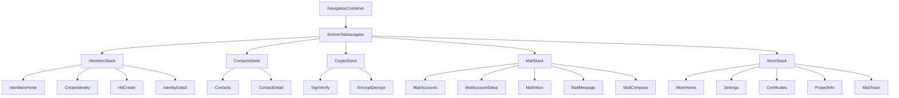

# Implement EBP Mobile Design

Match [`ebp_mobile_design.html`](ebp_mobile_design.html) in the real app under [`mobile/`](mobile/). Preserve existing services and screen logic; change navigation structure and presentation.

## Architecture

- Add dependency `@react-navigation/bottom-tabs` (peer deps already present: `@react-navigation/native`, `react-native-screens`, `react-native-safe-area-context`).
- Replace flat stack in [`mobile/src/navigation/AppNavigator.tsx`](mobile/src/navigation/AppNavigator.tsx) with tab + nested stacks.
- Remove hub-and-spoke `Home` route; rename/repurpose [`HomeScreen.tsx`](mobile/src/screens/HomeScreen.tsx) → `IdentitiesHomeScreen` (identity list + Create / EBP-HD only).
- Add [`MoreScreen.tsx`](mobile/src/screens/MoreScreen.tsx) as the More tab root (menu rows into Settings, Certificates, Project Info, Activity Log section of settings, Core self-test, Mail trace).

## Design system (new)

Create [`mobile/src/theme/tokens.ts`](mobile/src/theme/tokens.ts):

- Accent `#1a5fb4`, soft `#e8f0fa`, text `#111`, muted `#666`, border `#e8e8e8`, page `#f4f5f7`, danger `#d11a2a`, success `#1a7f37`
- Shared spacing / radius (10)

Shared components under `mobile/src/components/` (Pressable-based; stop using stock RN `Button` on restyled screens):

| Component | Role |
|-----------|------|
| `AppButton` | primary / secondary / danger; optional inline spinner + disabled |
| `TextField` | labeled field wrapping `TextInput` |
| `ListRow` | avatar / title / subtitle / badge / chevron |
| `Chip` | current-identity (and similar) chip |
| `SegmentedControl` | Crypto Sign↔Encrypt; mail Manual↔OAuth |
| `SectionTitle` | uppercase section labels |
| `InlineBusy` | list-region spinner + message |
| `Screen` | SafeArea + page background padding helper |

Update existing:

- [`BusyOverlay.tsx`](mobile/src/components/BusyOverlay.tsx) — keep API; ensure accent from tokens
- [`StatusBanner.tsx`](mobile/src/components/StatusBanner.tsx) — align colors with mockup (info/success/error)

Navigation theme + default header styles use the same tokens (white headers, accent tint for back where applicable).

## Loading rules (apply everywhere)

| Duration / kind | Pattern |
|-----------------|--------|
| Crypto, publish, sync, mail unlock, connection test | `BusyOverlay` |
| List/directory fetch (inbox, browse server) | `InlineBusy` in content area |
| Short form save (settings URL, create button) | `AppButton` spinner label (`Saving…` / `Creating…`) |

Wire `BusyOverlay` into Encrypt/Decrypt, Identity publish, Contact sync, Mail account test, HD create — not only Sign/Verify + mail unlock.

Replace raw status `<Text>` with `StatusBanner` (`kind` from success vs error heuristics where easy; otherwise `info`).

## Screen work (by tab)

**Identities** — Restyle list (chip, server/protocol meta, Create + EBP-HD, `ListRow`s); empty state; Create / HD / Detail layouts and action grouping per mockup (primary Publish, secondary Export/Import, danger Revoke).

**Contacts** — Search field chrome, Fetch / Browse actions, list rows; detail with Sync busy overlay.

**Crypto** — Both [`SignVerifyScreen`](mobile/src/screens/SignVerifyScreen.tsx) and [`EncryptDecryptScreen`](mobile/src/screens/EncryptDecryptScreen.tsx) get a top `SegmentedControl` that `navigate`s between them within `CryptoStack` (no logic merge required). Add BusyOverlay to encrypt/decrypt ops.

**Mail** — Restyle accounts / setup / inbox / message / compose; inbox loading uses `InlineBusy`; unlock keeps BusyOverlay; compose keeps [`RecipientResolveModal`](mobile/src/components/RecipientResolveModal.tsx) (restyle to match sheet look where practical).

**More** — New hub list; move Core self-test + Mail Trace off Identities home into Developer section; Settings content stays in [`SettingsScreen`](mobile/src/screens/SettingsScreen.tsx) pushed from More.

## Typing / call-site updates

- Redefine param lists: `RootTabParamList` + per-stack lists; screens use `NativeStackScreenProps` for their stack.
- Cross-tab navigation (rare today) via `navigation.navigate('MailTab', { screen: 'MailInbox' })` if needed later; Identities create still `replace`s to `IdentityDetail` within Identities stack.
- Update any typed navigate calls; grep for `'Home'`, `'Settings'`, etc.

## Out of scope

- Pixel-perfect icons (use simple text/glyph tab icons matching the mockup’s lightweight style, or Ionicons only if already easy without new native deps — prefer Unicode/simple View icons to avoid new packages).
- Dark mode.
- Changing crypto/mail service behavior beyond UI busy/error presentation.
- Wiki updates (unless you ask).

## Verification

- `cd mobile && npx tsc --noEmit` (or project lint) after navigator rewiring.
- `npm test` for existing App render smoke test; adjust if navigator mount needs a NavigationContainer mock.
- Manual checklist: each tab root visible; push/pop within stacks; BusyOverlay on Sign + Encrypt + Publish + Unlock; inbox shows inline spinner while loading.
