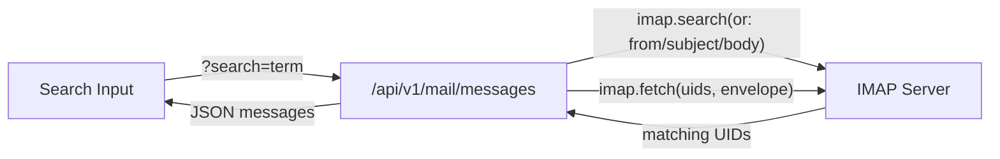

# Inbox Search Feature

Three files need changes: the backend API endpoint, the frontend JS logic, and the HTML form.

## Architecture

When a `search` query parameter is provided, the backend uses ImapFlow's `imap.search()` with an `or` clause to find messages matching the substring in `from`, `subject`, or `body`. It then fetches envelope metadata for the matching UIDs. When no search term is given, behavior is unchanged.



## 1. Backend: Add IMAP SEARCH to `/api/v1/mail/messages`

In [gui/local-backend/main.ts](gui/local-backend/main.ts) (the handler starting at ~line 1039):

- Read a new optional `search` query parameter (sanitized via `toSafeString`).
- **When `search` is provided**: use `imap.search({ or: [{ from: search }, { subject: search }, { body: search }] }, { uid: true }) `to get matching UIDs. Slice to `limit`, then `imap.fetch()` those UIDs with `{ uid: true }` option to fetch by UID. Return results in the same format.
- **When `search` is empty/absent**: keep the existing sequence-range-based fetch (no behavior change).

Key snippet of the new branch:

```typescript
const searchQuery = toSafeString(url.searchParams.get("search"), 256) || "";
// ... inside withMailboxLock:
if (searchQuery) {
  const uids = await imap.search(
    { or: [{ from: searchQuery }, { subject: searchQuery }, { body: searchQuery }] },
    { uid: true },
  );
  if (!uids || uids.length === 0) return json({ accountId: resolved.account.id, folder, messages: [] });
  const uidSlice = uids.slice(-limit);
  for await (const msg of imap.fetch(uidSlice.join(","), { uid: true, envelope: true, internalDate: true, flags: true, size: true }, { uid: true })) {
    // ... same result-building as existing code
  }
}
```

## 2. Frontend HTML: Add search input to inbox form

In [gui/index.html](gui/index.html) (~line 2215), add a `Search` text input (`id="mail-search"`) to the existing `mail-inbox-form`, before the Refresh button.

## 3. Frontend JS: Pass search param in API call

In [gui/app.js](gui/app.js) (~line 2162), read the value of `#mail-search` and append `&search=...` to the `/mail/messages` API call when non-empty.

## 4. E2E test

Add a lightweight mock-based test in [gui/e2e/mail.spec.ts](gui/e2e/mail.spec.ts) that verifies typing into the search input and submitting the form passes the `search` query parameter to the API and filters the displayed message list accordingly (similar to the existing mock-route pattern at ~line 345).