# Mail Message Load Reliability

Diagnosis is in [[analysis-mail-message-load-hang]]: the inbox list does a cheap envelope-only IMAP fetch, but selecting a message runs an unbounded chain (OAuth refresh, IMAP connect, mailbox lock, full source `fetchOne`, `simpleParser`, attachment mapping) with no per-step timeout, no frontend abort, and a 5-minute IMAP socket timeout. Since latency does not correlate with email size, we cannot guess which sub-step stalls; the plan must instrument first, then bound and cancel.

## Flow we are fixing

```mermaid
flowchart LR
    Click["User clicks message"] --> Frontend["mail.js click handler"]
    Frontend -->|"GET /mail/message"| Backend["routes.ts /api/v1/mail/message"]
    Backend --> Resolve["resolveMailAccount + OAuth refresh"]
    Resolve --> Connect["withImapReconnect: imap.connect"]
    Connect --> Lock["withMailboxLock(INBOX, readOnly)"]
    Lock --> Fetch["imap.fetchOne(uid, source: true)"]
    Fetch --> Parse["simpleParser(one.source)"]
    Parse --> Attach["map MIME attachments + EBP payloads"]
    Attach --> Render["JSON response, render in UI"]
```

Today every arrow can stall silently and the frontend has no abort path.

## Phase 1 - Instrument timings (diagnose root cause)

Goal: produce a single per-request timing line so we know which sub-step is slow.

- In [gui/local-backend/routes.ts](gui/local-backend/routes.ts) at the `GET /api/v1/mail/message` handler (around L730-L807), wrap each sub-step in `performance.now()` markers and emit one structured `console.warn` line at the end and on error: `mail/message uid=... resolveMs=... oauthMs=... connectMs=... lockMs=... fetchMs=... parseMs=... attachMs=... totalMs=... bytes=...`.
- Add the same wrapper to `GET /api/v1/mail/messages` (L649-L728) so we have a baseline for "list works fine" timings.
- Surface the same `totalMs` and `bytes` in the JSON response (e.g. `_timing`) so the frontend can log it for the user.
- No behavior change yet; just data.

## Phase 2 - Cancel and time-out the frontend request

Goal: stop "never loads" from being silent. New click cancels old fetch; timed-out fetches show a clear retry state.

- Extend `api(path, init)` in [gui/js/ui.js](gui/js/ui.js) (L58) to accept an external `AbortSignal` and forward it to `fetch`. Map `AbortError` to a friendly `Error("request aborted")`.
- Add a module-level `let mailMessageAbortController = null;` to [gui/js/mail.js](gui/js/mail.js).
- In the click handler around L608-L640: abort the previous controller, create a new one, pass `signal` to `api(...)`, and start a 30s frontend timeout that aborts the controller and shows `setStatus("Loading message timed out, click again to retry", "error")`.
- Also abort on folder change, account change, and `loadMailMessages` refresh.
- Keep the existing `mailMessageLoadRequestId` stale-response guard.

## Phase 3 - Bound the backend per step

Goal: even if a provider stalls, the request returns within a known budget.

- In [gui/local-backend/mail-imap.ts](gui/local-backend/mail-imap.ts), add a small `withTimeout(promise, ms, label)` helper that races against `setTimeout` and rejects with `HttpError(STATUS.BadGateway, "mail step timed out: <label>")`.
- In [gui/local-backend/routes.ts](gui/local-backend/routes.ts) `/api/v1/mail/message` handler, wrap each step with named timeouts: `connect` ~10s, `lock` ~10s, `fetchOne(source)` ~25s, `simpleParser` ~10s. Total budget ~60s, well under the current 300s `socketTimeout`.
- Keep `withImapReconnect`'s single retry-on-`NoConnection`, but only retry once per request to avoid doubling the wallclock budget.
- On timeout, ensure `safeImapDisconnect` still runs (already in the `finally` of `withImapReconnect`).

## Phase 4 - Defer attachment payload work

Goal: the body should render immediately; attachment-only stalls should not block the message reader.

- Today the handler eagerly decodes every `application/ebp-encrypted-attachment+json` attachment's content (L770-L801). Replace this with a metadata-only summary (`filename`, `contentType`, `size`, `index`, `isEbpEncryptedAttachment`).
- Add a new endpoint `GET /api/v1/mail/message/attachment?accountId=...&folder=...&uid=...&index=...` that fetches and parses just that attachment on demand using `imap.fetchOne(uid, { bodyParts: ["..."] }, { uid: true })` or, as a simpler first cut, parses the same MIME source but only returns the requested index.
- Update [gui/js/mail.js](gui/js/mail.js) `renderMailReaderAttachments` (L441-L530) to call the new endpoint when the user clicks Decrypt, and to lazily fetch the `ebpPayload` for that attachment.
- Update [wiki/message-payload-formats.md](wiki/message-payload-formats.md) (around L168) and [wiki/component-gui.md](wiki/component-gui.md) (Native Email section) to reflect the deferred attachment fetch path.

## Phase 5 - Tests and wiki update

- Extend the mocked routes in [gui/e2e/mail.spec.ts](gui/e2e/mail.spec.ts) (around L437-L466) with a "delayed `/mail/message`" mock to exercise the new abort + timeout path: rapid second click cancels the first; a stalled request triggers the timeout toast.
- Add a backend handler test in [gui/local-backend/tests/test_handler.ts](gui/local-backend/tests/test_handler.ts) that drives the timeout helper for a fake `fetchOne` that never resolves.
- Update [wiki/analysis-mail-message-load-hang.md](wiki/analysis-mail-message-load-hang.md) "Likely Fix Direction" section into a "Resolution" section once Phases 2-4 land, and append an entry to [wiki/log.md](wiki/log.md).

## Sequencing

Phase 1 ships standalone and is safe; the user reproduces the issue once with timing logs in hand. Phases 2 and 3 can land together for the user-visible reliability win. Phase 4 is the actual performance optimization for messages with heavy attachments. Phase 5 ties it back to the wiki.