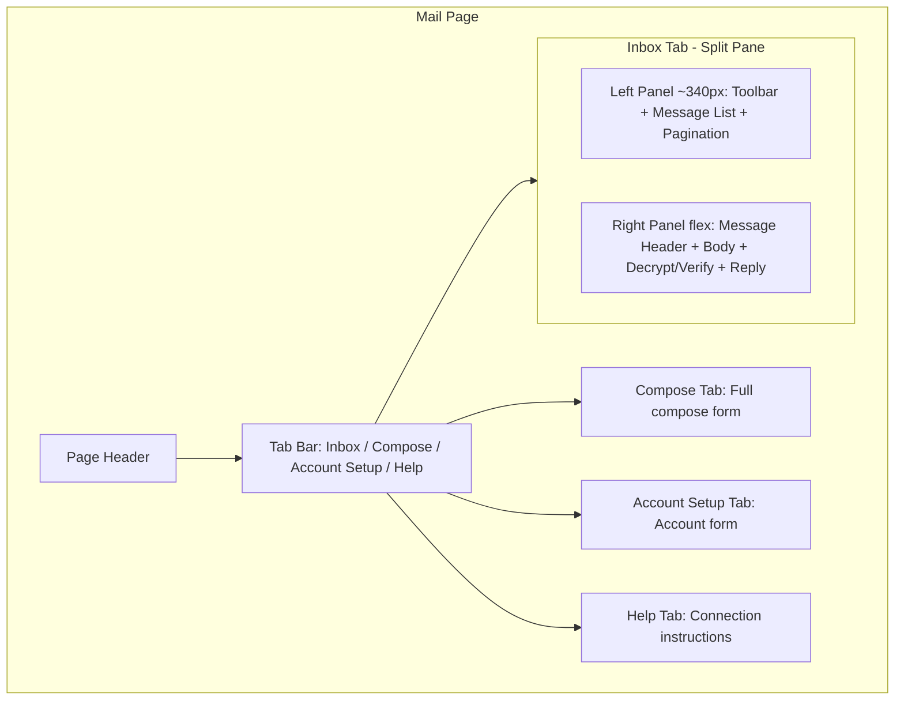

# Mail Page UX Redesign

## Current State

The mail page in [`gui/index.html`](gui/index.html) stacks four large sections vertically: Account Setup, Inbox list, Message Reader, and Compose. Users must scroll between sections constantly -- especially painful when reading messages while referencing the inbox list.

## Architecture

All changes are confined to two files: [`gui/index.html`](gui/index.html) (HTML structure + CSS) and [`gui/app.js`](gui/app.js) (mail JS logic). Every existing element ID (e.g. `#mail-message-list`, `#mail-compose-to`, `#mail-account-select`) and button text (e.g. "Send Email", "Save Mail Account") will be preserved so all e2e tests in [`gui/e2e/mail.spec.ts`](gui/e2e/mail.spec.ts) continue passing.

## New Layout

## Detailed Changes

### 1. Tabbed sub-navigation (HTML + CSS + JS)

Add a tab bar below the mail page header with four tabs: **Inbox** (default), **Compose**, **Account Setup**, and **Help**. Each tab toggles visibility of its content panel. CSS will style tabs to match the app's dark theme with an active accent underline.

### 2. Split-pane Inbox tab (HTML + CSS)

Restructure the Inbox tab into a side-by-side flex layout:

- **Left panel** (~340px fixed width, scrollable): contains the folder/search toolbar (`#mail-inbox-form`), message list (`#mail-message-list`), and pagination (`#mail-pagination`)
- **Right panel** (flex: 1): contains the message reader (`#mail-message-body-wrap`, `#mail-message-html-wrap`, `#mail-message-loading`), decrypt/verify controls (`#mail-decrypt-btn`, `#mail-verify-result`, etc.), and a new **Reply** button
- On screens narrower than 900px, collapse to stacked layout

### 3. Enhanced message list items (JS + CSS)

- **Unread indicator**: bold subject + colored left-border accent for unread (not `seen`) messages
- **Cleaner layout**: remove UID display and inline size from the visible list; show From, Subject, and a relative date (e.g. "2h ago", "Yesterday")
- **Better selected state**: more pronounced accent border + subtle background

### 4. Message reader header bar (HTML + JS)

When a message is selected, render a styled header area above the body showing: Subject, From, To, and Date -- drawn from `state.selectedMailMessage`. This replaces the current bare textarea approach with a more email-client-like reading experience.

### 5. Reply button (JS)

Add a "Reply" button in the reader panel. Clicking it:

- Switches to the Compose tab
- Pre-fills `#mail-compose-to` with the sender's address
- Pre-fills `#mail-compose-subject` with "Re: {original subject}"
- Focuses the body textarea

### 6. Folder dropdown (HTML + JS)

Replace the freetext `#mail-folder` input with a `<select>` dropdown containing common folders (INBOX, Sent, Drafts, Trash, Spam) plus a "Custom..." option that reveals an input for arbitrary folder names. The element keeps its ID for compatibility.

### 7. CSS polish

- Tab bar styles with active underline indicator
- Split-pane styles with a subtle divider between panels
- Smooth transitions for tab switching (fade)
- Message list scroll area with max-height
- Responsive collapse at narrower breakpoints
- Empty-state styling for the reader panel ("Select a message to read it")

### E2E Compatibility

All existing element IDs, button text, `aria-expanded` behavior on collapsible sections, and the `#mail-inbox-form button[type='submit'] `selector are preserved. The `expandMailSection` helper in the e2e tests uses `page.getByRole("button", { name: sectionTitle })` -- we will ensure the Account Setup and Compose section headings remain accessible buttons (via the existing `makeSectionCollapsible` mechanism or equivalent tab buttons).