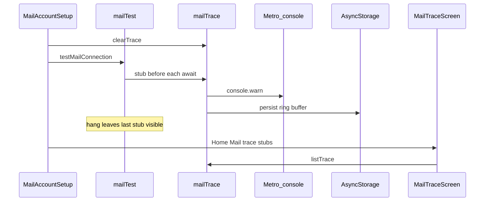

# Mail connection trace stubs

## Problem

[`connectTlsLineClient`](mobile/src/services/mail/tcpClient.ts) only times out the TCP connect (~30s). After connect, `readLine()` waits forever, so **Test IMAP + SMTP** can sit on `Testing…` with no status. You already use 993/465 + TLS, so we need instrumentation to see the last successful step (connect vs greeting vs LOGIN vs SELECT vs SMTP AUTH).

Metro **does** receive React Native `console.log` / `console.warn` when the device/emulator is attached to the bundler. That alone is not enough if you leave the hung screen or miss the terminal scrollback, so stubs will also be kept in-app.

## Approach

### 1. New service: `mobile/src/services/mail/mailTrace.ts`

- Ring buffer (e.g. last **200** entries) with `{ at, seq, stub, detail? }`.
- `clearMailTrace()`, `mailStub(stub: string, detail?: string)`, `listMailTrace()`.
- Each `mailStub`:
  - Push to an **in-memory** array immediately (so a hung JS await still leaves prior stubs readable).
  - `console.warn('[ebp-mail]', seq, stub, detail)` for Metro.
  - Fire-and-forget persist to AsyncStorage key `ebp.mobile.mailTrace` (await the write inside `mailStub` so a hard kill still keeps the last completed stub when practical).
- Do **not** put passwords/tokens in `detail` (host, port, authType, line prefixes / error messages only).

### 2. Instrument the mail path (stubs before every blocking await)

| Stub id | Where |
|---------|--------|
| `test.start` / `test.imap.start` / `test.smtp.start` / `test.done` | [`mailTest.ts`](mobile/src/services/mail/mailTest.ts) |
| `tcp.connect.start` / `tcp.connect.ok` / `tcp.connect.timeout` / `tcp.connect.error` | [`tcpClient.ts`](mobile/src/services/mail/tcpClient.ts) (include host:port) |
| `tcp.readLine.wait` / `tcp.readLine.ok` | wrap or call from higher layers carefully — prefer tagging at protocol steps to avoid noise |
| `imap.greeting.wait` / `imap.greeting.ok` / `imap.login.wait` / `imap.login.ok` / `imap.select.wait` / `imap.select.ok` | [`imap.ts`](mobile/src/services/mail/imap.ts) auth + [`mailTest.ts`](mobile/src/services/mail/mailTest.ts) SELECT |
| `smtp.greeting.wait` / `smtp.greeting.ok` / `smtp.ehlo.wait` / `smtp.auth.wait` / `smtp.auth.ok` | [`smtp.ts`](mobile/src/services/mail/smtp.ts) |

Clear the trace at the start of `onTest` in [`MailAccountSetupScreen.tsx`](mobile/src/screens/mail/MailAccountSetupScreen.tsx), and emit `test.error` with the message in `catch`.

Also stub `listInboxMessages` / `sendMimeMessage` entry points lightly so inbox/send hangs share the same viewer (same last-stub workflow).

### 3. Viewer UI from Home

- Add route `MailTrace` to [`AppNavigator.tsx`](mobile/src/navigation/AppNavigator.tsx).
- New screen [`MailTraceScreen.tsx`](mobile/src/screens/mail/MailTraceScreen.tsx): FlatList of stubs (newest first), timestamps, **Clear** button, auto-refresh on focus.
- On [`HomeScreen.tsx`](mobile/src/screens/HomeScreen.tsx): button **Mail trace stubs** next to the existing self-test / Mail row.

While Test is hung you can still use the stack back gesture to leave setup, open Home → Mail trace stubs, and read the **last stub** (in-memory + persisted).

### 4. Docs (minimal)

One short subsection in [`mobile/MAIL.md`](mobile/MAIL.md): how to use stubs + that Metro shows `[ebp-mail]` lines.

## Out of scope (follow-up)

Per-`readLine` / overall test timeouts and STARTTLS support are still the real reliability fixes; this plan only makes the hang **locatable**. After you report the last stub id, we can fix that step next.

## How you’ll use it

1. Open Mail account setup → **Test IMAP + SMTP**.
2. If it hangs, go back → Home → **Mail trace stubs**.
3. Note the last line (e.g. `imap.greeting.wait` vs `tcp.connect.start`).
4. Optionally watch Metro for the same `[ebp-mail]` stream live.
