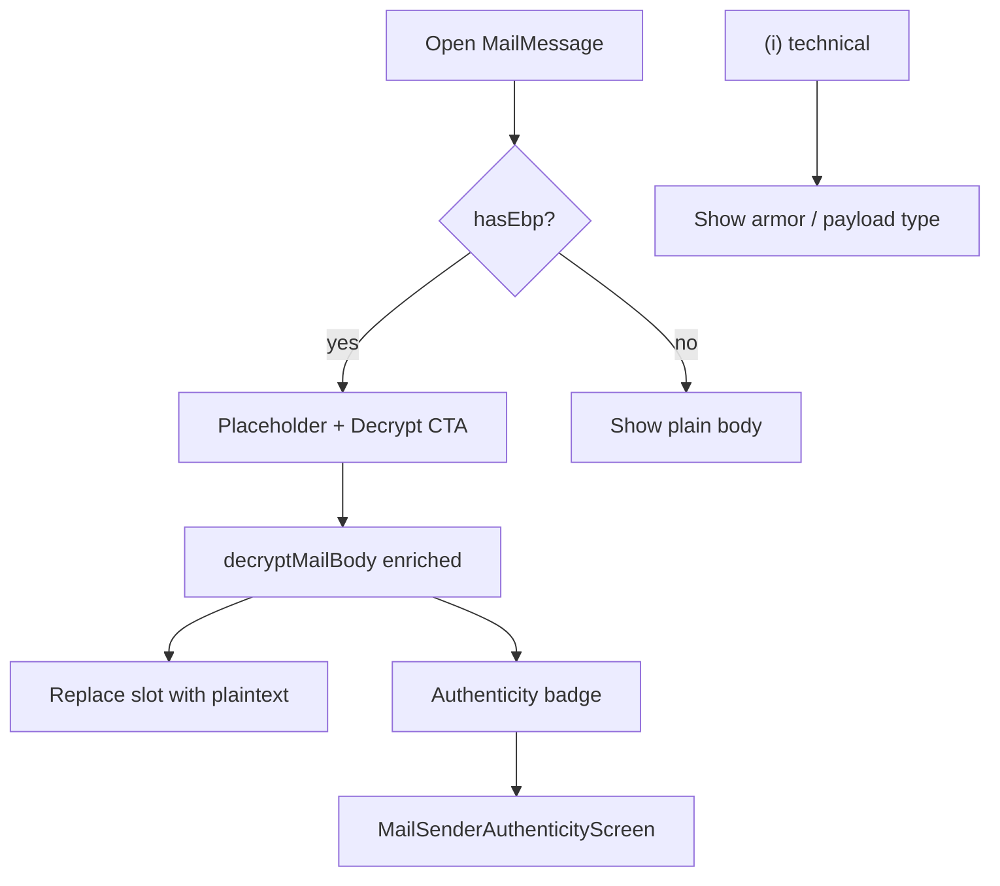

# Mobile mail authenticity UX + opaque email endorsement

## Scope decisions (locked in)

- **Opaque endorsement:** server `verify-email` + GUI/mobile identity “verify” UX. No auto-send on opaque attach (clients only push hashes). No CLI in this pass.
- **Mail reader:** [[component-mobile]] only. GUI mail reader redesign is out of scope (GUI already has verify meta on decrypt).
- **Auth indicator:** one tappable badge after decrypt (worst-of signature/From for color); full three-dimension summary on a dedicated screen. Wire ciphertext stays behind a separate **(i)** control.
- **Endorsement green:** `detailsMeta.email.verified` **or** `detailsMeta["opaque::email"].verified` when that path is what matched From.

## Phase 1 — Opaque `opaque::email` endorsement

### Server

Update [`server/verify-email.ts`](server/verify-email.ts):

- Accept optional `path` in request body (`"email"` default; allow `"opaque::email"` only).
- **email:** keep current equality against stored cleartext; send to `record.detail`.
- **opaque::email:** `getDetailRecord(..., "opaque::email")`; require `sha256Hex(providedDetail) === record.detail` (import from [`core/MessageHash.ts`](core/MessageHash.ts)); send mail **to `providedDetail`**; write verification token with `path: "opaque::email"`; **never** overwrite detail value with cleartext.
- Confirm: allow `path === "email" || path === "opaque::email"`.
- Leave [`server/handlers/identity.ts`](server/handlers/identity.ts) auto-send email-only; optionally fix its legacy `?token=` link to `#token=` for cleartext attach consistency (small related fix).

### Tests

Extend [`server/tests/main_handlers_test.ts`](server/tests/main_handlers_test.ts):

- Opaque happy path: attach hashed `opaque::email` → `POST /verify-email/request` with cleartext + `path` → confirm → `detailsMeta["opaque::email"].verified === true`, detail column still hash.
- Hash mismatch → 409; wrong path rejected.

### Clients

- [`gui/local-backend/routes.ts`](gui/local-backend/routes.ts): forward optional `path` on verify-email/request proxy.
- [`gui/js/render.js`](gui/js/render.js): for `opaque::email`, show verify when not verified; prompt for cleartext (or use resolved value) and send `{ fingerprint, detail: cleartext, path: "opaque::email" }`. Show verified marker from `detailsMeta["opaque::email"]`.
- [`mobile/src/services/contacts.ts`](mobile/src/services/contacts.ts): `requestVerifyEmail` accepts optional `path`.
- [`mobile/src/screens/IdentityDetailScreen.tsx`](mobile/src/screens/IdentityDetailScreen.tsx): stop sending the stored hash for opaque; prompt/use cleartext; pass `path: "opaque::email"`. If mobile can attach opaque details without hashing, hash on attach like GUI/CLI.

### Wiki (after Phase 1)

- Mark opaque endorsement as implemented in [[analysis-opaque-detail-endorsement]], [[overview]] upcoming bullet, [[identity-model]], [[component-server]]; append [[wiki/log.md]].

## Phase 2 — Mobile locked mail reader

Rewrite layout in [`mobile/src/screens/mail/MailMessageScreen.tsx`](mobile/src/screens/mail/MailMessageScreen.tsx):

- Capture `from` (and date if available) from `fetchMessageDetail`.
- When `hasEbp && !decrypted`: subject/From → “Encrypted with EBP” → **Decrypt** above the fold → placeholder body (“This message is encrypted.”) → **(i)** for technical details (armor/`body` in a collapsed section or modal).
- When decrypted: subject/From + authenticity badge → plaintext in the **same** body slot (do not append under the button) → secondary “Decrypt again” if needed → **(i)** still available.

## Phase 3 — Enrich decrypt + authenticity surfaces

### Data path (mirror GUI `/decrypt` fields needed for mail)

Enrich [`mobile/src/services/encryptDecrypt.ts`](mobile/src/services/encryptDecrypt.ts) and [`mobile/src/services/mail/ebpMail.ts`](mobile/src/services/mail/ebpMail.ts) so `decryptMailBody` returns at least:

- `plaintext`, `verified`, `verifyStatus` (preserve core `valid_unbound`; do not collapse unsigned/`invalid`)
- `signerFingerprint`, contact name if known, `isKnownContact`
- Signer email claim(s): cleartext `email` and/or opaque match vs message From
- `signerEmailVerified` from `detailsMeta` for the **matched** path (`email` or `opaque::email`)
- `signerMatchesSenderEmail` (reuse compose matching: cleartext + `sha256Hex` / `resolvedOpaqueDetails` from [`contacts.ts`](mobile/src/services/contacts.ts))
- `serverIdentityMatch` when verifying via embedded identity and not a known contact (same fetch/compare pattern as GUI [`gui/local-backend/routes.ts`](gui/local-backend/routes.ts) decrypt)

Pass message From from `MailMessageScreen` into `decryptMailBody` for the From-binding check.

### UI

- Small `AuthenticityBadge` (or inline Pressable): color from signature (invalid red, unsigned grey, valid green) with amber when valid but From mismatch / claim unverified; tap navigates to authenticity screen.
- New [`mobile/src/screens/mail/MailSenderAuthenticityScreen.tsx`](mobile/src/screens/mail/MailSenderAuthenticityScreen.tsx) + register in [`AppNavigator.tsx`](mobile/src/navigation/AppNavigator.tsx) `MailStackParamList` with the authenticity summary params (or a short-lived in-memory store if params are large).
- Screen sections: Who signed; Email / opaque::email claims; Endorsement (`detailsMeta`); From vs claims; Signature result. Plain language first, fingerprints second.

### Tests / manual

- Mobile unit/helpers for From↔opaque hash match and badge status derivation if extracted to a pure module.
- Manual: encrypted signed mail → no ciphertext scroll; decrypt replaces body; badge opens summary; opaque-endorsed identity shows endorsement after Phase 1.

## Phase 4 — Wiki close-out for mail UX

Update [[analysis-mobile-encrypted-mail-reader-ux]] with implemented status; [[wiki/index.md]] / [[wiki/log.md]] entries for the ship.

## Out of scope

- GUI mail reader locked-ciphertext redesign
- CLI verify-email for opaque
- Auto verification email on opaque detail attach
- Biometric / session unlock for decrypt
- Endorsement of opaque paths other than `opaque::email`
