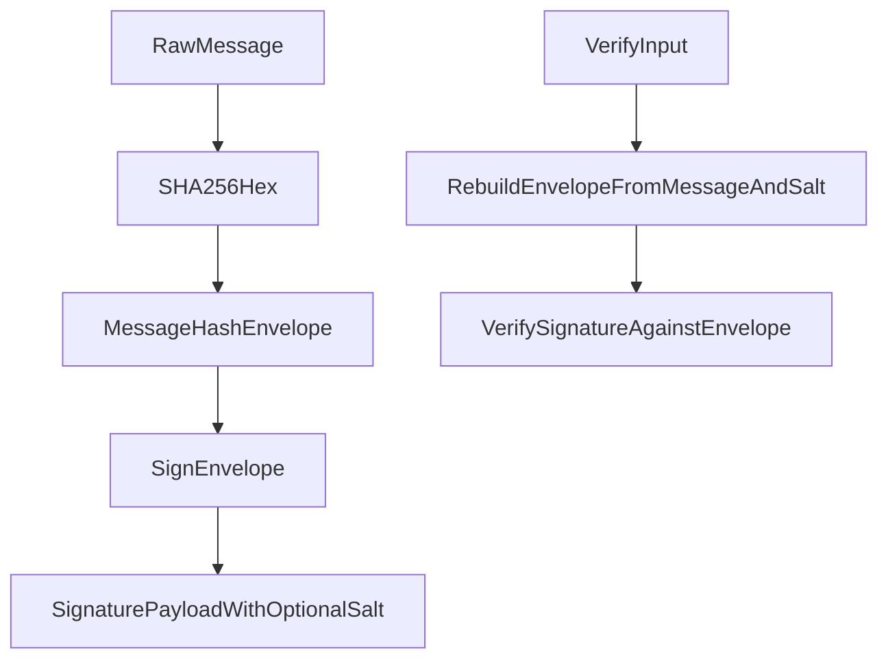

# Message Hash Signature Migration

## Goal

Switch all signing/verification flows in the repo from signing raw message payloads to signing a canonical hash envelope:

`ebp::messagehash::<sha256(message)>::<optional_salt>`

With your choices applied:

- Hard switch (no legacy verify support)
- Applies repo-wide, including internal state/detail/revocation signature flows

## Implementation Plan

1. **Create canonical hash-sign helpers in core**

   - Add shared helpers for:
     - `sha256Hex(message)`
     - `buildMessageHashEnvelope(messageHash, salt?)`
     - `signHashedMessage(message, salt?)`
     - `verifyHashedMessage(message, signature, salt?)`
   - Wire `Identity.signMessage`, `Identity.verifyMessage`, and `Identity.VerifySignature` to use the new hash-envelope semantics.
   - Primary file: [`/home/william/projects/even-better-privacy/core/Identity.ts`](/home/william/projects/even-better-privacy/core/Identity.ts)

2. **Propagate new semantics to all backend/API verification boundaries**

   - Update local GUI backend sign/verify handlers to emit and consume the new payload shape (including optional salt where appropriate).
   - Update public server verify parser to require new semantics and remove old-format fallback behavior.
   - Primary files:
     - [`/home/william/projects/even-better-privacy/gui/local-backend/main.ts`](/home/william/projects/even-better-privacy/gui/local-backend/main.ts)
     - [`/home/william/projects/even-better-privacy/server/main.ts`](/home/william/projects/even-better-privacy/server/main.ts)

3. **Update all client surfaces (GUI, website, CLI, extension)**

   - Ensure sign UIs/commands optionally generate salt and include it in payloads.
   - Ensure verify paths reconstruct exactly the hash-envelope string before verification.
   - Update text/placeholder/help copy to reflect hash-envelope signing, not raw-message signing.
   - Primary files:
     - [`/home/william/projects/even-better-privacy/gui/app.js`](/home/william/projects/even-better-privacy/gui/app.js)
     - [`/home/william/projects/even-better-privacy/gui/index.html`](/home/william/projects/even-better-privacy/gui/index.html)
     - [`/home/william/projects/even-better-privacy/website/verify.js`](/home/william/projects/even-better-privacy/website/verify.js)
     - [`/home/william/projects/even-better-privacy/website/verify.html`](/home/william/projects/even-better-privacy/website/verify.html)
     - [`/home/william/projects/even-better-privacy/cli/main.ts`](/home/william/projects/even-better-privacy/cli/main.ts)
     - [`/home/william/projects/even-better-privacy/email/chrome-extension/background.js`](/home/william/projects/even-better-privacy/email/chrome-extension/background.js)

4. **Migrate internal signing call sites (scope: all)**

   - Update internal signatures (state transitions, detail proofs, revocation certificates/verification paths) to hash-envelope signing and matching verification.
   - Validate all producer/consumer pairs use identical canonical envelope construction.
   - Key files to audit and patch:
     - [`/home/william/projects/even-better-privacy/core/Revocation.ts`](/home/william/projects/even-better-privacy/core/Revocation.ts)
     - [`/home/william/projects/even-better-privacy/server/revocation.ts`](/home/william/projects/even-better-privacy/server/revocation.ts)
     - [`/home/william/projects/even-better-privacy/main.ts`](/home/william/projects/even-better-privacy/main.ts)
     - [`/home/william/projects/even-better-privacy/scripts/generate_test_identities.ts`](/home/william/projects/even-better-privacy/scripts/generate_test_identities.ts)

5. **Update protocol payload schema + versions + tests/fixtures**

   - Add/rename fields as needed (`messageHash`, optional `salt`, etc.) and bump relevant format versions.
   - Rewrite tests to assert hard-switch behavior (old payloads invalid).
   - Primary files:
     - [`/home/william/projects/even-better-privacy/core/version.ts`](/home/william/projects/even-better-privacy/core/version.ts)
     - [`/home/william/projects/even-better-privacy/gui/local-backend/tests/main_test.ts`](/home/william/projects/even-better-privacy/gui/local-backend/tests/main_test.ts)
     - [`/home/william/projects/even-better-privacy/gui/local-backend/tests/test_handler.ts`](/home/william/projects/even-better-privacy/gui/local-backend/tests/test_handler.ts)
     - [`/home/william/projects/even-better-privacy/server/tests/main_handlers_test.ts`](/home/william/projects/even-better-privacy/server/tests/main_handlers_test.ts)
     - [`/home/william/projects/even-better-privacy/test/MessageExchange_test.ts`](/home/william/projects/even-better-privacy/test/MessageExchange_test.ts)
     - [`/home/william/projects/even-better-privacy/test/Identity_test.ts`](/home/william/projects/even-better-privacy/test/Identity_test.ts)

## Flow Impact Diagram

## Validation

- Run lint checks on all changed files.
- Run local-backend tests and server tests for signature/revocation/state transitions.
- Spot-test GUI + website verify flows for:
  - signed message
  - detached signature
  - signed file (already hash-based; ensure envelope consistency)
- Confirm old payload formats are rejected everywhere (hard-switch).