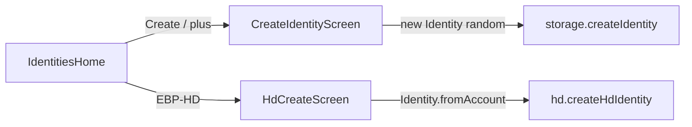
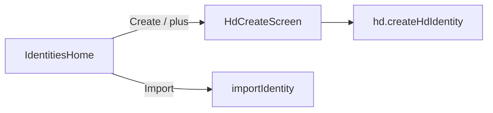

# Mnemonic-only mobile identity creation

## Goal

In the mobile app, users must create new identities only through the mnemonic (EBP-HD) flow. Remove the random-key `CreateIdentity` path.

## Current state

- Non-mnemonic: [`CreateIdentityScreen.tsx`](mobile/src/screens/CreateIdentityScreen.tsx) → [`storage.createIdentity`](mobile/src/services/storage.ts) (`new Identity(...)`, no seed)
- Mnemonic: [`HdCreateScreen.tsx`](mobile/src/screens/HdCreateScreen.tsx) → [`hd.createHdIdentity`](mobile/src/services/hd.ts)

## Approach

Fully delete the non-mnemonic screen/route and point every Create entry at `HdCreate`. Collapse the redundant **Create** + **EBP-HD** home actions into a single **Create** that opens the mnemonic flow. Keep **Import** (file restore of an existing identity is not random keygen).

After:

## Changes

### 1. Identities home entry points — [`IdentitiesHomeScreen.tsx`](mobile/src/screens/IdentitiesHomeScreen.tsx)

- Header `+`, **Create**, and empty-state **Create identity** → `navigation.navigate('HdCreate')`
- Remove the separate **EBP-HD** button and empty-state **Restore with EBP-HD** (same destination as Create; `HdCreate` already supports generate + paste/restore)
- Update empty-state copy to say identities are created from a mnemonic (and import remains available)

Resulting actions: **Create** | **Import** (two buttons, not three).

### 2. Navigation — [`AppNavigator.tsx`](mobile/src/navigation/AppNavigator.tsx)

- Remove `CreateIdentity` from `IdentitiesStackParamList`
- Unregister the `CreateIdentity` stack screen and drop its import
- Set `HdCreate` screen title to **Create Identity** (clearer than “EBP-HD” once it is the only create path)

### 3. Delete non-mnemonic UI

- Delete [`CreateIdentityScreen.tsx`](mobile/src/screens/CreateIdentityScreen.tsx)

### 4. Remove unused random-create API

- Remove `createIdentity` from [`storage.ts`](mobile/src/services/storage.ts) (only caller is the deleted screen; HD create already uses `persistIdentity`)
- Touch [`NATIVE_CRYPTO.md`](mobile/NATIVE_CRYPTO.md) only if it still lists `createIdentity` as a mobile entry point

### Out of scope

- GUI / CLI / server identity generation (mobile-only change)
- Changing HD crypto, passphrase, or discover behavior inside `HdCreateScreen`
- Blocking import of non-HD identity files

## Verification

- Identities home shows Create + Import only; `+` and Create open the mnemonic screen
- No route or screen named `CreateIdentity`
- Completing HD create still lands on Identity Detail
- Import still works from home / empty state
- Typecheck / navigate: no remaining references to `CreateIdentity` or `createIdentity` under `mobile/`