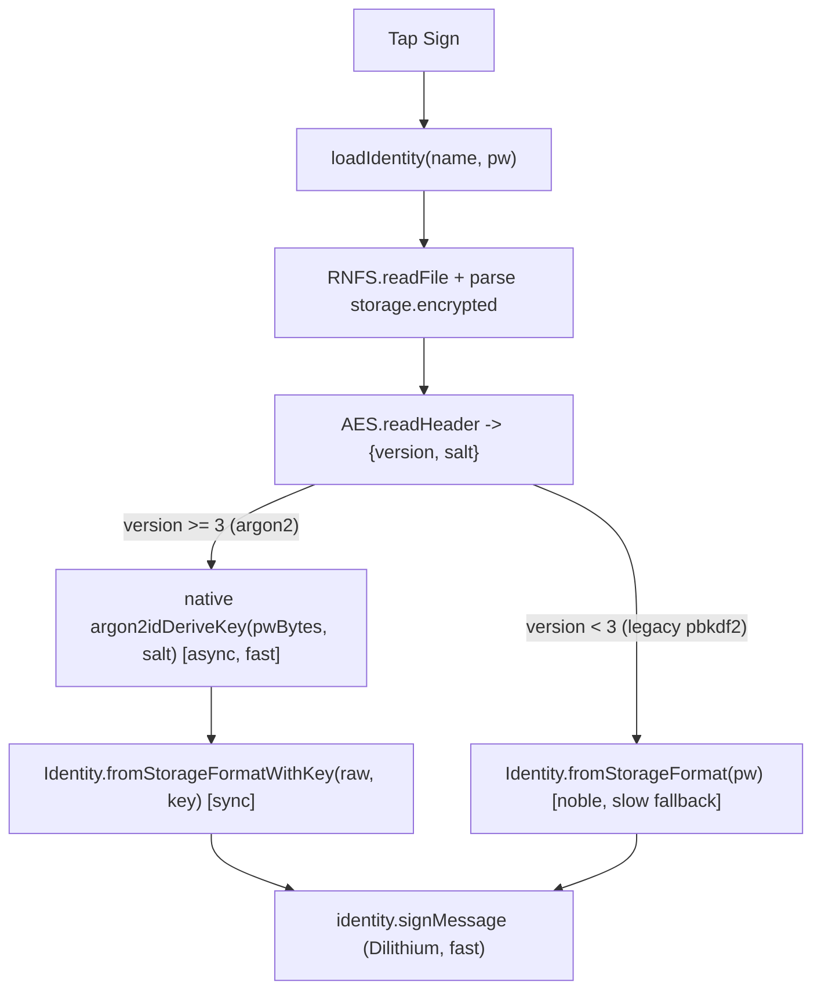

# Fix Mobile Signing Hang via Native Argon2id (parity-preserving)

## Root cause (confirmed)
`signMessage` -> `loadIdentity` -> `Identity.fromStorageFormat(raw, password)` -> `AES.decrypt` -> `deriveKey` runs `@noble/hashes` Argon2id at `m=64 MiB, t=3, p=1` synchronously on the JS thread. Under Hermes (no JIT, on Android+iOS) this memory-hard pure-JS loop is so slow it effectively never returns, freezing the `BusyOverlay`. Desktop V8 does the same call in ~1.9s; the dominant cost is Argon2, not Dilithium (raw `ml_dsa87.sign` ~6ms).

## Strategy (chosen)
Async, parity-preserving native KDF via libsodium (`crypto_pwhash` Argon2id is hardcoded `p=1`, version `0x13`), mapping our exact params. NO parameter change, NO new ciphertext version, NO storage migration, NO behavior change for GUI/CLI/server. Core gets purely additive key-based APIs; only mobile call sites switch to them. No runtime parity self-test gate (per decision); parity is validated once on-device against an offline noble vector.

## Parameter mapping (must match exactly)
- noble today: `argon2id(pw, salt, { t:3, m:65536 /*KiB*/, p:1, dkLen:32 })`, version `0x13`, type id, no secret/AD.
- libsodium call: `argon2idDeriveKey(pwBytes, salt16, keyLength=32, iterations=3, memoryLimit=67108864 /*bytes = 64*1024*1024*/)`.
- libsodium fixes `p=1` and uses ARGON2ID13, so output should be byte-identical. Salt must be exactly 16 bytes (our `SALT_LENGTH` is already 16).

## Flow after change

## Changes

### 1. Core: additive key-based AES primitives — [core/AES.ts](core/AES.ts)
- Refactor existing `encrypt`/`decrypt` to internally call new key-based helpers (DRY, no behavior change):
  - `AES.encryptWithKey(key: Uint8Array, plaintext: string, salt: Uint8Array, aad?: string): string` — writes the same `[version(1)|salt|iv|ciphertext]` base64 using `CURRENT_AES_VERSION`, generating `iv` internally; applies `aad` (v>=4) exactly as today.
  - `AES.decryptWithKey(key: Uint8Array, encoded: string, aad?: string): string` — parses version/salt/iv, runs GCM (applies `aad` for v>=4), throws `DecryptionAuthError` on tag failure.
  - `AES.readHeader(encoded: string): { version: number; salt: Uint8Array }` — exposes salt+version so the caller can derive the key before decrypt. (Reuses `getCiphertextVersion`.)
- `encrypt(pw, pt, aad)` becomes: `deriveKey(pw, salt, ...)` then `encryptWithKey`. `decrypt(pw, enc, aad)` becomes: `readHeader` -> `deriveKey` -> `decryptWithKey`.

### 2. Core: additive key-based Identity entry points — [core/Identity.ts](core/Identity.ts)
- Extract two private helpers from the existing `fromStorageFormat` (lines ~1240-1417) so logic is shared:
  - parse+validate+build identity shell (public metadata, details, revocation),
  - `applyPrivateKeysFromJson(identity, pub, privateJson)` (the block at ~1295-1389 that builds signing/encryption keys from decrypted `privateData`).
- Add `static fromStorageFormatWithKey(storageData: string, key: Uint8Array): PrivateIdentity` — same parse/validate/shell, then `privateJson = AES.decryptWithKey(key, storage.encrypted!, identityStorageAad())`, then `applyPrivateKeysFromJson`.
- Add `toStorageFormatWithKey(key: Uint8Array, salt: Uint8Array): string` — same as `toStorageFormat` but uses `AES.encryptWithKey(key, json, salt, identityStorageAad())`.
- Existing password-based `fromStorageFormat`/`toStorageFormat` are unchanged (GUI/CLI/server keep using them).

### 3. Mobile: native KDF dependency + wrapper
- Add native libsodium JSI dep (primary: `react-native-nacl-jsi`; if it is not RN 0.84/new-arch compatible, fall back to `react-native-libsodium`, which also exposes `crypto_pwhash` with `p=1`). iOS: `pod install`. Android: autolink (Hermes + new arch already enabled; mind 16KB page alignment).
- New `mobile/src/services/argon2.ts`:
  - `deriveIdentityKey(passwordBytes: Uint8Array, salt: Uint8Array): Promise<Uint8Array>` calling the lib with the mapping above (32-byte output, iterations=3, memoryLimit=67108864 bytes).
  - One-off dev parity helper that compares the native output for a fixed `(password, salt)` against a hardcoded expected hex computed offline via Deno+noble.

### 4. Mobile: switch unlock/create/save to async native KDF — [mobile/src/services/storage.ts](mobile/src/services/storage.ts)
- `loadIdentity`: read raw, parse `storage.encrypted`, `AES.readHeader` -> if `version >= 3` derive key via `deriveIdentityKey(utf8(password.trim()), salt)` then `Identity.fromStorageFormatWithKey(raw, key)`; else (legacy pbkdf2 v1/v2) fall back to sync `Identity.fromStorageFormat(raw, password)`.
- `createIdentity` / `saveIdentity`: generate 16-byte salt (`randomBytes(16)`), `deriveIdentityKey`, then `identity.toStorageFormatWithKey(key, salt)` instead of `toStorageFormat(password)`.
- All other identity-loading flows (encrypt/decrypt, publish, revocation, details, hierarchy, sign file) already `await loadIdentity`, so they are fixed transitively with no further edits.

## Verification
- Core (Deno) tests in [core/tests/](core/tests/): round-trip `encryptWithKey`/`decryptWithKey`; and that `decryptWithKey(deriveKey(pw, salt), enc)` equals `decrypt(pw, enc)` and `fromStorageFormatWithKey(data, deriveKey(...))` matches `fromStorageFormat(data, pw)` — this proves the key-based path is identical to the password path at the noble level.
- On-device (the only native piece): run the dev parity helper to confirm native libsodium output == offline noble vector for a known `(password, salt)`; then create an identity on the phone and verify it decrypts on desktop CLI/GUI (and vice versa).
- Manual: sign a message on the phone — overlay should resolve in well under a second instead of hanging.

## Risks / notes
- Hard dependency on byte-exact libsodium<->noble parity. If the chosen lib interprets `memoryLimit` as KiB (not bytes) or uses a different alg id, parity breaks; the offline-vector check catches this before shipping.
- RN 0.84 / New Architecture compatibility of the native lib must be confirmed; `react-native-libsodium` is the documented fallback.
- Legacy PBKDF2 (v1/v2) blobs still use slow noble on mobile, but mobile only ever creates v4 (argon2) identities on-device, so this path is effectively unused.
- Requires a native rebuild (pods/gradle); cannot be validated from this environment — needs a device/emulator build.