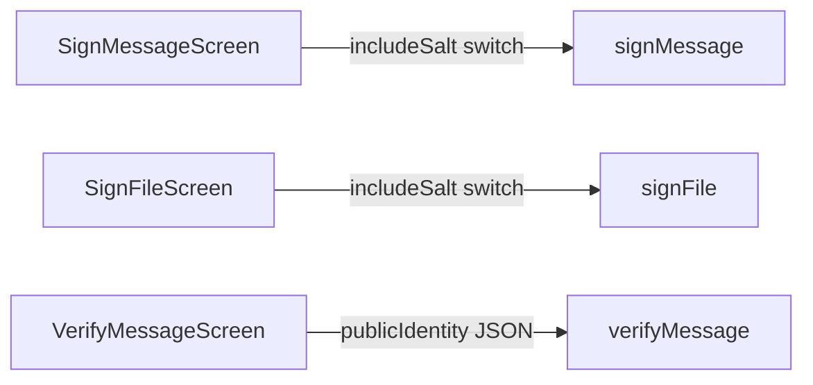

# Mobile crypto feature parity

Close GUI crypto surfaces 7–9 from [wiki/analysis-mobile-testing-and-gui-gaps.md](wiki/analysis-mobile-testing-and-gui-gaps.md). **Exclude** item 10 (save JSON to `~/Downloads`) — documented as desktop-only; mobile already uses clipboard + Share ([analysis-gui-mobile-parity-deltas.md](wiki/analysis-gui-mobile-parity-deltas.md)).

[signVerify.ts](mobile/src/services/signVerify.ts) already accepts `includeSalt` and `publicIdentity`. Work is UI + tests.

## 1. Sign Message include-salt (gap 7)

[SignMessageScreen.tsx](mobile/src/screens/crypto/SignMessageScreen.tsx) already has Detached + Include identity switches; it never passes `includeSalt` (service defaults `true`).

- State default `true`; Switch `testID="sign-include-salt"`; pass `options: { detached, includeIdentity, includeSalt }`.
- Copy GUI help: signs `ebp::messagehash::<sha256>::<optional salt>`.

## 2. Sign File include-salt (gap 8)

[SignFileScreen.tsx](mobile/src/screens/crypto/SignFileScreen.tsx) hardcodes `includeSalt: true`. `signFile` already returns `salt`.

- Switch `testID="sign-file-include-salt"`; pass through.
- Optional: show generated salt after sign (GUI `#sign-file-salt`).

## 3. Verify with pasted/imported public keys (gap 9)

[VerifyMessageScreen.tsx](mobile/src/screens/crypto/VerifyMessageScreen.tsx) is payload + optional detached message only. GUI `#verify-use-public-keys` + textarea + file import. Current Maestro [sign-verify.yaml](mobile/e2e/sign-verify.yaml) works because `includeIdentity` defaults true (embedded keys), so this path is untested.

- Switch `testID="verify-use-public-keys"` revealing multiline `testID="verify-public-keys"`.
- Paste-from-clipboard + “Import public keys file” (`pick` / `keepLocalCopy` / `RNFS.readFile`, same as Sign File).
- Parse JSON → `verifyMessage({ payload, message, publicIdentity })`. Surface parse errors.
- Optional sender field for contact fallback (lower priority; service already has `sender`).

Do **not** change [VerifyFileScreen.tsx](mobile/src/screens/crypto/VerifyFileScreen.tsx) — file verify uses `payload.identity`.

## Tests

Put crypto logic tests in Deno `test/mobile-signVerify_parity_test.ts` (repo already uses [test/mobile-parity_test.ts](test/mobile-parity_test.ts) for mobile-adjacent crypto without RN mocks).

- **Salt on/off (message):** `includeSalt: false` → payload `salt === ""`; signature still verifies; salted vs unsalted signatures differ.
- **Salt on/off (file):** empty salt; signed message is `ebp::filehash::<hash>::::<context>`; verify via `buildFileSignMessage`.
- **Public keys:** sign detached with `includeIdentity: false`; verify with explicit `publicIdentity` (mirror [gui/local-backend/tests/main_test.ts](gui/local-backend/tests/main_test.ts) ~801); reject tampered signature; reject JSON missing signing key.
- **Maestro:** extend [mobile/e2e/sign-verify.yaml](mobile/e2e/sign-verify.yaml) to toggle `sign-include-salt` off and still round-trip verify.
- **Maestro:** new [mobile/e2e/verify-public-keys.yaml](mobile/e2e/verify-public-keys.yaml): HD create → export public JSON → Sign with detached ON and include-identity OFF → Verify with public keys pasted → “Valid signature”.
- **Skip Maestro for Sign File** (document picker is unreliable; wiki ranks 25–28).

Wire `verify-public-keys` into [scripts/mobile-e2e.sh](scripts/mobile-e2e.sh) after `sign-verify`.

## Wiki

Check off crypto items 7–9 (keep 10 as desktop-only) in the gaps page; append [wiki/log.md](wiki/log.md).
