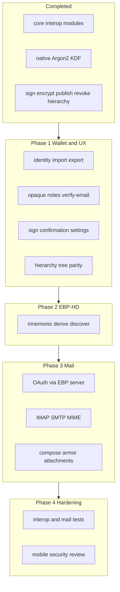
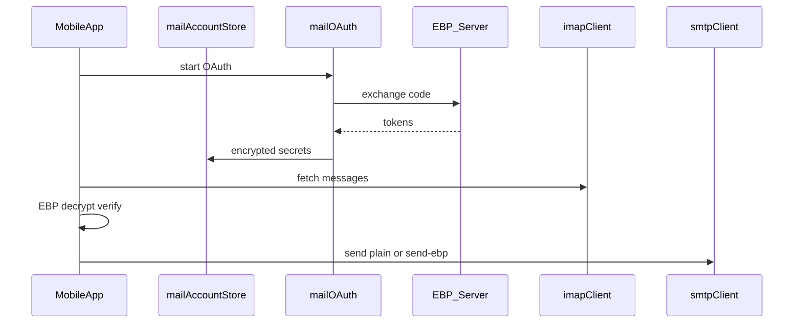

# Mobile–GUI Feature Parity Plan

## Current baseline

**Done (do not re-implement):**
- Wire-format interop via shared `core/` modules ([`test/interop-fixtures_test.ts`](test/interop-fixtures_test.ts), wiki [[analysis-gui-mobile-parity-deltas]])
- Native Argon2 unlock for signing ([`mobile/src/services/argon2.ts`](mobile/src/services/argon2.ts), [`mobile/src/services/storage.ts`](mobile/src/services/storage.ts))
- Core flows: identities, contacts, sign/verify, encrypt/decrypt, publish, details, revocation, hierarchy propose/accept ([`mobile/src/services/`](mobile/src/services/), 10 screens in [`mobile/src/navigation/AppNavigator.tsx`](mobile/src/navigation/AppNavigator.tsx))

**Reference implementation:** GUI local backend ([`gui/local-backend/routes.ts`](gui/local-backend/routes.ts) — 60+ `/api/v1/*` routes) + frontend ([`gui/js/mail.js`](gui/js/mail.js), [`gui/js/render.js`](gui/js/render.js), [`gui/app.js`](gui/app.js)). Mobile has **no local HTTP server**; parity means equivalent **in-process services + screens**, not porting Deno routes verbatim.

**Out of scope (desktop ecosystem only):** Tauri shell ([`desktop/`](desktop/)), Chrome extension localhost API ([`email/`](email/)).



---

## Phase 0 — Parity contract (short, unblocks everything)

Update wiki so implementation has a frozen checklist:

- Extend [`wiki/analysis-gui-mobile-parity-deltas.md`](wiki/analysis-gui-mobile-parity-deltas.md) with a **Parity v1 checklist** (must-have / desktop-only / done).
- Add [`wiki/analysis-mobile-parity-roadmap.md`](wiki/analysis-mobile-parity-roadmap.md) linking phases below; index entry in [`wiki/index.md`](wiki/index.md).

**Acceptance:** Every row in the current “Missing features” table maps to a phase and a test or manual checklist item.

---

## Phase 1 — Wallet, contacts, and UX gaps

Smaller deltas that unblock daily use without mail.

### 1.1 Identity import, export, delete

| Capability | GUI today | Mobile target |
|------------|-----------|---------------|
| Create | `POST /api/v1/identity/generate` | [`storage.createIdentity`](mobile/src/services/storage.ts) |
| Import `.identity.json` | No dedicated API (manual file copy) | **Add** `importIdentity` + document picker ([`@react-native-documents/picker`](mobile/package.json)) |
| Delete | Not exposed in GUI either | **Add** `deleteIdentity` + confirm UI on [`IdentityDetailScreen.tsx`](mobile/src/screens/IdentityDetailScreen.tsx) (consider matching GUI later) |
| Cross-device | `~/.ebp/` | Export public + encrypted identity via Share API; document import path in Settings |

Reuse [`core/Identity.ts`](core/Identity.ts) `fromStorageFormat` / native KDF path already in `storage.ts`.

### 1.2 Contact and detail UX (GUI-only routes today)

Port behavior from [`gui/js/render.js`](gui/js/render.js) into mobile services + screens:

| GUI route | Mobile work |
|-----------|-------------|
| `POST /api/v1/contacts/resolve-opaque` | New `resolveOpaqueDetail()` in [`contacts.ts`](mobile/src/services/contacts.ts); UI on [`ContactDetailScreen.tsx`](mobile/src/screens/ContactDetailScreen.tsx) / identity detail when attaching opaque paths |
| `POST /api/v1/contacts/update-local-notes` | Extend contact JSON schema + editor on contact detail |
| `POST /api/v1/verify-email/request` | Proxy to configured EBP server (same as [`routes.ts`](gui/local-backend/routes.ts) ~4336); button on email details in [`IdentityDetailScreen.tsx`](mobile/src/screens/IdentityDetailScreen.tsx) |

Preserve existing `resolvedOpaqueDetails` merge on re-import ([`contacts.ts`](mobile/src/services/contacts.ts)).

### 1.3 Safety and settings

| Gap | Implementation |
|-----|----------------|
| Sign confirmation | Password modal + explicit confirm before sign in [`signVerify.ts`](mobile/src/services/signVerify.ts) / [`SignVerifyScreen.tsx`](mobile/src/screens/SignVerifyScreen.tsx) (mirror GUI `/api/v1/sign` gate intent) |
| Settings breadth | Extend [`settings.ts`](mobile/src/services/settings.ts) + [`SettingsScreen.tsx`](mobile/src/screens/SettingsScreen.tsx): mail render prefs keys (even before mail UI), activity/diagnostic log viewer, password policy toggle (already partially present) |
| `fingerprint-from-public` | Add helper using [`core/Fingerprint.ts`](core/Fingerprint.ts) on verify screen for pasted public identity JSON |

### 1.4 Hierarchy UX

Mobile has [`hierarchy.ts`](mobile/src/services/hierarchy.ts) + [`CertificatesScreen.tsx`](mobile/src/screens/CertificatesScreen.tsx) but lacks GUI’s merged tree ([`gui/js/hierarchy.js`](gui/js/hierarchy.js), `GET /api/v1/hierarchy/tree`).

- Add `getHierarchyTreeLocal()` merging local certs + server (`source=server` + local pending), port logic from [`gui/local-backend/hierarchy-local.ts`](gui/local-backend/hierarchy-local.ts).
- Improve UI: list/tree view (SVG optional; structured list is acceptable for v1).
- Wire `reject` with server notify if GUI does ([`hierarchy.ts`](mobile/src/services/hierarchy.ts) gap noted in exploration).

**Phase 1 exit criteria:** Import/export identity; delete identity; opaque resolve + local notes; verify-email; sign confirm; expanded settings; hierarchy tree matches GUI data, not just server JSON dump.

---

## Phase 2 — EBP-HD ([[ebp-hd]])

Core logic already in [`core/Mnemonic.ts`](core/Mnemonic.ts), [`core/Hd.ts`](core/Hd.ts), [`core/HdPath.ts`](core/HdPath.ts). GUI exposes four routes ([`routes.ts`](gui/local-backend/routes.ts) ~1731–1896); only mnemonic + create are wired in [`gui/app.js`](gui/app.js).

### New mobile surface

- **Service:** `mobile/src/services/hd.ts` — `generateMnemonic`, `verifyMnemonic`, `deriveIdentity`, `discoverGaps` (call server identity API for publish state like GUI `hd/discover`).
- **Screen:** `HdCreateScreen.tsx` (mnemonic display, confirmation phrase, path fields: profile/account/change/index per [`gui/index.html`](gui/index.html) HD form).
- **Storage:** Save derived identity via `storage.createIdentity` / `saveIdentity` with `hdProvenance` from core.
- **Navigation:** Link from Home + CreateIdentity (“Create from mnemonic”).

**Tests:** Reuse vectors in [`core/tests/fixtures/ebp-hd/test-vectors.json`](core/tests/fixtures/ebp-hd/test-vectors.json); add one RN integration test that derives a known vector identity.

**Phase 2 exit criteria:** User can generate mnemonic, confirm, derive identity, and run discovery against server — byte-compatible with CLI/GUI HD.

---

## Phase 3 — Full in-app mail stack (largest phase)

User requirement: **full mail parity** (IMAP/SMTP, OAuth, compose/decrypt, attachments). GUI reference modules:

| Module | Path | Responsibility |
|--------|------|----------------|
| Accounts | [`gui/local-backend/mail-account.ts`](gui/local-backend/mail-account.ts) | Multi-account store, encrypted secrets, PIN unlock |
| OAuth | [`gui/local-backend/mail-oauth.ts`](gui/local-backend/mail-oauth.ts) | Start/poll/complete; token exchange via **EBP server** |
| IMAP/MIME | [`gui/local-backend/mail-imap.ts`](gui/local-backend/mail-imap.ts), [`mail-worker.ts`](gui/local-backend/mail-worker.ts) | Fetch, parse, attachments |
| Routes | [`gui/local-backend/routes.ts`](gui/local-backend/routes.ts) | 18 `/api/v1/mail/*` endpoints |
| UI | [`gui/js/mail.js`](gui/js/mail.js) | Accounts, inbox, read, compose, EBP send |

Server already implements token exchange ([`server/main.ts`](server/main.ts) `/api/v1/mail/oauth/exchange`, `/refresh`) — mobile must **not** embed OAuth client secrets; same trust model as GUI.

### 3.1 Architecture for React Native



**New package layout (suggested):**

```
mobile/src/services/mail/
  accountStore.ts    # port mail-account persistence (per-identity dir under DocumentDirectory/ebp)
  oauth.ts           # port mail-oauth; mobile redirect via app scheme / universal link
  imap.ts            # list/fetch messages, attachments
  smtp.ts            # send + send-ebp
  mime.ts            # parse bodies; extract EBP armor
  ebpMail.ts         # compose armor, decrypt-attachment, integration with encryptDecrypt.ts
mobile/src/screens/mail/
  MailAccountsScreen.tsx
  MailInboxScreen.tsx
  MailMessageScreen.tsx
  MailComposeScreen.tsx
```

**Dependency decision (early spike required):** GUI uses Deno `ImapFlow` + Nodemailer — not RN-compatible. Phase 3 starts with a **spike** to pick RN-viable IMAP/SMTP + MIME libraries (evaluate maintenance, OAuth XOAUTH2 support, attachment handling). Document choice in `mobile/NATIVE_CRYPTO.md` or new `mobile/MAIL.md`.

**OAuth mobile difference:** GUI callback is `http://127.0.0.1:8787/api/v1/mail/oauth/callback`. Mobile needs:
- Registered redirect URI (custom scheme e.g. `ebp://mail/oauth` or HTTPS universal link)
- In-app browser / system browser + deep link handler (`Linking` API)
- Poll/complete flow analogous to [`gui/js/mail.js`](gui/js/mail.js) (without localhost server)

May require **server/config** update for allowed mobile redirect URIs (document in server deploy notes).

**Secrets at rest:** Port encrypted envelope pattern from `mail-account.ts`; prefer **Keychain/Keystore** wrappers for PIN-derived keys where possible (stronger than GUI file-only on mobile).

### 3.2 Feature mapping (18 GUI mail routes → mobile)

| GUI capability | Mobile deliverable |
|----------------|-------------------|
| OAuth start/poll/complete/open-browser | `mail/oauth.ts` + accounts screen |
| Account CRUD, select, unlock, test | `mail/accountStore.ts` + settings/accounts UI |
| List/read messages, attachment fetch | Inbox + message screens |
| `send`, `send-ebp` | Compose screen + armor wrap ([[message-payload-formats]]) |
| `decrypt-attachment` | Message detail + [`encryptDecrypt.ts`](mobile/src/services/encryptDecrypt.ts) file paths |
| Mail prefs in settings | Keys mirrored from GUI `state.js` mail render options |

**Armor in compose:** Today mobile only parses armor on decrypt/verify ([`EncryptDecryptScreen.tsx`](mobile/src/screens/EncryptDecryptScreen.tsx)); mail compose must call same builders as GUI `send-ebp`.

### 3.3 Testing

- Port scenarios from [`gui/e2e/mail.spec.ts`](gui/e2e/mail.spec.ts) into mobile integration tests where feasible (mock IMAP/SMTP).
- Add interop fixture: mobile-composed encrypted mail body decryptable by GUI (and reverse).
- Manual matrix: Gmail OAuth, password IMAP (if supported), read/decrypt/reply encrypted thread.

**Phase 3 exit criteria:** User can link mailbox, read inbox, decrypt EBP messages in-thread, compose/send EBP-encrypted mail with armor, decrypt attachments — matching GUI mail.js flows.

---

## Phase 4 — Hardening and governance

| Item | Action |
|------|--------|
| Interop | Extend [`test/interop-fixtures_test.ts`](test/interop-fixtures_test.ts) with mobile-origin HD + mail payloads |
| Security | Dedicated mobile pass (April 2026 audit explicitly excluded `mobile/` — [[security-audit-2026-04/README]]) |
| Wiki | Mark checklist items done in [[analysis-gui-mobile-parity-deltas]]; log in [`wiki/log.md`](wiki/log.md) |
| README | Update mobile milestone in [`ReadMe.md`](ReadMe.md) |

---

## Risk register

| Risk | Mitigation |
|------|------------|
| No mature RN IMAP/OAuth stack | Time-boxed library spike in Phase 3 week 1; fallback native module only if JS libs fail |
| OAuth redirect URI registration | Coordinate Google/Microsoft console + server allowlist before Phase 3 UI |
| `routes.ts` size / drift | Implement against **behavior** + e2e spec, not line-by-line port; share MIME/EBP helpers in `core/` where possible |
| Mail secrets on device | Keychain + encrypted file; document threat model vs GUI |
| Scope creep | Phase 0 checklist; defer SVG hierarchy polish if list view meets contract |

---

## Suggested execution order

1. Phase 0 (contract)
2. Phase 1 (wallet + contacts + hierarchy) — parallel-friendly subtasks
3. Phase 2 (HD) — can overlap late Phase 1
4. Phase 3 spike → Phase 3 implementation (mail)
5. Phase 4

**Not blocking mail but nice during Phase 1:** identity export/share, diagnostic log screen.

---

## Key files to touch (by phase)

| Phase | Primary paths |
|-------|----------------|
| 0 | `wiki/analysis-*.md`, `wiki/index.md`, `wiki/log.md` |
| 1 | `mobile/src/services/storage.ts`, `contacts.ts`, `settings.ts`, `hierarchy.ts`, `mobile/src/screens/*` |
| 2 | `mobile/src/services/hd.ts`, new HD screen, `core/*` (read-only) |
| 3 | `mobile/src/services/mail/*`, new mail screens, `mobile/package.json`, possibly `server/` redirect config |
| 4 | `test/`, `wiki/`, security audit notes |
