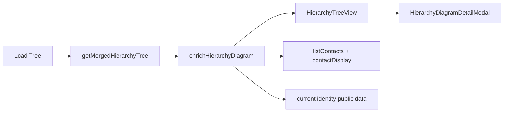

# Mobile Hierarchy Graph Rendering

## Decisions (locked)

- **Mobile-only layout port** of `_layoutTree` / edge Bezier math from [`gui/js/hierarchy.js`](gui/js/hierarchy.js) — no `core/` extraction in this pass.
- **Dependency:** add `react-native-svg` only. **No** `react-native-gesture-handler` / Reanimated for v1.
- **Interaction:** one-finger pan via `PanResponder` on the SVG surface; zoom via **Fit all** + **+/−** buttons; tap node/edge → modal detail. **No** free node dragging.
- **Scope:** Certificates Hierarchy Tree section only (not contact-detail entry point).

## Data flow

## Implementation

### 1. Dependency

- Add `react-native-svg` to [`mobile/package.json`](mobile/package.json) (version compatible with RN 0.84).
- Run install + iOS pods as needed for the project’s usual mobile workflow.

### 2. Diagram model + enrichment

New [`mobile/src/services/hierarchyDiagram.ts`](mobile/src/services/hierarchyDiagram.ts):

- Types matching GUI renderer input: `nodes[]` (`fingerprint`, `label`, `details`, `color`, `isSelf`, `isFocus`), `relationships[]`, `roots[]`.
- `fingerprintColor(fp)` — port of [`fingerprintColor`](gui/local-backend/hierarchy-local.ts) using `decodeFingerprintBech32` + `toHex` (export `decodeFingerprintBech32` from [`mobile/src/ebpCore.ts`](mobile/src/ebpCore.ts) if missing).
- `enrichHierarchyDiagram(tree, opts)`:
  - `roots`: fingerprints in `allFingerprints` that are not any relationship’s child (same as GUI).
  - Labels via [`resolveContactLabels`](mobile/src/services/contactDisplay.ts) for contacts; for self, read public identity details (`Identity.readPublicData`) and prefer `name` detail / storage name; fallback condensed fingerprint.
  - `isSelf` / `isFocus` from current identity fingerprint and Load Tree focus fingerprint.
- Helper to load self public data without password (read current identity file + `Identity.readPublicData`), colocated in storage or diagram service.

### 3. Layout + view component

New pure layout module [`mobile/src/services/hierarchyLayout.ts`](mobile/src/services/hierarchyLayout.ts) (Deno-testable):

- Port `_layoutTree` constants (`nodeRadius=26`, `levelHeight=160`, `nodeSpacingX=180`, paddings) and cubic edge path helper from [`gui/js/hierarchy.js`](gui/js/hierarchy.js).

New [`mobile/src/components/HierarchyTreeView.tsx`](mobile/src/components/HierarchyTreeView.tsx):

- Fixed height ~320pt card surface; `react-native-svg` `Svg` with controlled `viewBox`.
- Draw edges (`Path` + markers; expired → warning/`#d29922`), then nodes (`Circle` fill=`color`, stroke accent for self/focus; truncated label + short fp text).
- Overlay toolbar: **Fit all**, **−**, **+**.
- `PanResponder` pans by adjusting viewBox; zoom buttons scale viewBox around center.
- Tap node → detail payload (label, fingerprint, YOU/FOCUS, details); tap edge (wide transparent hit `Path`) → master/child labels, context, created, expiry, expired badge.
- Empty state when `nodes.length === 0`.

New [`mobile/src/components/HierarchyDiagramDetailModal.tsx`](mobile/src/components/HierarchyDiagramDetailModal.tsx) — same Modal/Card pattern as [`CertificateDetailModal.tsx`](mobile/src/components/CertificateDetailModal.tsx); copyable fingerprints.

### 4. Wire Certificates screen

Update [`mobile/src/screens/CertificatesScreen.tsx`](mobile/src/screens/CertificatesScreen.tsx):

- Replace `treeOutput` string state with diagram DTO state (or `null`).
- `onLoadTree`: `getMergedHierarchyTree` → `enrichHierarchyDiagram` (contacts + self) → set diagram; keep status line summary.
- Hierarchy Tree `Card`: keep ContactPicker + Load Tree; swap `TextField` JSON for `HierarchyTreeView` + detail modal.
- Ensure outer `ScrollView` does not steal pans: diagram container uses `onStartShouldSetResponder` / PanResponder claim so pan stays inside the fixed-height graph.

### 5. Tests + wiki

- Extend [`test/mobile-parity_test.ts`](test/mobile-parity_test.ts) (or small sibling): assert 2-node master→child layout places child at higher level (larger `y`) and both positions finite; optional edge-path non-empty.
- After ship: note visual parity in [`wiki/analysis-mobile-hierarchy-graph-rendering.md`](wiki/analysis-mobile-hierarchy-graph-rendering.md) + short [`wiki/log.md`](wiki/log.md) entry (implementation complete).

## Out of scope

- Extracting shared layout for GUI.
- Pinch-zoom / node drag / contact-detail “View Hierarchy” surface.
- GUI↔mobile hierarchy E2E.
