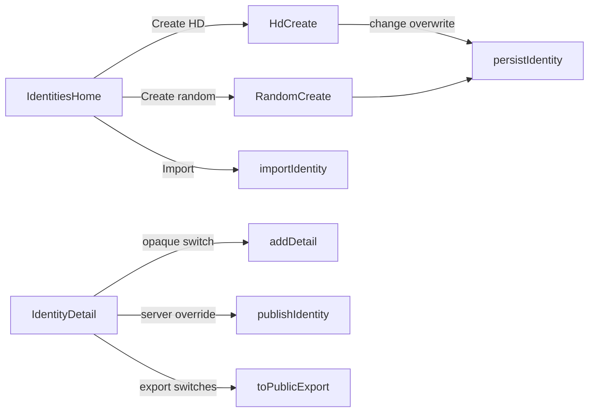

# Mobile identity feature parity

Close the six GUI identity surfaces that have no mobile control ([wiki/analysis-mobile-testing-and-gui-gaps.md](wiki/analysis-mobile-testing-and-gui-gaps.md) items 1–6). Most service APIs already exist; the work is UI wiring plus tests.

**Note:** Random-key create **reverses** the earlier mnemonic-only decision in [.cursor/plans/mnemonic-only_identity_create_cb29822b.plan.md](.cursor/plans/mnemonic-only_identity_create_cb29822b.plan.md). HD remains the default Create path; random keys are an explicit second option.

## 1. Random-key create (gap 1)

GUI: `#generate-form` → `POST /api/v1/identity/generate`. Mobile Create currently always opens [HdCreateScreen.tsx](mobile/src/screens/HdCreateScreen.tsx).

- Add `createRandomIdentity({ name, password, signingType, overwrite })` in a new [mobile/src/services/identity.ts](mobile/src/services/identity.ts) (mirror CLI `cmdGenerate` / backend generate: `new Identity(signingType, 'kyber')` then [persistIdentity](mobile/src/services/storage.ts)).
- New `RandomCreateScreen`: name, password, signing `SegmentedControl` (`dilithium` | `sphincs`), overwrite switch, confirm Alert on overwrite.
- [IdentitiesHomeScreen.tsx](mobile/src/screens/IdentitiesHomeScreen.tsx): keep **Create** → HD; add **Create random** (or a two-choice sheet). Register route in [AppNavigator.tsx](mobile/src/navigation/AppNavigator.tsx).

## 2. HD change + overwrite (gaps 2–3)

[createHdIdentity](mobile/src/services/hd.ts) already accepts `change?: HdChange` and `overwrite?: boolean`; [HdCreateScreen](mobile/src/screens/HdCreateScreen.tsx) never passes them.

- Add `SegmentedControl` for `external` | `internal` (`testID="hd-change"`) with copy that internal/recovery identities are not for publication. Leave Discover on the external chain (matches GUI/backend).
- Add overwrite `Switch` `testID="hd-overwrite"`; confirm with `Alert` before persist.

## 3. Selective public export (gap 4)

Core already has `Identity.toPublicExport({ includeSigningKey, includeEncryptionKey, includeDetails })`. Mobile [exportPublicIdentity](mobile/src/services/signVerify.ts) always dumps `readPublicData()`.

- Extend `exportPublicIdentity` to take those options (require identity password, same as GUI).
- On [IdentityDetailScreen.tsx](mobile/src/screens/IdentityDetailScreen.tsx), three switches above Export public JSON; block “both keys off” (GUI `enforceExportKeySelection`).

## 4. Opaque add-detail toggle (gap 5)

[addDetail](mobile/src/services/details.ts) already hashes when the path starts with `opaque::`. GUI prepends the prefix from `#detail-opaque`.

- Switch `testID="identity-detail-opaque"` next to Push to server.
- Prefix `opaque::` unless the path already starts with it (copy GUI guard). Reset switch after success.

## 5. Per-action server override (gap 6)

`publishIdentity`, `fetchContactFromServer`, and `browseServerIdentities` already take optional `server`. Screens only use Settings.

- Optional `TextField` `testID="identity-publish-server"` on Identity Detail.
- Same field on [FetchContactModal.tsx](mobile/src/components/FetchContactModal.tsx) and [BrowseContactsModal.tsx](mobile/src/components/BrowseContactsModal.tsx). Empty = Settings URL.

## Tests

| Gap | Automated test |
|-----|----------------|
| Random create | Jest `mobile/__tests__/identity-create-test.ts` (signing type, overwrite reject/succeed). Maestro `mobile/e2e/create-random.yaml`: home → random create → fingerprint on detail (faster than HD). |
| HD change | Deno: extend [test/mobile-parity_test.ts](test/mobile-parity_test.ts) — internal vs external fingerprint at same index. |
| Overwrite | Jest on `persistIdentity` / `createHdIdentity`. Maestro: create same name twice, assert error then success with overwrite. |
| Selective export | Deno/Jest: omit details; omit one key and assert leaf hash; reject both keys off. Do **not** assert huge JSON in Maestro. |
| Opaque | Jest `details-test.ts`: `opaque::email` stores SHA-256. Extend [mobile/e2e/details.yaml](mobile/e2e/details.yaml): toggle opaque, add email, search must not hit cleartext. |
| Server override | Jest: mock fetch, assert custom host. Maestro optional: publish-server field filled vs Settings (needs two URLs or skip if only one e2e server). |

Wire `create-random` into [scripts/mobile-e2e.sh](scripts/mobile-e2e.sh) after smoke (no HD cost). Stamp `testID`s used by Maestro.

## Wiki

When implemented: check off items 1–6 in [wiki/analysis-mobile-testing-and-gui-gaps.md](wiki/analysis-mobile-testing-and-gui-gaps.md); append [wiki/log.md](wiki/log.md).
