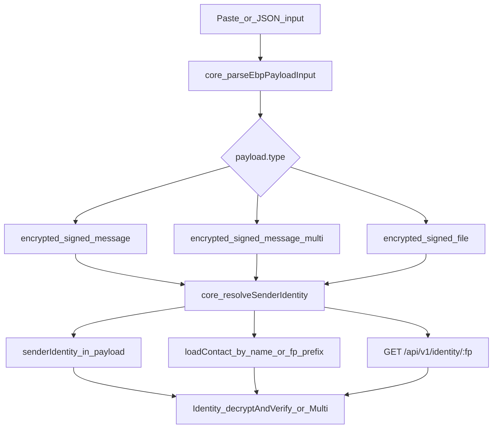

# Mobile interop drift remediation

Scope is **format / implementation drift** from [[wiki/analysis-gui-mobile-parity-deltas.md]] only. **Out of scope:** native email, EBP-HD, opaque-detail/verify-email UI, sign-confirmation UX, shared `~/.ebp/` on device, identity import/delete screens, hierarchy SVG, audit remediation.

**In scope (8 drift items):**

| Drift | Fix strategy |
|-------|----------------|
| Decrypt without contact | Shared signer resolution (embedded → local contact → server) |
| Multi-recipient decrypt | Call existing `Identity.decryptAndVerifyMulti` |
| File/message payload `version` | Canonical builders in `core/` |
| Salt RNG | `randomHex(16)` via CSPRNG (not `Math.random`) |
| Password on create | `validatePassword` from [`core/PasswordPolicy.ts`](core/PasswordPolicy.ts) |
| Armored paste | `parseEbpPayloadInput` using `extractArmoredPayload` |
| `ebp-signed-file` shape | Add `fileName`; shared `buildFileSignMessage` |
| Encrypt signed output | Embed `senderIdentity` when `sign=true` (your choice) |

---

## Phase 1 — Shared `core/` building blocks

Add small, testable modules so mobile and GUI do not fork logic from [`gui/local-backend/routes.ts`](gui/local-backend/routes.ts) (~200 lines of decrypt sender logic).

### 1a. `core/PayloadInput.ts`

- `parseEbpPayloadInput(text: string): Record<string, unknown>`
  - Trim input → `extractArmoredPayload` ([`core/Payloads.ts`](core/Payloads.ts)) → else `JSON.parse`
  - Clear errors for invalid JSON / missing `type`

### 1b. `core/SenderResolution.ts`

- Move fingerprint helper from [`gui/local-backend/contacts.ts`](gui/local-backend/contacts.ts) `computeExternalFingerprint` → **`core/Fingerprint.ts`** (or `core/ExternalIdentity.ts`) using existing `computeIdentityFingerprint`.
- `externalIdentityFromEmbeddedRecord(record): ExternalIdentity | null` — port `buildEmbeddedContact` from `routes.ts` (lines ~3653–3691): validate keys, compute fingerprint, reject `senderFingerprint` mismatch.
- `resolveSenderIdentity(params)` with injectable async deps:
  - `senderHint?: string` (contact name / fp prefix)
  - `senderFingerprint?: string`
  - `embeddedIdentity?: Record<string, unknown>`
  - `loadContact(hint) => Promise<ExternalIdentity>`
  - `fetchFromServer(fp) => Promise<ExternalIdentity | null>` (optional)
  - Resolution order (match GUI message decrypt): **local contact by hint → server by fp → embedded → throw** (with same error messages as GUI where practical)

### 1c. `core/FilePayload.ts` — builders

Add (versions from [`core/version.ts`](core/version.ts) `FILE_FORMAT_VERSIONS`):

- `buildEncryptedFilePayload(...)`
- `buildEncryptedSignedFilePayload(...)`

Today mobile hand-builds objects in [`mobile/src/services/encryptDecrypt.ts`](mobile/src/services/encryptDecrypt.ts) without `version`; GUI inlines the same in [`gui/local-backend/routes.ts`](gui/local-backend/routes.ts).

### 1d. `core/CryptoUtils.ts` (or extend [`core/MessageHash.ts`](core/MessageHash.ts))

- `randomHex(byteLength = 16)` — port from [`cli/utils.ts`](cli/utils.ts) / [`gui/local-backend/http.ts`](gui/local-backend/http.ts) (uses `crypto.getRandomValues`; mobile already depends on [`react-native-get-random-values`](mobile/package.json)).
- `buildFileSignMessage(fileHash, salt, contextMessage)` — single definition for `ebp::filehash::...` (today duplicated in [`mobile/src/services/signVerify.ts`](mobile/src/services/signVerify.ts) and [`gui/js/crypto-utils.js`](gui/js/crypto-utils.js)).

### 1e. Deno tests

- `core/PayloadInput.test.ts` — JSON + armored samples
- `core/SenderResolution.test.ts` — embedded identity, fp mismatch, server stub
- Extend `core/FilePayload.test.ts` for builders

---

## Phase 2 — Mobile service updates

Touch [`mobile/src/ebpCore.ts`](mobile/src/ebpCore.ts) to re-export new core symbols.

### 2a. [`mobile/src/services/encryptDecrypt.ts`](mobile/src/services/encryptDecrypt.ts)

**Encrypt (output interop):**

- `encryptMessage`: keep `buildEncryptedMessagePayload` / `buildEncryptedSignedMessagePayload`; when `sign: true`, pass `senderIdentity: identity.summary` (canonical public block, same fields GUI embeds).
- `encryptFile`: return `buildEncryptedFilePayload` / `buildEncryptedSignedFilePayload` instead of manual objects.

**Decrypt (input interop):**

- Add `decryptMessage` branch for `ebp-encrypted-signed-message-multi` → `identity.decryptAndVerifyMulti(...)` after `resolveSenderIdentity`.
- For `ebp-encrypted-signed-message` and `ebp-encrypted-signed-file`, use `resolveSenderIdentity` instead of `loadContact(senderHint)` only.
- `fetchFromServer`: reuse pattern from [`mobile/src/services/contacts.ts`](mobile/src/services/contacts.ts) `fetchContactFromServer` + `normalizeExternalIdentity` (strip revoked details).

### 2b. [`mobile/src/services/signVerify.ts`](mobile/src/services/signVerify.ts)

- Replace `Math.random().toString(16).slice(2)` with `randomHex(16)` for message and file signing salts.
- `signFile`: add `fileName` to payload; use `buildFileSignMessage` + `signMessage(signedMessage)` (unchanged semantics, canonical string).
- `verifyMessage` / `verifyFileSignature`: accept armored input via shared parse helper if callers pass raw text (or parse in screens).

### 2c. [`mobile/src/services/storage.ts`](mobile/src/services/storage.ts)

- Replace 8-char check with `validatePassword(password)` (enforce policy like CLI; no opt-out UI in this plan).
- Surface `reason` / `suggestions` in `CreateIdentityScreen` error text.

### 2d. Screens (minimal UI wiring, not new features)

- [`SignVerifyScreen.tsx`](mobile/src/screens/SignVerifyScreen.tsx), [`EncryptDecryptScreen.tsx`](mobile/src/screens/EncryptDecryptScreen.tsx): before `JSON.parse`, run `parseEbpPayloadInput` on decrypt/verify text fields.
- [`CreateIdentityScreen.tsx`](mobile/src/screens/CreateIdentityScreen.tsx): update password hint copy to match [[wiki/password-policy]] (12+ chars).

---

## Phase 3 — GUI refactor (single source of truth)

Refactor **decrypt paths only** (not mail/OAuth/sign-confirmation features):

- [`gui/local-backend/routes.ts`](gui/local-backend/routes.ts): `POST /api/v1/decrypt` and `POST /api/v1/decrypt-file` call `resolveSenderIdentity` + shared builders where applicable.
- [`gui/local-backend/contacts.ts`](gui/local-backend/contacts.ts): re-export or thin-wrap `computeExternalFingerprint` from `core`.
- [`gui/local-backend/routes.ts`](gui/local-backend/routes.ts) `POST /api/v1/sign`: use `core/randomHex` instead of local `http.ts` duplicate if desired.
- [`gui/js/crypto-utils.js`](gui/js/crypto-utils.js): import/re-export `buildFileSignMessage` from a small shared entry or duplicate one-line re-export during transition (prefer one canonical `core` copy consumed by Deno; GUI frontend can keep thin wrapper until bundler imports `core`).

**Note:** GUI `decrypt-file` today is *weaker* than message decrypt (contact-only). Refactoring both to `resolveSenderIdentity` fixes mobile **and** closes GUI file-decrypt vs message-decrypt inconsistency.

---

## Phase 4 — Verification

### Automated

- `deno test core/` (new + existing payload tests)
- `deno task test` if repo root runs broader suite
- `cd mobile && npm test` — add Jest tests for:
  - `parseEbpPayloadInput` (armored fixture)
  - Round-trip: fixture JSON from GUI export decrypts on mobile service layer (mock `loadContact` / `fetch`)

### Golden fixtures (recommended)

Add `test/fixtures/interop/` (or `mobile/__tests__/fixtures/`):

- `encrypted-signed-with-sender-identity.json` (from GUI encrypt with include public keys)
- `encrypted-signed-message-multi.json`
- `armored-encrypted-signed.txt` (PEM-wrapped)
- `encrypted-signed-file-v1.json` (with `version` field)

### Manual smoke

1. GUI: sign+encrypt message with public keys → copy armored body → mobile decrypt (no contact).
2. Mobile: sign+encrypt with `sign=true` → GUI decrypt without contact.
3. Mobile: decrypt multi-recipient payload created in GUI mail flow (paste JSON).
4. Create identity on mobile with weak password → rejected; strong password → opens in GUI.

---

## Phase 5 — Wiki touch-up (short)

Update [[wiki/analysis-gui-mobile-parity-deltas.md]] — mark drift items resolved, note remaining **feature** gaps. Bump [[wiki/component-mobile]] `last_updated` and link to shared `core` modules.

---

## Explicitly deferred (feature plan)

- Native email / armor in compose
- EBP-HD, password-policy Settings toggle
- Opaque resolve, verify-email, local notes
- Shared `~/.ebp/` / Files app integration
- Sign-confirmation modal on mobile
- April 2026 audit scope for `mobile/`
