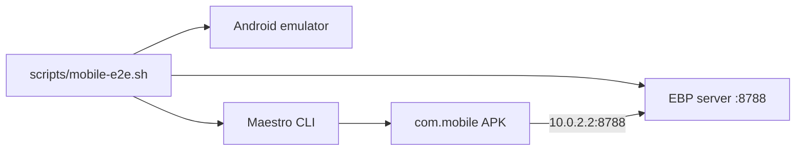

# Mobile Maestro E2E Framework

## Decisions (locked)

- **Driver:** Maestro (YAML under `mobile/e2e/`), not Detox/Appium/Playwright.
- **Platform MVP:** Android emulator only (`applicationId` `com.mobile`).
- **Server:** Reuse GUI e2e pattern — Deno key server on `http://localhost:8788` with throwaway SQLite + `RATE_LIMIT_DISABLED=true` (same env as [`playwright.config.ts`](playwright.config.ts)). App reaches it via emulator loopback `http://10.0.2.2:8788`.
- **Isolation:** `adb shell pm clear com.mobile` before each suite (no in-app factory reset).
- **Scope:** smoke + HD create/publish + hierarchy propose/accept/tree. Mail E2E and GUI↔mobile interop are out of scope.
- **Password constant:** `Smoke-test-password1` (match GUI).

## Architecture



## 1. Make UI selectable (testIDs)

Production UI has **zero** `testID`s today. Thread optional `testID` through shared primitives, then stamp critical controls:

- [`mobile/src/components/AppButton.tsx`](mobile/src/components/AppButton.tsx) — pass `testID` to `Pressable`.
- [`mobile/src/components/TextField.tsx`](mobile/src/components/TextField.tsx) — pass `testID` to `TextInput`.
- [`mobile/src/components/PasswordModal.tsx`](mobile/src/components/PasswordModal.tsx) — input + submit.
- [`mobile/src/navigation/AppNavigator.tsx`](mobile/src/navigation/AppNavigator.tsx) — tab `testID`s (`tab-identities`, `tab-more`, …).

Screen stamps (minimum):

| Screen | testIDs |
|--------|---------|
| [`IdentitiesHomeScreen.tsx`](mobile/src/screens/IdentitiesHomeScreen.tsx) | `identities-create`, identity list rows |
| [`HdCreateScreen.tsx`](mobile/src/screens/HdCreateScreen.tsx) | mnemonic generate, name, password, `hd-create-submit` |
| [`SettingsScreen.tsx`](mobile/src/screens/SettingsScreen.tsx) | `settings-server-url`, `settings-save` |
| [`IdentityDetailScreen.tsx`](mobile/src/screens/IdentityDetailScreen.tsx) | password field, `identity-publish` |
| [`CertificatesScreen.tsx`](mobile/src/screens/CertificatesScreen.tsx) | role, other party, `cert-create-proposal`, pending Accept/Reject, `cert-load-tree` |
| [`MoreScreen.tsx`](mobile/src/screens/MoreScreen.tsx) | rows for Settings / Certificates |

Maestro will target `id: …` (RN `testID`).

## 2. Harness scripts and tasks

Add [`scripts/mobile-e2e.sh`](scripts/mobile-e2e.sh):

1. Start key server (mirror Playwright env: `PORT=8788`, `DB_PATH=test-results/mobile-e2e-server.sqlite`, `RATE_LIMIT_DISABLED=true`); wait on `/api/v1/health`.
2. Require a booted emulator (`adb get-state`).
3. Install debug APK (`cd mobile && npm run android` or `adb install -r` after assemble) if needed.
4. `adb shell pm clear com.mobile`.
5. Run Maestro: `maestro test mobile/e2e/` (or a single flow via args).
6. Tear down the server on exit.

Wire in [`deno.json`](deno.json):

- `test:e2e:mobile` → `./scripts/mobile-e2e.sh`
- `test:e2e:mobile:smoke` → same script with `mobile/e2e/smoke.yaml`

Document prerequisites in a short [`mobile/e2e/README.md`](mobile/e2e/README.md): Android SDK/emulator, Maestro CLI install, `deno task test:e2e:mobile`.

## 3. Maestro flows (ladder)

```
mobile/e2e/
  smoke.yaml
  identity.yaml
  hierarchy.yaml
  helpers/
    clear-and-launch.yaml   # optional shared subflow
    set-server.yaml
```

| Flow | Assert |
|------|--------|
| `smoke.yaml` | Launch → Identities tab visible; navigate More → Settings heading |
| `identity.yaml` | Clear → HD create (`Generate mnemonic` → name → password → Create) → Settings set `http://10.0.2.2:8788` → open identity → Publish → status/fingerprint visible |
| `hierarchy.yaml` | Two HD identities published → Certificates propose master→child → switch/accept as child → Load Tree shows relationship (port of [`gui/e2e/hierarchy.spec.ts`](gui/e2e/hierarchy.spec.ts)) |

Identity creation on mobile is **HD-only** via [`HdCreateScreen.tsx`](mobile/src/screens/HdCreateScreen.tsx) (not GUI’s classic Generate). Flows must follow that path.

## 4. Wiki follow-up

After the harness lands, update [[analysis-mobile-e2e-framework]] and [[analysis-hierarchy-gui-e2e-coverage]] to mark Maestro smoke/identity/hierarchy as present; append `wiki/log.md`.

## Out of scope

- iOS Maestro / TestFlight
- Mail E2E
- GUI↔mobile interop E2E
- CI emulator job (local `deno task` first; CI can follow once smoke is stable)
- In-app “wipe all data” API (adb clear is enough for MVP)
