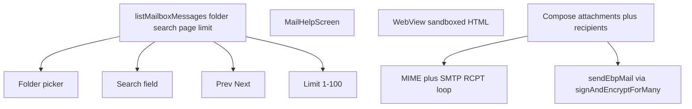

# Mobile mail feature parity

Close GUI mail surfaces 11–18 from [wiki/analysis-mobile-testing-and-gui-gaps.md](wiki/analysis-mobile-testing-and-gui-gaps.md). Inbox list work shares one IMAP refactor. Live mailbox Maestro stays out of scope (GUI [mail.spec.ts](gui/e2e/mail.spec.ts) is also skipped; wiki ranks 29–30).

Core already has `Identity.signAndEncryptForMany` and mobile decrypt already handles `ebp-encrypted-signed-message-multi` ([encryptDecrypt.ts](mobile/src/services/encryptDecrypt.ts)). Compose is still single-recipient.

## Phase A — Inbox list (gaps 11–14)

[listInboxMessages](mobile/src/services/mail/imap.ts) hardcodes `SELECT INBOX` and `UID SEARCH ALL`. Screen hardcodes limit 40.

1. Generalize to `listMailboxMessages({ folder, search, page, limit })` and pass `folder` into `fetchMessageDetail`. Quote mailbox names; default folder `INBOX`.
2. Extract pure `paginateUids(uids, page, limit)` matching GUI math in [gui/local-backend/routes.ts](gui/local-backend/routes.ts) (~1042–1095): newest-first, `{ page, totalPages, total }`.
3. Search: when query non-empty, IMAP `UID SEARCH TEXT "q"` (fallback `OR SUBJECT FROM` if TEXT unsupported). Reset page to 1 on folder/search/limit change.
4. [MailInboxScreen.tsx](mobile/src/screens/mail/MailInboxScreen.tsx): folder picker (INBOX / Sent / Drafts / Trash / Spam / Custom), search field, limit field clamped 1–100 (default 20), Prev/Next. Pass `folder` in `MailMessage` route params.
5. Optional later: `LIST "" "*"` for Gmail `[Gmail]/Sent Mail` names — not required for v1 presets.

## Phase B — Help + HTML preview (gaps 17–18)

**Help:** New `MailHelpScreen` with the GUI copy from [gui/index.html](gui/index.html) `#mail-tab-help` (Gmail, Proton Bridge, generic IMAP/SMTP). Link from [MailAccountsScreen.tsx](mobile/src/screens/mail/MailAccountsScreen.tsx) header. `testID="mail-help-body"`.

**HTML:** Settings `getMailRenderHtml()` is **saved but unused**. Reader is plain `<Text>` ([MailMessageScreen.tsx](mobile/src/screens/mail/MailMessageScreen.tsx)).

- Add `react-native-webview`.
- Port `buildSandboxedEmailSrcDoc` from [gui/js/mail.js](gui/js/mail.js) (CSP `default-src 'none'`, no JS). Prefer a small shared helper if import from `core/`/`gui` is awkward — duplicate with a unit test is fine.
- When setting on and `bodyHtml` present: `WebView` with `javaScriptEnabled={false}`, inline HTML only (no remote URLs). Else `bodyText`.
- Encrypted EBP mail stays on the existing locked/plain reader ([analysis-mobile-encrypted-mail-reader-ux.md](wiki/analysis-mobile-encrypted-mail-reader-ux.md)).

## Phase C — Compose (gaps 15–16)

**Plain attachments first:** document picker (already used elsewhere via `@react-native-documents/picker`), MIME `multipart/mixed` in [mime.ts](mobile/src/services/mail/mime.ts), list + remove on [MailComposeScreen.tsx](mobile/src/screens/mail/MailComposeScreen.tsx).

**Multi-recipient:** dynamic To rows (contact picker + email). [smtp.ts](mobile/src/services/mail/smtp.ts) currently one `RCPT TO` — loop all addresses. Plain send can join `To:` headers.

**EBP multi:** wrap existing `signAndEncryptForMany` in `sendEbpMail` for `recipients: { contact, email }[]`. Encrypted attachments can follow GUI `send-ebp` in a follow-up if body+multi lands first; do not block Phase A/B on encrypted attachments.

Recipient resolve per row reuses [RecipientResolveModal](mobile/src/components/RecipientResolveModal.tsx) / [analysis-mobile-compose-recipient-resolve.md](wiki/analysis-mobile-compose-recipient-resolve.md).

## Tests

Prefer mocked IMAP line protocol (pattern in [mobile/__tests__/imapFetchLiteral-test.ts](mobile/__tests__/imapFetchLiteral-test.ts)) over device mail.

| Area | Test |
|------|------|
| Folder | Mock client: assert `SELECT Sent` vs `SELECT INBOX` |
| Search | Mock `* SEARCH 1 2 3`; assert UID filter / command quoting |
| Pagination | Pure `paginateUids` fixtures (page 1 vs 2, empty, limit clamp) |
| Limit | Clamp helper 1–100 |
| Help | Maestro: Accounts → Help, assert “Gmail” / “Proton” — **no credentials** |
| HTML sandbox | Unit: CSP meta present, no `<script`; setting off → no WebView |
| Attachments | Extend [mimeDecode-test.ts](mobile/__tests__/mimeDecode-test.ts): round-trip `multipart/mixed` + base64 part |
| Multi-recipient | Unit: multiple `RCPT TO`; `sendEbpMail` builds `ebp-encrypted-signed-message-multi` (core tests already cover cipher) |

**Do not** add Maestro inbox/send flows (live IMAP + unlock PIN). Optional: `__DEV__` “attach fixture file” only if a later E2E needs it.

## Wiki

Update gaps 11–18 as each phase lands; append [wiki/log.md](wiki/log.md). Mention Gmail folder-name caveat if presets miss provider folders.
