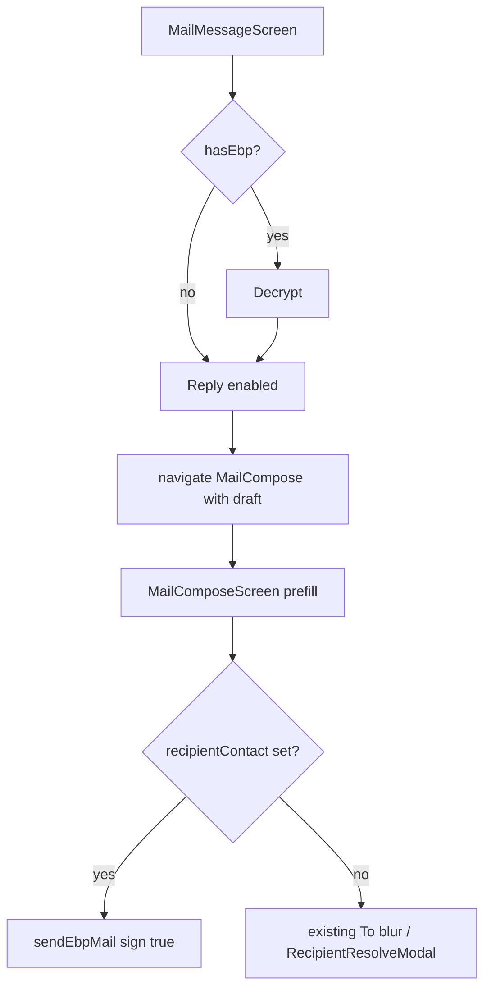

# Mobile mail Reply

## Locked decisions

- **Scope:** [[component-mobile]] only (not GUI this pass).
- **Reply All:** out of scope.
- **When Reply is enabled:** always for plain mail once loaded; for EBP mail **after successful decrypt** (needed to trust signer identity for encrypt-to).
- **Prefill:** To + `Re:` subject + quoted original body + `In-Reply-To` / `References` from original `Message-ID`.
- **Crypto:** if original was EBP-signed/encrypted, reply uses existing `sendEbpMail` with `sign: true` and `recipientContact` bound to the **signer** identity (not SMTP From alone). Plain originals use existing plain/encrypted resolve path from To.

## Current state

- Reader: [`MailMessageScreen.tsx`](mobile/src/screens/mail/MailMessageScreen.tsx) — decrypt + authenticity; **no Reply**.
- Compose: [`MailComposeScreen.tsx`](mobile/src/screens/mail/MailComposeScreen.tsx) — empty draft; route is `MailCompose: undefined`.
- Send: [`ebpMail.ts`](mobile/src/services/mail/ebpMail.ts) — `sendEbpMail` / `sendPlainMail`; MIME builders in [`mime.ts`](mobile/src/services/mail/mime.ts) emit only From/To/Subject.
- Decrypt already returns `signerFingerprint`, `contactName`, `isKnownContact`, `messageFrom`, `plaintext` ([`mailAuthenticity.ts`](mobile/src/services/mail/mailAuthenticity.ts)).
- GUI Reply is weaker (To + `Re:` only, no contact bind / quote / headers) — do **not** mirror that gap.



## Implementation

### 1. Compose route prefill

In [`AppNavigator.tsx`](mobile/src/navigation/AppNavigator.tsx), change:

```ts
MailCompose: {
  to?: string;
  subject?: string;
  message?: string;
  recipientContact?: string;
  encryptionIntent?: 'encrypted' | 'unencrypted';
  inReplyTo?: string;
  references?: string;
} | undefined;
```

In [`MailComposeScreen.tsx`](mobile/src/screens/mail/MailComposeScreen.tsx):

- Read `route.params` on mount; seed `to` / `subject` / `message` / `recipientContact`.
- If `recipientContact` provided → set `encryptionIntent = 'encrypted'` (skip pending).
- Keep existing To-blur resolve for drafts without a contact.
- Pass `inReplyTo` / `references` through to send helpers.

### 2. MIME threading headers

Extend [`buildSimpleMimeMessage`](mobile/src/services/mail/mime.ts) and [`buildMultipartMimeMessage`](mobile/src/services/mail/mime.ts) with optional `inReplyTo?` / `references?` and emit:

- `In-Reply-To: <id>`
- `References: <id>` (or append to existing References chain if we later parse one; v1: Message-ID only is enough)

Thread those params through `sendEbpMail` / `sendPlainMail` in [`ebpMail.ts`](mobile/src/services/mail/ebpMail.ts).

### 3. Build reply draft from message screen

Add a small helper (e.g. `mobile/src/services/mail/mailReply.ts`):

- `extractEmailAddress` / `normalizeEmail` (reuse from [`mailAuthenticity.ts`](mobile/src/services/mail/mailAuthenticity.ts))
- `formatReplySubject(subject)` → keep if already `re:`, else `Re: …`
- `formatQuotedBody({from, date, body})` → standard `On … <from> wrote:\n> …` block
- `parseMessageId(rawSource)` via existing `parseHeaderField` in [`imapFetchBody.ts`](mobile/src/services/mail/imapFetchBody.ts)
- `resolveReplyRecipientContact(authenticity)`:
  - if `isKnownContact && contactName` → use it
  - else if `signerFingerprint` → `loadContact(fingerprint)` / list match; on miss try `fetchContactFromServer({ fingerprint })` then use imported name
  - else → no contact (compose falls back to To resolve)

### 4. Reply button on `MailMessageScreen`

- Place a primary **Reply** control near subject / after decrypt (visible when message is readable).
- On press, navigate:

```ts
navigation.navigate('MailCompose', {
  to: extractEmailAddress(detail.from),
  subject: formatReplySubject(detail.subject),
  message: formatQuotedBody(...),
  recipientContact: resolvedContactName, // EBP path
  encryptionIntent: resolvedContactName ? 'encrypted' : undefined,
  inReplyTo: messageId,
  references: messageId,
});
```

- EBP locked (not yet decrypted): Reply disabled or hidden with short hint (“Decrypt to reply securely”) so we never encrypt to SMTP From alone when a signer fingerprint exists.
- Plain mail: Reply always; `encryptionIntent` left pending so existing compose resolve still runs.

### 5. Tests / docs touch

- Unit-test subject quoting, Message-ID parse, and MIME header emission (small pure helpers).
- Note reply prefill + encrypt-to-signer in [`mobile/MAIL.md`](mobile/MAIL.md).
- Wiki (query/ingest style, after ship): short `analysis-mobile-mail-reply` + index/log entries describing Reply semantics and link from [[component-mobile]].

## Out of scope

- Reply All / CC
- GUI reply improvements
- Forward
- Attachment re-attach on reply
- Auto-saving unknown signer without server fetch (fetch+import is the recovery path)

## Success criteria

- Plain mail: Reply opens compose with To / `Re:` / quote / threading headers.
- EBP signed+encrypted: after decrypt, Reply opens compose already bound to signer contact; send produces `ebp-encrypted-signed-message` to that fingerprint, signed by the unlocked identity.
- Unknown but published signer: server fetch imports contact and enables encrypted reply.
- No Reply action that silently sends plaintext when the original was EBP-encrypted and a signer contact was resolved.