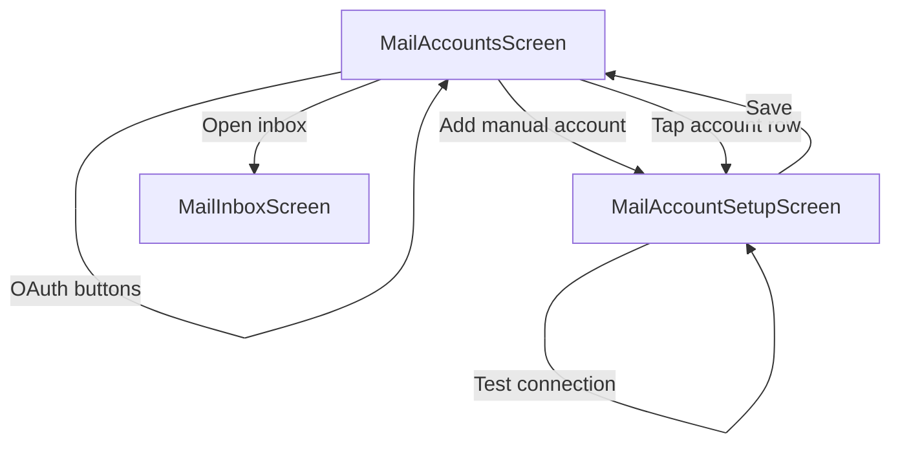

# Mobile manual mail account setup

## Problem

[`MailAccountsScreen.tsx`](mobile/src/screens/mail/MailAccountsScreen.tsx) only creates placeholder accounts (`user@example.com`, `imap.example.com`) via `addPasswordAccount`. There is no way to enter hosts, email, or separate IMAP/SMTP passwords. The status message references a settings panel that does not exist.

The underlying storage layer is already GUI-compatible ([`types.ts`](mobile/src/services/mail/types.ts), [`accountStore.ts`](mobile/src/services/mail/accountStore.ts)) including PBKDF2-encrypted `mail-account.secrets.json`, but mobile never loads secrets from disk after restart (`resolveSelectedAccount` throws *"Mail secrets locked; unlock with PIN first"* with no unlock UI).

## Target UX



**Mail Accounts list** ([`MailAccountsScreen.tsx`](mobile/src/screens/mail/MailAccountsScreen.tsx)):
- Remove the stub PIN field and **"Add password IMAP (manual hosts)"** button.
- Show existing accounts (highlight selected). Tap row → edit.
- OAuth buttons unchanged (Gmail / Outlook).
- **"Add manual account"** → new setup screen.
- When `mail-account.secrets.json` exists and secrets are not in memory: show **Unlock mail PIN** field + button (loads all account secrets into memory, same as GUI `unlockMailSecretsWithPin`).
- **"Open inbox"** uses the selected account (unchanged).

**Manual setup / edit screen** (new [`MailAccountSetupScreen.tsx`](mobile/src/screens/mail/MailAccountSetupScreen.tsx)):
- Fields aligned with GUI [`mail-manual-fields`](gui/index.html) + account label:

| Field | Default |
|-------|---------|
| Account label | "Mail account" |
| IMAP host / port / TLS | port 993, TLS on |
| SMTP host / port / TLS | port 465, TLS on |
| Username | — |
| IMAP password / SMTP password | separate secure fields |
| From email | — |
| From name | optional |
| Persist passwords on device | **on by default** (per your preference) |

- **Save** validates, upserts account, stores secrets in memory, and if `persistSecrets` is true prompts for **email PIN** (required on first save; reuse in-memory PIN on subsequent saves in same session).
- **Test IMAP + SMTP** runs in-process auth against entered credentials (no server round-trip).
- **Delete account** (edit mode only).
- OAuth-linked accounts opened from the list: read-only summary + delete only (no host/password editing).

## Backend logic (mobile services)

### 1. Validation helper — new [`mobile/src/services/mail/accountConfig.ts`](mobile/src/services/mail/accountConfig.ts)

Port the essentials of GUI [`normalizeMailConfig`](gui/local-backend/mail-account.ts) (without OAuth host override):

- `clampPort(value, fallback)` — 1–65535
- `normalizeManualMailConfig(base, payload)` — require `imapHost`, `smtpHost`, `username`, `fromEmail`; set `authType: 'password'`, `oauthProvider: ''`
- `validateManualSecrets(imapPassword, smtpPassword, isNew)` — require passwords on create; on edit allow empty to mean "keep existing"

### 2. Secrets lifecycle — extend [`accountStore.ts`](mobile/src/services/mail/accountStore.ts)

Add GUI-parity helpers (mirror [`mail-account.ts`](gui/local-backend/mail-account.ts)):

- `getMailSecretsStatus(identityName)` → `{ inMemory, locked }` (check `secretsMemory` + whether `mail-account.secrets.json` exists and is encrypted envelope)
- `unlockMailSecretsWithPin(identityName, pin)` → load via existing `loadEncryptedSecrets`, populate `secretsMemory` + `pinMemory`
- `saveMailAccountWithSecrets(identityName, { record, imapPassword?, smtpPassword?, pin? })` — merge into per-account secret map (preserve existing passwords when edit fields left blank), call `upsertMailAccount`, `setMailSecretsInMemory`, and if `persistSecrets` call `saveEncryptedSecrets` with full store (load-merge-save pattern from GUI [`POST /mail/account`](gui/local-backend/routes.ts))

### 3. Connection test — new [`mobile/src/services/mail/mailTest.ts`](mobile/src/services/mail/mailTest.ts)

- `testImapConnection(config, secrets)` — connect, LOGIN, SELECT INBOX, disconnect (reuse logic from [`imap.ts`](mobile/src/services/mail/imap.ts); consider extracting shared `imapAuthenticate` if needed)
- `testSmtpConnection(config, secrets)` — connect, EHLO, AUTH LOGIN, disconnect (reuse from [`smtp.ts`](mobile/src/services/mail/smtp.ts))
- `testMailConnection` runs both and returns first error

## Navigation

Update [`AppNavigator.tsx`](mobile/src/navigation/AppNavigator.tsx):

```ts
MailAccountSetup: { accountId?: string }; // undefined = new manual account
```

Register screen with title **"Mail account"** (or **"Add mail account"** / **"Edit mail account"** via `options` callback).

## UI implementation notes

- Reuse form patterns from [`SettingsScreen.tsx`](mobile/src/screens/SettingsScreen.tsx) (`ScrollView`, `TextInput`, `Switch`, section labels).
- Port inputs: numeric ports via `keyboardType="number-pad"` with `clampPort` on save.
- On save success: `navigation.goBack()` + activity log entry.
- Pre-fill edit mode from `readMailStore`; never pre-fill password fields (show placeholder "unchanged" when secrets exist in memory).
- Clean up duplicate placeholder accounts is manual (user can delete from edit screen); no migration script needed.

## Documentation

Update [`mobile/MAIL.md`](mobile/MAIL.md):
- Manual account setup flow and field descriptions
- Email PIN unlock behavior after app restart
- Note that credentials stay on-device (not sent to EBP server)

## Verification

- Manual on device/emulator:
  1. Mail Accounts → Add manual account → fill real or test IMAP/SMTP → Test → Save with PIN
  2. Open inbox (same session)
  3. Kill and relaunch app → unlock PIN on Mail Accounts → Open inbox
  4. Edit account (change from name), delete a stub `user@example.com` account
- Optional: small unit test for `normalizeManualMailConfig` / `clampPort` in `mobile/__tests__/accountConfig-test.ts` (pure functions, no RN mocks)

## Out of scope

- Provider presets (Fastmail, iCloud host autofill)
- OAuth account editing beyond delete
- GUI / server changes
- Removing duplicate stub accounts automatically
