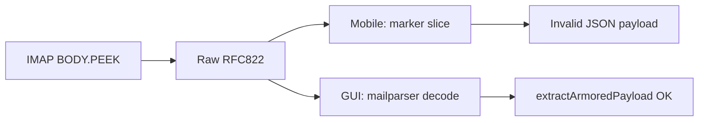

# Fix mobile mail decrypt Invalid JSON payload

## Root cause (confirmed)

[`extractEbpPayloadFromMime`](mobile/src/services/mail/mime.ts) scans raw IMAP RFC822 and can return a marker slice even when `extractArmoredPayload` fails. Decrypt then hits `parseEbpPayloadInput` → `Invalid JSON payload` **before** the identity password is used. Desktop works because [`simpleParser`](gui/local-backend/mail-worker.ts) decodes CTE first.

## Approach

Hand-rolled decode in mobile only (no new npm dependency). Scope: multipart walk + `quoted-printable` + `base64` + `7bit`/`8bit`/`binary` passthrough; then armor extract on decoded text. Skip optional paste/retry UX.

## Implementation

### 1. Expand MIME helpers in [`mobile/src/services/mail/mime.ts`](mobile/src/services/mail/mime.ts)

Add private helpers:

- `parseHeadersAndBody(part)` — split on first blank line; lowercase header map
- `getBoundary(contentType)` — from `multipart/*; boundary="…"`
- `decodeTransferEncoding(body, cte)` — QP (soft breaks `=\r\n`/`=\n`, `=XX` hex); base64 via `Buffer`; else return body as-is
- `collectDecodedTextParts(source)` — walk top-level and nested multiparts; for each `text/plain` / `text/html` leaf, decode CTE and collect strings

Rewrite:

- **`extractTextFromMimeSource`** — use collected decoded parts (plain preferred for `text`, html for `html`) so the message screen shows readable body, not QP garbage.
- **`extractEbpPayloadFromMime`** — for each decoded text candidate (plain first, then html), call `extractArmoredPayload`. On success, return a **clean** armor string via `armorPayload(parsed)` (import from `ebpCore`). If none succeed, return `null`. **Remove** the marker-only fallback (`BEGIN`/`END` slice without successful JSON parse).

### 2. Clearer decrypt error in [`mobile/src/services/mail/ebpMail.ts`](mobile/src/services/mail/ebpMail.ts)

When `detail.ebpPayload` is null but `rawSource` / body still contains `-----BEGIN EBP`, throw something like: `Could not parse EBP armor (message may need MIME decode)`. Keep existing `No EBP payload in message` when markers are absent.

`decryptMailBody` can keep using `parseEbpPayloadInput` on the now-clean armor string.

### 3. Tests — new [`mobile/__tests__/mimeDecode-test.ts`](mobile/__tests__/mimeDecode-test.ts)

Fixtures covering:

| Case | Expect |
|------|--------|
| Multipart mixed, 7bit armor (mobile compose shape from `buildMultipartMimeMessage`) | `extractEbpPayloadFromMime` returns parseable armor; `extractArmoredPayload` succeeds |
| `text/plain` + `Content-Transfer-Encoding: quoted-printable` with soft breaks inside JSON | Same — payload extracts after QP decode |
| `text/plain` + `base64` CTE wrapping armor | Same |
| BEGIN/END markers present but JSON corrupted (no valid CTE fix) | Returns `null` (no false “EBP detected”) |

Use a minimal valid payload object (`{ type: "ebp-encrypted-message", version: 1, … }`) armored with `armorPayload` from core (or inline armor string).

### 4. Wiki follow-up (after code)

Update [`wiki/analysis-mobile-mail-decrypt-invalid-json.md`](wiki/analysis-mobile-mail-decrypt-invalid-json.md) with a short “Resolution” note and append to [`wiki/log.md`](wiki/log.md).

## Out of scope

- Adding `mailparser` to mobile
- STARTTLS / IMAP hang fixes (separate analysis)
- Desktop/GUI changes
- Manual paste/retry UX on the message screen

## Verification

- `cd mobile && npm test -- mimeDecode-test`
- Manual: open a message that previously showed “EBP payload detected” then `Invalid JSON payload` on decrypt; after fix it should either decrypt or not claim EBP until parse succeeds.