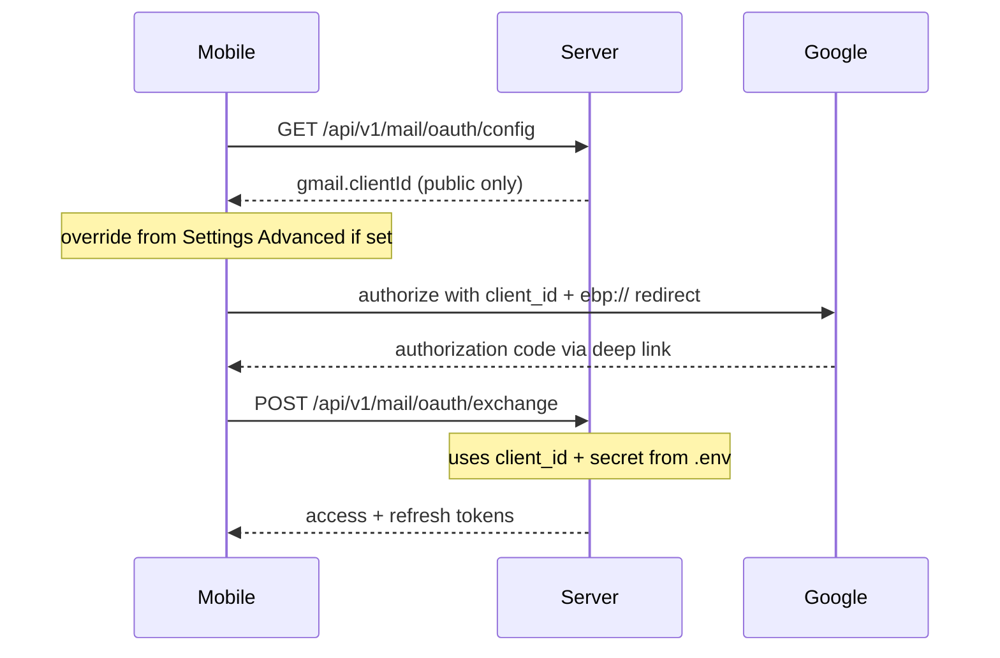

# Mobile OAuth via server config

## Architecture



The server already reads `MAIL_OAUTH_GMAIL_CLIENT_ID` / `MAIL_OAUTH_OUTLOOK_CLIENT_ID` in [`server/mail-oauth.ts`](server/mail-oauth.ts) for token exchange. This change exposes only those public IDs via GET; secrets stay server-side.

## 1. Server: public config endpoint

**File:** [`server/mail-oauth.ts`](server/mail-oauth.ts)

- Add `getOAuthPublicProviderConfig()` returning per-provider `{ clientId: string }` for `gmail` and `outlook` (read from existing `OAUTH_PROVIDER_SERVER_CONFIGS`, **never** include `clientSecret`).
- Add `handleOAuthConfig(): Response` returning JSON:

```json
{
  "providers": {
    "gmail": { "clientId": "…", "configured": true },
    "outlook": { "clientId": "", "configured": false }
  }
}
```

`configured` is `clientId.length > 0` (mirrors exchange guard without throwing).

**File:** [`server/main.ts`](server/main.ts)

- Register `GET /api/v1/mail/oauth/config` before the existing exchange/refresh routes.
- Export handler for tests if needed (follow existing `handleRequest` pattern).

**Rate limiting:** No change required — falls under existing `GET *` (200/min) in [`server/rate-limit.ts`](server/rate-limit.ts).

## 2. Server tests

**New file:** `server/tests/mail_oauth_config_test.ts`

- Set `MAIL_OAUTH_GMAIL_CLIENT_ID` / `MAIL_OAUTH_OUTLOOK_CLIENT_ID` via `Deno.env.set` in test setup.
- Assert response includes expected client IDs, `configured` flags, and response body does **not** contain `clientSecret` or `secret`.
- Optionally hit via `handleRequest` integration-style (same pattern as [`server/tests/main_handlers_test.ts`](server/tests/main_handlers_test.ts)).

## 3. Mobile: fetch config + resolution order

**File:** [`mobile/src/services/mail/oauth.ts`](mobile/src/services/mail/oauth.ts)

- Add `fetchMailOAuthConfig(serverUrl: string)` → `Record<'gmail'|'outlook', { clientId: string; configured: boolean }>`.
- Add `resolveOAuthClientId(provider, serverConfig, override?)` with priority:
  1. Advanced override (if non-empty)
  2. Server-fetched `clientId`
  3. Empty → throw clear error
- Keep existing `PROVIDERS` static fields (`authUrl`, `scopes`, IMAP/SMTP hosts) — only `clientId` comes from server.

**File:** [`mobile/src/services/settings.ts`](mobile/src/services/settings.ts)

- Add AsyncStorage keys + getters/setters for optional overrides:
  - `MAIL_OAUTH_GMAIL_CLIENT_ID_OVERRIDE`
  - `MAIL_OAUTH_OUTLOOK_CLIENT_ID_OVERRIDE`

## 4. Mobile UI changes

**File:** [`mobile/src/screens/mail/MailAccountsScreen.tsx`](mobile/src/screens/mail/MailAccountsScreen.tsx)

- Remove the inline OAuth client ID `TextInput`.
- On screen focus: fetch config from `getServerUrl()`; show status if fetch fails or provider not configured.
- `startOAuth`: load override from settings, resolve client ID, then call `startMailOAuth`.

**File:** [`mobile/src/screens/SettingsScreen.tsx`](mobile/src/screens/SettingsScreen.tsx)

- Add **Advanced** section (after Mail preferences) with:
  - Short note: “Normally loaded from the key server. Override only for development.”
  - Optional text fields for Gmail / Outlook OAuth client ID overrides
  - Persist via new settings helpers on blur or Save (reuse existing Save button pattern for server URL)

## 5. Documentation

**File:** [`mobile/MAIL.md`](mobile/MAIL.md)

- Document that OAuth client IDs are fetched from `GET /api/v1/mail/oauth/config` on the configured EBP server.
- Root `.env` on the server remains the canonical config (`MAIL_OAUTH_GMAIL_CLIENT_ID`, etc.).
- Advanced override in Settings is dev-only fallback.

## Out of scope

- Mobile `.env` / `react-native-config` build-time loader
- GUI local-backend changes (already uses `/mail/oauth/start` with env)
- Exposing IMAP/SMTP host config from server (stays in mobile `PROVIDERS`)

## Verification

- `deno task test:server` (new mail oauth config test)
- Manual: set server URL in mobile Settings → Mail Accounts → Link Gmail should work without pasting client ID, assuming server `.env` is configured and `ebp://mail/oauth/callback` is registered in Google Cloud Console
