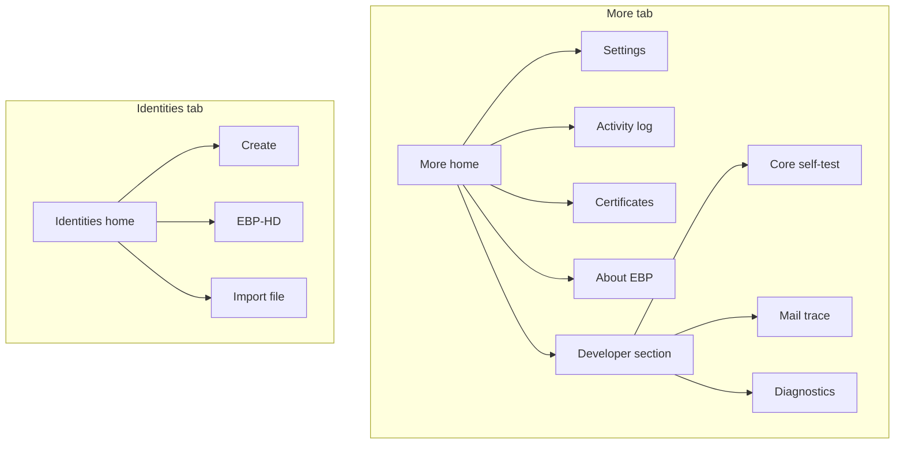

# Mobile More tab full IA rework

## Problem

[`MoreScreen.tsx`](mobile/src/screens/MoreScreen.tsx) advertises four destinations (Server URL, Password policy, Mail preferences, Activity log) that all navigate to the same catch-all [`SettingsScreen.tsx`](mobile/src/screens/SettingsScreen.tsx). That screen mixes preferences, identity import, OAuth overrides, crypto diagnostics, and the activity log. Import also appears on [`IdentityDetailScreen.tsx`](mobile/src/screens/IdentityDetailScreen.tsx), which is the wrong place for adding a *new* identity.

## Target information architecture

**More home** becomes one row per real screen (plus inline self-test):

| Section | Rows | Destination |
|---|---|---|
| Preferences | Settings | Slim settings (server, password policy, mail, OAuth overrides) |
| | Activity log | New `ActivityLog` screen |
| App | Certificates | Existing screen |
| | About EBP | Existing `ProjectInfo` |
| Developer | Core self-test | Confirm + run (unchanged) |
| | Mail trace | Existing screen |
| | Diagnostics | New screen: Argon2/PBKDF2 parity + identity directory path |

Drop the fake per-setting rows; show a useful Settings subtitle (e.g. current server URL) on the single Settings row only.

## Screen ownership changes

### Slim [`SettingsScreen.tsx`](mobile/src/screens/SettingsScreen.tsx)

Keep only:

- Key server URL + Save
- Enforce password policy switch
- Mail preferences (HTML render, include public keys)
- Advanced OAuth client ID overrides

Remove: Import identity, Diagnostics buttons, Activity log list/clear, identity directory path.

### New `ActivityLogScreen.tsx`

Move activity log list + Clear from Settings. Register as `ActivityLog` on the More stack.

### New `DiagnosticsScreen.tsx`

Move Argon2 parity, mail PBKDF2 parity, and `BASE_DIR` display from Settings. Register as `Diagnostics` on the More stack.

### Identities: own import

On [`IdentitiesHomeScreen.tsx`](mobile/src/screens/IdentitiesHomeScreen.tsx):

- Add an **Import** action beside Create / EBP-HD (and in the empty state)
- Reuse the document-picker + `importIdentity` flow currently in Settings (prefer `overwrite: false`, matching Identity Detail’s safer behavior; surface the existing “already exists” error)

Remove Import from:

- Settings
- Identity Detail (keep Export / Export public / Delete / Revoke there — those are about the selected identity)

Optional small helper (e.g. `pickAndImportIdentityFile()` in [`storage.ts`](mobile/src/services/storage.ts) or a tiny service) to avoid copying picker boilerplate — only if it stays thin; otherwise inline once on Identities Home.

## Navigation

Update [`MoreStackParamList`](mobile/src/navigation/AppNavigator.tsx) and `MoreNavigator`:

- Add `ActivityLog`, `Diagnostics`
- Keep `Settings`, `Certificates`, `ProjectInfo`, `MailTrace`

No tab bar changes.

## Out of scope

- Moving Certificates into the Identities stack (stays in More as hierarchy/trust tooling)
- Renaming the More tab
- GUI settings parity
- Deep-link / scroll-to-section within Settings

## Verification

- Manual: More rows each open a distinct screen; Settings no longer shows import/log/diagnostics
- Identities Home import succeeds; Import gone from Identity Detail and Settings
- Self-test and Mail trace still work from Developer section
