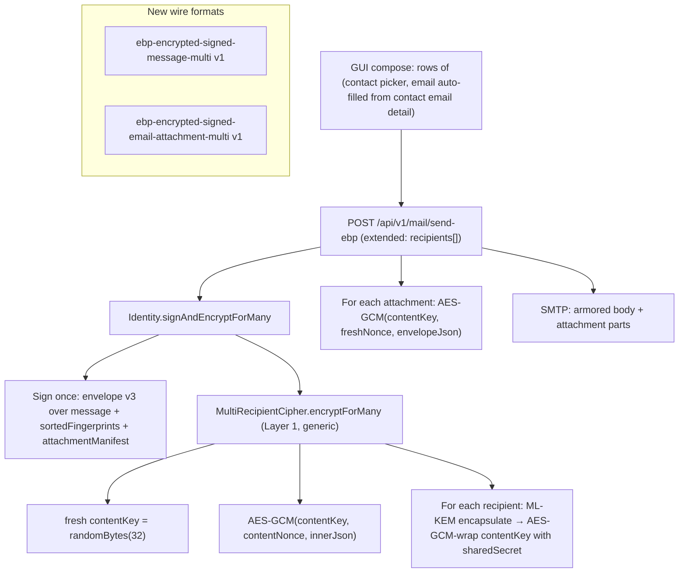

# Multi-Recipient EBP Email With Single AES Key

## Answers to Your Crypto Questions

- **Sign-then-encrypt or encrypt-then-sign?** Sign-then-encrypt. In [`core/Identity.ts`](core/Identity.ts) `signAndEncryptFor` (lines 168–176) the message is signed first, then `{ message, signature, envelopeVersion: 2, recipientFingerprint }` is JSON-stringified and handed to `Identity.EncryptFor` → `KyberEncryptionKey.EncryptFor` (ML-KEM encapsulate + AES-256-GCM encrypt).
- **Does the signature get encrypted?** Yes — it lives inside the AES-GCM ciphertext, so non-recipients on the wire (and even recipients before they decrypt) never see it.
- **Would sign-once work today?** Almost. The current envelope v2 signs over `buildRecipientBoundEnvelope(recipientFingerprint, message, salt)` — a single recipient's fingerprint is part of the signed bytes (this is the F-CRYPTO-02 protection against surreptitious forwarding). To sign once for many recipients we add a new **envelope v3** that signs over `(message, sortedRecipientFingerprints, attachmentManifest)`. Each recipient verifies (a) signature is valid over that canonical input, and (b) their own fingerprint is in the list. Surreptitious-forwarding protection is preserved at the *set* level.

## Layered Architecture



### Layer 1 — Generic multi-recipient KEM-DEM primitive (new file)

[`core/MultiRecipientCipher.ts`](core/MultiRecipientCipher.ts) — knows nothing about email. Reusable for any future "encrypt for many identities" use case (group file share, broadcast revocation hints, hierarchy distribution, etc.).

```ts
export type RecipientEncapsulation = {
  fingerprint: string;
  kemCiphertext: string;     // hex (1568B for ML-KEM-1024)
  keyWrapNonce: string;      // hex (12B)
  wrappedContentKey: string; // hex (32B key + 16B GCM tag = 48B)
};

export class MultiRecipientCipher {
  static encryptForMany(plaintext: Uint8Array, recipients: ExternalIdentity[]):
    { recipients: RecipientEncapsulation[]; contentNonce: string; ciphertext: string; contentKey: Uint8Array };

  static unwrapContentKey(entry: RecipientEncapsulation, myKey: KyberEncryptionKey): Uint8Array;

  static encryptWithContentKey(plaintext: Uint8Array, contentKey: Uint8Array):
    { contentNonce: string; ciphertext: string };

  static decryptWithContentKey(ciphertext: string, contentNonce: string, contentKey: Uint8Array): Uint8Array;
}
```

KEM-DEM construction per recipient: ML-KEM-1024 encapsulate against recipient's public encryption key → `(kemCt_i, sharedSecret_i)`. Use `sharedSecret_i` as a 256-bit AES-GCM **key-wrapping key** to encrypt the 32-byte `contentKey` with a fresh 12-byte `keyWrapNonce_i`. Each recipient stores `{ fingerprint, kemCiphertext, keyWrapNonce, wrappedContentKey }`. Plaintext is encrypted exactly once under `contentKey` with its own `contentNonce`.

### Layer 2 — Envelope v3 + Identity helpers ([`core/MessageHash.ts`](core/MessageHash.ts), [`core/Identity.ts`](core/Identity.ts))

Add `buildMultiRecipientBoundEnvelope(recipientFingerprints, message, attachmentManifest?, salt?)`:
- Sort fingerprints lexicographically.
- Sort manifest by `attachmentId`.
- Canonical JSON-stringify with a fixed tag header `EBP-MULTIRECIPIENT-V3` (legacy v1/v2 verifiers must fail-closed, same pattern as v2 today).

Add to `Identity`:
- `signAndEncryptForMany(message, recipients[], { attachmentManifest? }) → { bodyPayload, contentKey, sortedRecipientFingerprints }`. Signs **once**, builds inner JSON `{ message, signature, envelopeVersion: 3, recipientFingerprints, attachmentManifest? }`, calls Layer 1.
- `decryptAndVerifyMulti(payload, sender) → { message, contentKey, attachmentManifest, recipientFingerprints, verifyStatus }`. Finds my entry by my fingerprint in `payload.recipients`, unwraps content key, AES-decrypts ciphertext, parses inner JSON, **fails closed** if my fingerprint isn't in `recipientFingerprints`, verifies signature over the canonical envelope.

### Layer 3 — Wire formats ([`core/Payloads.ts`](core/Payloads.ts), [`core/EmailAttachmentPayload.ts`](core/EmailAttachmentPayload.ts), [`core/version.ts`](core/version.ts))

Add `FILE_FORMAT_VERSIONS.encryptedSignedMessageMulti: 1` and `encryptedSignedEmailAttachmentMulti: 1`.

Body payload shape:

```json
{
  "type": "ebp-encrypted-signed-message-multi",
  "version": 1,
  "senderFingerprint": "...",
  "recipients": [
    { "fingerprint": "...", "kemCiphertext": "...", "keyWrapNonce": "...", "wrappedContentKey": "..." }
  ],
  "contentNonce": "...",
  "ciphertext": "...",
  "senderIdentity": { /* optional */ }
}
```

Attachment payload shape (no per-recipient encapsulations — content key comes from the body):

```json
{
  "type": "ebp-encrypted-signed-email-attachment-multi",
  "version": 1,
  "senderFingerprint": "...",
  "attachmentId": "...",
  "contentNonce": "...",
  "ciphertext": "..."
}
```

The cleartext attachment envelope (after AES decrypt with the body's content key) keeps the existing fields (`fileName`, `mimeType`, `fileDataBase64`, `attachmentId`, `bodyPayloadHash`). Sender attribution comes from the **body's signature** binding the attachment manifest entry `{ attachmentId, ciphertextSha256 }`.

### Layer 4 — Backend ([`gui/local-backend/routes.ts`](gui/local-backend/routes.ts))

Extend `POST /api/v1/mail/send-ebp` (around lines 1048–1157):
- Accept new field `recipients: Array<{ contact: string; email: string }>`. Keep singular `recipient` for backward compatibility.
- Resolve every `contact` via `loadContact` (failing fast on any missing contact).
- If `recipients.length > 1`, take the multi path:
  1. Pre-compute attachment manifest by AES-GCM-encrypting each attachment's cleartext envelope with a not-yet-finalized content key — *or*, simpler: call `Identity.signAndEncryptForMany` first with **the manifest determined post-hoc** by treating the body and attachments together. To keep the order signature-first, the implementation will:
     - Generate `contentKey` and `contentNonce` for each artifact upfront via Layer 1's `encryptWithContentKey`.
     - Compute SHA-256 over each attachment's ciphertext to populate `attachmentManifest`.
     - Sign envelope v3 over `(message, sortedFingerprints, attachmentManifest)`.
     - Wrap `contentKey` per recipient.
- SMTP `to:` header = `recipients.map(r => r.email).join(', ')`. Existing `nodemailer.sendMail` flow stays the same.

Extend `/api/v1/mail/decrypt` and `/api/v1/mail/decrypt-attachment`:
- Detect `ebp-encrypted-signed-message-multi`; dispatch to multi decrypt path.
- `/decrypt` response includes `contentKey` (hex) when payload is multi, so the frontend can pass it back for lazy attachment decrypts. The content key is held only in frontend memory.

### Layer 5 — GUI compose UI ([`gui/index.html`](gui/index.html), [`gui/js/mail.js`](gui/js/mail.js), [`gui/js/contact-search.js`](gui/js/contact-search.js))

Replace the single `#mail-compose-recipient` (and `#mail-compose-to`) with a **rows widget** under `#mail-compose-form` (markup currently around lines 2858–2894 of `gui/index.html`).

- "Add recipient" button creates a row.
- Each row contains:
  - Contact picker (reuse contact-search; scoped per-row, single-select).
  - Auto-filled email field — populated on contact-select from `getDetailValue(contact.details, "email") || contact.localEmail || ""` (this code path already exists in [`gui/js/contact-search.js`](gui/js/contact-search.js) lines 70–128). Inline-editable to override.
  - Fingerprint chip beneath the row (`ebpdk1abc…xyz`) so the binding `email ⇄ identity` is visually obvious at all times.
  - Remove button.
- Submit handler in `gui/js/mail.js` builds `recipients: [{ contact, email }]` and POSTs to `/api/v1/mail/send-ebp`. The legacy `to` field is no longer authoritative in EBP mode — it's hidden when EBP mode is selected.
- Validation: at least one row with a resolved contact and non-empty email; soft warning if the typed email differs from the contact's published `email` detail.

### Layer 6 — GUI decrypt UI ([`gui/js/mail.js`](gui/js/mail.js))

- After `/decrypt` for a multi payload, cache the returned `contentKey` (hex) in memory keyed by message id (cleared on message-change). No persistence.
- Display the recipient list (`recipientFingerprints`) so each recipient sees who else got the email — resolved against local contacts where possible.
- When user clicks decrypt on an attachment, POST `/api/v1/mail/decrypt-attachment` with the cached `contentKey` plus the attachment payload. The backend AES-GCM-decrypts and verifies `attachmentId` + ciphertext SHA-256 against the body's signed manifest before returning the file bytes.
- Verification status: envelope v3 only emits `valid` or `invalid` (no `valid_unbound`).

### Layer 7 — Wiki updates ([`wiki/`](wiki/))

- [`wiki/message-payload-formats.md`](wiki/message-payload-formats.md): add `ebp-encrypted-signed-message-multi` v1 + `ebp-encrypted-signed-email-attachment-multi` v1 sections; describe envelope v3 inner JSON; add to the version-constants table.
- [`wiki/ml-kem.md`](wiki/ml-kem.md): brief note on the KEM-DEM key-wrap pattern used to seal a single content key for many recipients.
- [`wiki/overview.md`](wiki/overview.md): bump "Upcoming Features" entry once shipped.
- Append a `## [YYYY-MM-DD] feature | multi-recipient-email` entry to [`wiki/log.md`](wiki/log.md).

### Layer 8 — Tests

- `core/MultiRecipientCipher.test.ts`: round-trip with 1, 3, 10 recipients; tampered ciphertext fails; tampered wrapped key fails; recipient outside list cannot decrypt.
- `core/Identity.test.ts` additions: multi-recipient sign+encrypt+decrypt+verify happy path; surreptitious-forwarding to a non-listed recipient fails closed; tampered manifest invalidates the signature; tampered attachment ciphertext fails the manifest hash check.
- `core/Payloads.test.ts` additions: payload encode/decode roundtrip + armor.

## Non-Goals / Known Limitations (Flagged in UI)

- **Bcc with cryptographic privacy is not supported** in this iteration. All recipients see all other recipient fingerprints because they're inside the signed envelope (required for the single-signature design). UI labels all rows as mutually visible. A separate Bcc envelope per Bcc recipient would be a future extension.
- **Sender identity is the current identity** (`state.currentIdentity`); per-compose sender selection is out of scope.
- **CLI and Chrome extension stay single-recipient** for now. CLI: future `ebp encrypt --recipients alice,bob,carol`.
- **Subject is still in the SMTP header (cleartext)**, unchanged from today.