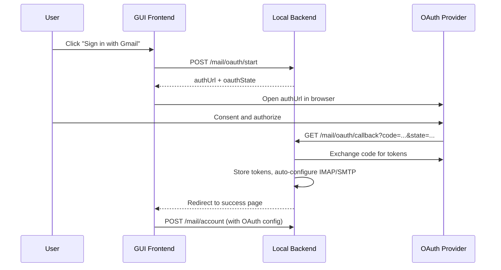

# OAuth Email Account Integration

## Architecture

When users add a new email account, they choose between OAuth (default) and manual IMAP/SMTP. For OAuth, the local backend drives the standard Authorization Code flow: it generates an auth URL, the user's browser opens the provider's consent screen, the provider redirects back to a local callback endpoint, and the backend exchanges the code for access and refresh tokens. These tokens are stored in the existing encrypted secrets store and used with XOAUTH2 for IMAP/SMTP connections.



## Key Files

- [`gui/local-backend/main.ts`](gui/local-backend/main.ts) -- Backend: data model changes, OAuth endpoints, token management, XOAUTH2 auth
- [`gui/index.html`](gui/index.html) -- Frontend: new account setup UI with auth method toggle and provider buttons
- [`gui/app.js`](gui/app.js) -- Frontend: OAuth flow orchestration, provider selection logic

## Data Model Changes (main.ts)

Extend `MailAccountConfig` with:

- `authType: "oauth" | "password"` (default `"password"` for backward compat)
- `oauthProvider: "gmail" | "outlook" | ""` (empty for manual)

Extend `MailAuthSecrets` (per-account) to support OAuth tokens:

- Keep existing `imapPassword` / `smtpPassword` for manual accounts
- Add `accessToken`, `refreshToken`, `tokenExpiry` (epoch ms) for OAuth accounts

Add hardcoded OAuth provider configs (client IDs, scopes, endpoints):

```
OAUTH_PROVIDERS = {
  gmail: {
    clientId: "...",
    clientSecret: "...",
    authUrl: "https://accounts.google.com/o/oauth2/v2/auth",
    tokenUrl: "https://oauth2.googleapis.com/token",
    scopes: ["https://mail.google.com/", "openid", "email"],
    imapHost: "imap.gmail.com", imapPort: 993,
    smtpHost: "smtp.gmail.com", smtpPort: 465,
  },
  outlook: {
    clientId: "...",
    clientSecret: "...",
    authUrl: "https://login.microsoftonline.com/common/oauth2/v2.0/authorize",
    tokenUrl: "https://login.microsoftonline.com/common/oauth2/v2.0/token",
    scopes: ["https://outlook.office.com/IMAP.AccessAsUser.All",
             "https://outlook.office.com/SMTP.Send",
             "offline_access", "openid", "email"],
    imapHost: "outlook.office365.com", imapPort: 993,
    smtpHost: "smtp.office365.com", smtpPort: 587,
  },
}
```

## Backend Endpoints (main.ts)

### `POST /api/v1/mail/oauth/start`

Accepts `{ provider: "gmail" | "outlook" }`. Generates a random `state` nonce, stores it in an in-memory map (state -> provider + timestamp), and returns `{ authUrl, oauthState }`. The redirect URI is `http://127.0.0.1:{PORT}/api/v1/mail/oauth/callback`.

### `GET /api/v1/mail/oauth/callback`

Handles the OAuth redirect. Validates `state`, exchanges `code` for tokens via the provider's token endpoint, extracts the user's email from the `id_token` or userinfo endpoint, stores the tokens in a temporary in-memory pending-oauth map, and returns an HTML page that tells the user the connection succeeded and they can close the tab.

### `POST /api/v1/mail/oauth/complete`

Called by the frontend after the callback succeeds. Creates or updates the mail account with OAuth config, moves pending tokens into the encrypted secrets store, and auto-populates IMAP/SMTP host/port from the provider preset.

### Token Refresh

Add a `refreshOAuthToken(identityDir, accountId)` helper that checks `tokenExpiry`, and if within 5 minutes of expiry, calls the provider's token endpoint with the refresh token to get a new access token. Call this in `resolveMailAccount` and `buildImapClient` before connecting.

## XOAUTH2 Auth in IMAP/SMTP (main.ts)

Modify `buildImapClient` to detect `authType === "oauth"` and use `{ user, accessToken }` auth instead of `{ user, pass }` -- ImapFlow natively supports this via `auth.accessToken`.

Modify the nodemailer transport in send and test endpoints to use `auth: { type: 'OAuth2', user, accessToken }` when the account is OAuth.

## Frontend UI (index.html + app.js)

Replace the current "Account Setup" section with a two-phase flow:

**Phase 1 -- Auth method selector** (shown when creating a new account):

- Two visually distinct cards/buttons: "Sign in with OAuth" (default, prominent) and "Manual IMAP/SMTP" (secondary)
- OAuth sub-view: shows Gmail and Outlook provider buttons; clicking one calls `/mail/oauth/start` and opens the auth URL in a new window
- Manual sub-view: reveals the existing IMAP/SMTP form fields

**Phase 2 -- Post-OAuth completion**:

- After the callback, the frontend polls or is notified that the OAuth flow completed
- Auto-fills the account name and email from the OAuth response
- User confirms and saves

When loading an existing OAuth account, the form shows a read-only provider badge and email, with a "Re-authenticate" button (to re-run the OAuth flow if tokens are revoked).

## Provider Registration

Ship pre-registered OAuth client credentials for Gmail and Outlook hardcoded in `main.ts`. This is standard practice for desktop/local applications (Thunderbird, Evolution, etc.). The credentials will be for a registered OAuth app with `http://127.0.0.1:8787/api/v1/mail/oauth/callback` as the redirect URI.

## Backward Compatibility

- Existing accounts with no `authType` field default to `"password"` -- no migration needed
- `normalizeMailConfig` is extended to handle the new fields with safe defaults
- The `resolveMailAccount` function branches on `authType` to use either password or OAuth token auth