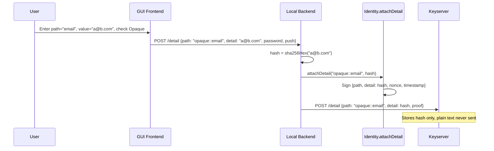

# Opaque Details

## Architecture

The existing detail flow is: user enters path + value -> `Identity.attachDetail(path, value)` signs and stores `[value, proof]` -> optionally pushes `{path, detail, proof}` to keyserver.

For opaque details, the local backend will hash the value before calling `attachDetail`, so the signed proof contains the hash. The keyserver receives only the hash -- no protocol or server changes are needed. On the viewer side, a new "Check" button lets users enter a candidate value, which is hashed and compared locally. Matched values are persisted in the contact's local JSON file.

## Changes by Layer

### 1. Core (`core/MessageHash.ts`) -- no changes

`sha256Hex` is already exported and available for hashing opaque values.

### 2. Core (`core/ExternalIdentity.ts`) -- add optional field

Add `resolvedOpaqueDetails?: Record<string, string>` to the `ExternalIdentity` type to store locally-resolved plain-text values for opaque details.

### 3. GUI Local Backend ([gui/local-backend/main.ts](gui/local-backend/main.ts))

- **`POST /api/v1/detail`**: When path starts with `"opaque::"`, hash the `detail` value via `sha256Hex()` before calling `attachDetail()`. The response and local storage only contain the hash.
- **New endpoint `POST /api/v1/contacts/resolve-opaque`**: Accept `{fingerprint, path, value}`. Hash `value`, compare against the contact's stored detail hash. If match, save `value` into the contact's `resolvedOpaqueDetails` map in the JSON file and return success. If no match, return an error.

### 4. GUI Frontend ([gui/app.js](gui/app.js))

- **Add detail form**: Add an "Opaque" checkbox (`#detail-opaque`). When checked, prepend `"opaque::"` to the path before submitting.
- **`renderIdentityDetails()`**: Detect `opaque::` prefix on detail paths. Show an "Opaque" badge and truncate the hash display for readability.
- **`showContactDetails()`**: For details with `opaque::` prefix:
  - Show the full path (with prefix), the hash value, and a small "Check" button.
  - If a resolved value exists (from `resolvedOpaqueDetails`), show the plain-text value with a verified indicator instead/alongside the hash.
  - Clicking "Check" shows an inline input field. On submit, call `POST /api/v1/contacts/resolve-opaque`. On success, re-render with the resolved value and indicator.

### 5. GUI HTML ([gui/index.html](gui/index.html))

- Add the `#detail-opaque` checkbox to the add-detail form (in the row alongside "Push to server").

### 6. CLI ([cli/main.ts](cli/main.ts))

- `cmdAttachDetail`: Add `--opaque` flag. When set, prepend `"opaque::"` to path and hash the value via `sha256Hex()` before calling `attachDetail()`.
- Update help text to document the `--opaque` flag.

### 7. Test handler ([gui/local-backend/tests/test_handler.ts](gui/local-backend/tests/test_handler.ts))

- Mirror the local backend changes: handle `opaque::` prefix in the detail endpoint and add the resolve-opaque endpoint.