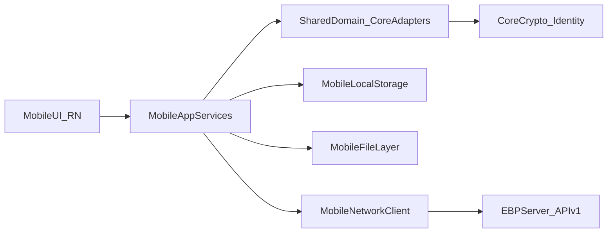

# React Native Parity Plan (iOS + Android)

## Goal

Build a **bare React Native** mobile app with full feature parity to the existing GUI, while adapting backend/API layers where desktop-local assumptions do not fit mobile.

## Current System Baseline

- GUI behavior and feature flow are concentrated in [`/home/william/projects/even-better-privacy/gui/app.js`](/home/william/projects/even-better-privacy/gui/app.js) and [`/home/william/projects/even-better-privacy/gui/index.html`](/home/william/projects/even-better-privacy/gui/index.html).
- Local orchestration + API routes are in [`/home/william/projects/even-better-privacy/gui/local-backend/main.ts`](/home/william/projects/even-better-privacy/gui/local-backend/main.ts).
- Core cryptography and identity primitives are in [`/home/william/projects/even-better-privacy/core/`](/home/william/projects/even-better-privacy/core/).
- Public server endpoints are in [`/home/william/projects/even-better-privacy/server/main.ts`](/home/william/projects/even-better-privacy/server/main.ts).

## Target Architecture

## Delivery Phases

### 1) Parity Inventory + Contracts

- Build a definitive parity matrix from GUI pages/forms to mobile screens/actions.
- Enumerate each GUI local-backend endpoint and classify as:
  - directly reusable on mobile,
  - needs API redesign,
  - must remain local-device only.
- Define mobile acceptance criteria per feature (behavior, errors, payload compatibility).

### 2) Shared Domain + API Boundary Refactor

- Extract reusable domain/service logic out of GUI-centric flow so web GUI and RN can share the same business behavior.
- Keep `core` cryptographic operations authoritative; add adapter layer rather than duplicating crypto logic.
- Introduce typed request/response contracts for identity, contacts, sign/verify, encrypt/decrypt, file payloads, detail sync, and revocation.

### 3) Mobile Foundation (Bare RN)

- Create `mobile/` app workspace with iOS/Android targets and CI-friendly build scripts.
- Establish app architecture (navigation, state, service layer, error handling, loading UX).
- Implement secure local persistence for identity metadata, server config, contacts index, and cached artifacts.

### 4) Backend/API Adaptation Work

- Adapt current GUI-local assumptions from [`/home/william/projects/even-better-privacy/gui/local-backend/main.ts`](/home/william/projects/even-better-privacy/gui/local-backend/main.ts) into mobile-compatible service boundaries.
- Add/adjust server capabilities in [`/home/william/projects/even-better-privacy/server/main.ts`](/home/william/projects/even-better-privacy/server/main.ts) where parity requires it (without weakening current verification/revocation guarantees).
- Preserve payload format compatibility so desktop GUI, CLI, and mobile can interoperate.

### 5) Feature Parity Implementation (by domain)

- **Identity Management:** generate/use identity, export public, publish, context display.
- **Contacts + Discovery:** import, fetch, browse/search server identities, sync/delete local contact.
- **Sign/Verify:** message sign/verify + file sign/verify parity.
- **Encrypt/Decrypt:** message encrypt/decrypt + file encrypt/decrypt parity.
- **Details + Email Verification:** add/push details, sync indicators, trigger email verification.
- **Revocation:** detail revocation, identity revocation, emergency certificate generation.

### 6) QA, Compatibility, and Hardening

- Add shared test fixtures proving payload compatibility across GUI/CLI/mobile.
- Create RN integration tests and E2E flows for critical user journeys.
- Run cross-platform regression matrix (Android/iOS + existing GUI + server).
- Performance and security pass (large-file flows, key handling, secure storage, offline/error behavior).

### 7) Release Plan

- Internal alpha with feature flags (if needed), then beta with telemetry/logging for failures.
- Documentation updates in [`/home/william/projects/even-better-privacy/ReadMe.md`](/home/william/projects/even-better-privacy/ReadMe.md): install/run, supported parity table, known limitations.

## Milestone Gates

- **Gate A:** parity inventory signed off.
- **Gate B:** shared service/contracts complete and used by GUI and mobile paths.
- **Gate C:** all feature domains implemented on mobile.
- **Gate D:** compatibility + E2E matrix green; release-ready docs complete.