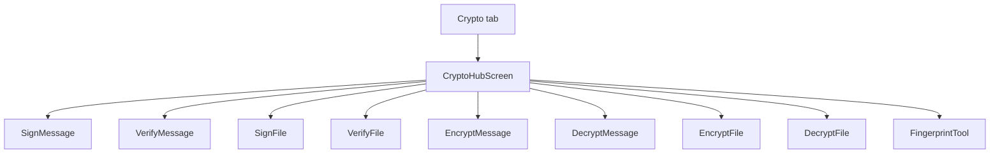

# Reorganize Crypto UI

## Problem

[`SignVerifyScreen`](mobile/src/screens/SignVerifyScreen.tsx) and [`EncryptDecryptScreen`](mobile/src/screens/EncryptDecryptScreen.tsx) each stack 4+ unrelated workflows on one scroll with only `SectionTitle` dividers. Hard to scan; easy to mix message vs file flows.

**Chosen IA: hub cards** (clearer separation than sub-tabs/accordion; aligns with the mockup’s “one job at a time” Crypto frames).

## Target structure

### Hub ([`CryptoHubScreen.tsx`](mobile/src/screens/CryptoHubScreen.tsx) — new)

- Current-identity chip (reuse `Chip` + `getCurrentIdentity`)
- Two groups with `SectionTitle`:
  - **Sign / Verify** — ListRows: Sign message, Verify message, Sign file, Verify file, Fingerprint from public JSON
  - **Encrypt / Decrypt** — ListRows: Encrypt message, Decrypt message, Encrypt file, Decrypt file
- Tapping a row `navigate`s to the matching stack screen
- Remove top Sign↔Encrypt `CryptoModeSwitch` from individual screens (hub replaces that mode switch)

### Focused screens

Split existing logic (handlers, busy overlay, `useSecretPrompt`, switches) into dedicated screens under `mobile/src/screens/crypto/`:

| Screen | Content |
|--------|---------|
| `SignMessageScreen` | message, detached/include switches, sign, output |
| `VerifyMessageScreen` | payload + optional detached message, verify |
| `SignFileScreen` | pick file, context, sign |
| `VerifyFileScreen` | pick file + payload, verify |
| `EncryptMessageScreen` | recipient, message, sign switch, encrypt |
| `DecryptMessageScreen` | payload, sender, decrypt |
| `EncryptFileScreen` | pick file, recipient, sign switch, encrypt |
| `DecryptFileScreen` | payload, sender, decrypt |
| `FingerprintToolScreen` | public JSON → fingerprint |

Each screen: `Screen` + header title via navigator options; password popup only when needed (unchanged rules); `BusyOverlay` / `StatusBanner` local to that op.

### Navigation

Update [`AppNavigator.tsx`](mobile/src/navigation/AppNavigator.tsx) `CryptoStackParamList`:

- Initial route: `CryptoHub`
- Register the 9 focused screens
- Delete (or stop registering) monolithic `SignVerify` / `EncryptDecrypt`
- Remove [`CryptoModeSwitch.tsx`](mobile/src/components/CryptoModeSwitch.tsx) if unused

Preserve all service calls; only UI structure changes.

## Out of scope

- Changing crypto algorithms / payload formats
- Caching identity password across screens
- Updating `ebp_mobile_design.html` (optional follow-up)
