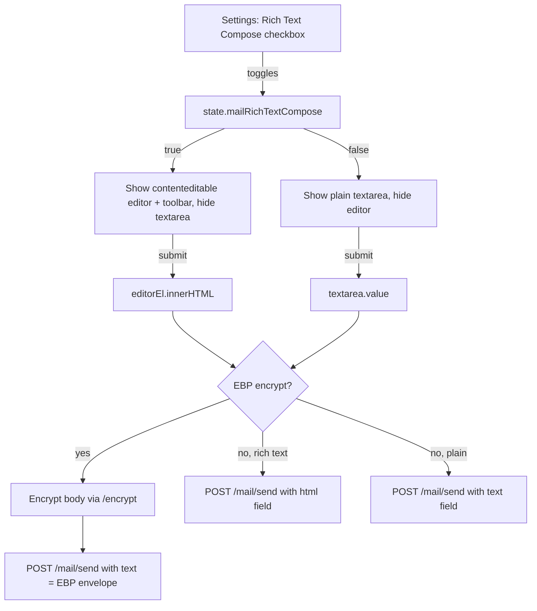

# Rich Text Compose Editor

## Architecture

The GUI is a vanilla JS app (`index.html` + `app.js`) with no build system. Instead of pulling in a library, we build a lightweight rich text editor using the browser's native `contenteditable` attribute and `document.execCommand` (widely supported, still works in all modern browsers). Zero external dependencies.

The backend already accepts an `html` field on `/api/v1/mail/send` (see [`gui/local-backend/main.ts` lines 1170-1208](gui/local-backend/main.ts)), so no backend changes are needed.



## Key Files

- [`gui/index.html`](gui/index.html) -- add editor markup, toolbar, settings checkbox, CSS
- [`gui/app.js`](gui/app.js) -- add preference wiring, toolbar logic, submit changes

## Changes

### 1. Settings checkbox (index.html)

In the Settings page (`#page-settings`), add a new subsection under the existing "Mail Reader" section (or as a sibling "Mail Compose" section):

```html
<section>
  <h3>Mail Compose</h3>
  <label class="inline">
    <input id="settings-mail-rich-compose" type="checkbox" />
    Use rich text editor when composing emails
  </label>
  <p class="small muted" style="margin-top: 8px;">When enabled, the compose body uses a formatting toolbar. The message is sent as HTML.</p>
</section>
```

### 2. Contenteditable editor in Compose section (index.html)

Wrap the existing textarea and a new rich editor in a container. The rich editor consists of a small toolbar and a `contenteditable` div, hidden by default:

```html
<div id="mail-compose-rich-wrap" style="display: none;">
  <div class="rich-toolbar" id="mail-compose-toolbar">
    <button type="button" data-cmd="bold" title="Bold"><b>B</b></button>
    <button type="button" data-cmd="italic" title="Italic"><i>I</i></button>
    <button type="button" data-cmd="underline" title="Underline"><u>U</u></button>
    <span class="rich-toolbar-sep"></span>
    <button type="button" data-cmd="insertOrderedList" title="Numbered list">OL</button>
    <button type="button" data-cmd="insertUnorderedList" title="Bullet list">UL</button>
    <span class="rich-toolbar-sep"></span>
    <button type="button" data-cmd="createLink" title="Insert link">Link</button>
    <button type="button" data-cmd="removeFormat" title="Clear formatting">Clear</button>
  </div>
  <div id="mail-compose-body-rich" contenteditable="true" class="rich-editor" placeholder="Write your email..."></div>
</div>
```

### 3. Dark-theme CSS for the editor (index.html)

Add styles for `.rich-toolbar`, `.rich-toolbar button`, `.rich-toolbar-sep`, and `.rich-editor` that match the existing dark theme (`--bg-input`, `--border`, `--text-primary`, etc.). The `.rich-editor` div should mirror the textarea's appearance (min-height, padding, font, border, focus ring).

### 4. State and preference wiring (app.js)

Mirror the existing `mailRenderHtml` / `MAIL_RENDER_HTML_PREF_KEY` pattern:

- Add `const MAIL_RICH_COMPOSE_PREF_KEY = "ebp.mail.richTextCompose";` (line ~4)
- Add `mailRichTextCompose: false` to `state` (line ~47)
- Load it in `loadUiPreferences()` (line ~70)
- In `initMailPage()`, wire the settings checkbox: on change, toggle `state.mailRichTextCompose`, persist with `saveBooleanPreference`, and call `applyComposeEditorMode()`

### 5. Toolbar actions and editor management (app.js)

- `applyComposeEditorMode()`: toggle visibility of the textarea vs the rich editor wrapper. On first show, attach click handlers to toolbar buttons that call `document.execCommand(cmd)` (with a `prompt()` for `createLink`).
- After send, clear both the textarea `.value` and the rich editor `.innerHTML`.

### 6. Update compose submit logic (app.js)

In the `composeForm` submit handler (~line 2296):

- If `state.mailRichTextCompose`, read `document.getElementById("mail-compose-body-rich").innerHTML` as the HTML body, and derive a plain-text fallback via `.innerText`.
- Otherwise, read from the textarea as today.
- **EBP-encrypt mode**: encrypt the HTML (or plain text if rich text is off) as the `message` field to `/encrypt`, then send the EBP envelope as `text`.
- **Plaintext mode + rich text enabled**: send `{ html: htmlBody, text: plainFallback }` to `/mail/send`.
- **Plaintext mode + rich text off**: send `{ text: body }` unchanged.