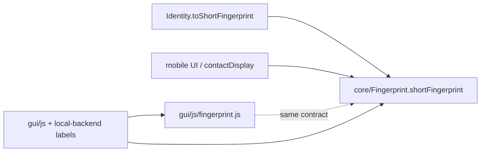

# Short fingerprint helper

## Definition (core)

There is no `Fingerprint` class — computation lives in [`core/Fingerprint.ts`](core/Fingerprint.ts), with [`Identity.toFingerprint()`](core/Identity.ts) as the class wrapper.

Add a pure display helper in [`core/Fingerprint.ts`](core/Fingerprint.ts) beside the existing fingerprint APIs:

```ts
/** First 12 + … + last 12; unchanged if shorter than 25 chars. */
export function shortFingerprint(fp: string): string {
  if (fp.length < 25) return fp;
  return `${fp.slice(0, 12)}…${fp.slice(-12)}`;
}
```

Use Unicode ellipsis `…` (U+2026), matching mobile’s existing [`condenseFingerprint`](mobile/src/services/contactDisplay.ts).

Also add on [`Identity`](core/Identity.ts) next to `toFingerprint()`:

```ts
toShortFingerprint(): string {
  return shortFingerprint(this.toFingerprint());
}
```

Cover with Deno tests in [`test/Fingerprint_test.ts`](test/Fingerprint_test.ts) (long bech32 → `12…12`; short string unchanged).

Re-export `shortFingerprint` from [`mobile/src/ebpCore.ts`](mobile/src/ebpCore.ts).

## Out of scope (defaults)

- **Email extension** — not desktop/mobile UI.
- **Contact storage/lookup prefixes** (`substring(0, 16)` used as filenames / load keys) — not display.
- **`formatOpaqueHash`** — opaque detail hashes, not fingerprints.
- **CSS `text-overflow: ellipsis`** on the GUI context bar — visual clip, not a programmatic short form.

## Desktop GUI call sites

Browser modules cannot import Deno `core/` TS. Add a thin mirror [`gui/js/fingerprint.js`](gui/js/fingerprint.js) that implements the same `shortFingerprint` contract (comment: mirrors `core/Fingerprint.shortFingerprint`), then import it from GUI modules.

Replace display truncations:

| Location | Current | Change |
|---|---|---|
| [`gui/js/contact-search.js`](gui/js/contact-search.js) (~117) | first 24 + `...` | `shortFingerprint` |
| [`gui/js/mail.js`](gui/js/mail.js) (~579) | first 24 + `...` | `shortFingerprint` |
| [`gui/js/hierarchy.js`](gui/js/hierarchy.js) (~58–59, ~337) | first 16 / first 16 + `…` | `shortFingerprint` |
| [`gui/js/render.js`](gui/js/render.js) (~663) | first 16 + `...` in import toast | `shortFingerprint` |
| [`gui/local-backend/routes.ts`](gui/local-backend/routes.ts) (~2498, ~2917) | hierarchy label fallback `16…` | import `shortFingerprint` from core |

## Mobile call sites

Point display truncation at core via `ebpCore` / direct core import:

| Location | Current | Change |
|---|---|---|
| [`mobile/src/services/contactDisplay.ts`](mobile/src/services/contactDisplay.ts) | local `condenseFingerprint` (already 12…12) | implement via `shortFingerprint`; keep `condenseFingerprint` as a thin alias so existing callers/`ContactLabels.condensedFingerprint` keep working, or rename call sites to `shortFingerprint` |
| [`mobile/src/screens/IdentitiesHomeScreen.tsx`](mobile/src/screens/IdentitiesHomeScreen.tsx) | local `truncateFp` (4…4) | `shortFingerprint` |
| [`mobile/src/components/HierarchyTreeView.tsx`](mobile/src/components/HierarchyTreeView.tsx) | local `shortFp` (16…) | `shortFingerprint` |
| [`mobile/src/screens/ContactsScreen.tsx`](mobile/src/screens/ContactsScreen.tsx) | import toast `16...` | `shortFingerprint` |
| [`mobile/src/services/storage.ts`](mobile/src/services/storage.ts) | self-test status `16...` | `shortFingerprint` |
| [`mobile/src/services/mail/ebpMail.ts`](mobile/src/services/mail/ebpMail.ts) | From-name fallback first 12 | `shortFingerprint` |

Update [`mobile/__tests__/contactDisplay-test.ts`](mobile/__tests__/contactDisplay-test.ts) to assert against the core helper.

Prefer migrating mobile call sites to the name `shortFingerprint`; leave a one-line `condenseFingerprint` re-export only if it reduces churn in `resolveContactLabels`.

## Flow



## Verification

- Run Deno fingerprint tests.
- Run mobile contactDisplay tests.
- Spot-check: contact search dropdown, hierarchy node labels, identity list subtitle, import toast — all show `first12…last12`.
