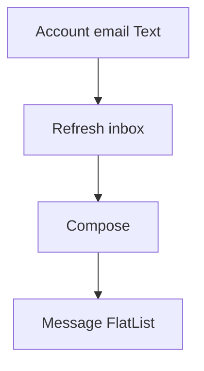

# Show current account email on inbox

## Change

Edit only [`mobile/src/screens/mail/MailInboxScreen.tsx`](mobile/src/screens/mail/MailInboxScreen.tsx).

## Approach

1. Add local state for the current address, e.g. `accountEmail`.
2. In the existing `load` callback (already calls `resolveSelectedAccount`), set that state from:
   - `resolved.account.config.fromEmail || resolved.account.config.username`
   - same fallback used when sending mail and listing accounts
3. On failure / no account, clear `accountEmail` (along with messages).
4. Render a `Text` above the two buttons:

```tsx
{accountEmail ? <Text style={styles.accountEmail}>{accountEmail}</Text> : null}
<Button title="Refresh inbox" onPress={load} />
<Button title="Compose" onPress={() => navigation.navigate('MailCompose')} />
```

5. Style lightly to match the screen (`meta`-like secondary text, small bottom margin so it sits clearly above the buttons).

## Why this is enough

- `useFocusEffect` already reloads on focus, so switching accounts elsewhere will refresh the displayed address when returning to the inbox.
- No new services, navigation, or shared context needed.

## Layout result


