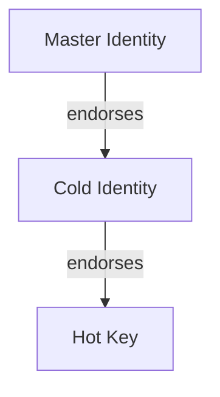

# EBP: Even Better Privacy


PGP supports no quantum secure standards and implementing those standards is going to be awkward. 

EBP is a self declared successor to PGP. 

This is the EBP reference implementation.

Project page: [williamdoyle.ca/ebp](https://williamdoyle.ca/ebp)

## Installation

### For Linux

- Navigate to [the releases page](https://github.com/willpiam/even-better-privacy/releases)
- Locate the latest release and click the "Assets" dropdown
- Select the `.AppImage` file and download it
- Once downloaded, make sure it has permission to run as a program
- Double-click the downloaded file to launch the EBP program

### For Mac

- Navigate to [the releases page](https://github.com/willpiam/even-better-privacy/releases)
- Locate the latest release and click the "Assets" dropdown
- Select the `.dmg` file and download it
- TODO: Finish this section.

### For Windows

Pending...

### From Source (Linux, Windows, & Mac)

If you are comfortable with the CLI and or would like to contribute to this codebase you will likely want to run ebp from source. 

1. Install [Deno](https://deno.land/)
2. Clone this repository
3. Run tests to verify everything works: `deno task test:core`

#### Quick Start (GUI + Public Server)

1. Run `deno task gui`
2. navigate to [http://localhost:8787](http://localhost:8787) (or wherever the terminal points you to) in your browser
3. click on settings
4. Set *server url* to https://ebp-cqyo.onrender.com

### Desktop AppImage (Linux - In development)

This is the easiest way for non-technical users to install and update EBP on Linux.

Run a prebuilt AppImage:

1. Download the latest `EBP.AppImage`
2. Make it executable: `chmod +x EBP.AppImage`
3. Run it: `./EBP.AppImage`

Update is just replacing the AppImage file with a newer one and running it again. All user data stays in `~/.ebp`.

Build AppImage locally:

1. Install dependencies: `sudo apt install libwebkit2gtk-4.0-dev libssl-dev build-essential`
2. Install Node.js (for Tauri): https://nodejs.org/
3. Install Rust: https://www.rust-lang.org/tools/install
4. From the project root, run:
   - `chmod +x build_desktop.sh`
   - `./build_desktop.sh`
5. The generated single-file AppImage will be:
   - `./EBP.AppImage`
6. Run it:
   - `./EBP.AppImage`
   - If your system does not support FUSE, use:
     - `APPIMAGE_EXTRACT_AND_RUN=1 ./EBP.AppImage`

## Environment Configuration

Create a `.env` file in the project root (the same folder as this `ReadMe.md`). Example:

```
DB_TYPE=psql # options include sqlite | psql

# postgres database connection details
PG_HOST=localhost
PG_PORT=5432
PG_USER=postgres
PG_PASSWORD=postgres
PG_DATABASE=ebp
PG_POOL_SIZE=5

SMTP_HOST=smtp.example.com
SMTP_PORT=465
SMTP_USER=<sender email address>
SMTP_PASS="sender email password here"
SMTP_FROM=<sender email address>
SMTP_SECURE=true

PUBLIC_BASE_URL=<base url of ebp key server>
```

## Supported Crypto-Systems

### Signing

#### Hash Based

- SLH-DSA (SPHINCS+)

#### Lattice Based

- ML-DSA (Dilithium)
- FN-DSA (Falcon) (Planned)

### Encrypting

- ML-KEM (Kyber)

| Name                      | Varient Used      | Public Key Size   | Purpose  |
| --------------------------|-------------------|-------------------|----------|
| ML-KEM (Kyber)            | ML-KEM-1024       | 1,568 bytes       | KEM      |
| SLH-DSA (SPHINCS+)        | SLH-DSA SHA2-256s | 64 bytes          | Auth     |
| ML-DSA (Dilithium)        | ml_dsa87          | 2,592 bytes       | Auth     |
| FN-DSA (Falcon) (Planned) | NA                | NA                | Auth     |

## Scheme

Unlike RSA or ECC, the new post quantum schemes support either encryption or message signing but not both in the same scheme. Therefore we insist signing and encryption (or rather KEM) keys never appear in isolation but always come in pairs; a signing key and an encryption key. The resulting object is called an Identity. The fingerprint of an identity is the hash of the two keys. 

### A Note On KEMs

At the moment we treat KEMs like regular asymmetric encryption. When we send an encrypted message to an identity we always generate a fresh AES key and use it to encrypt the message, then we encapsulate the AES key with the recipients KEM key, then we send the encapsulated key along with the ciphertext to the recipient. Responses are encrypted with a new AES key, not the one initially provided by the first sender. 

I am open to changing this in the future. This approach has been easiest for me, and I don’t see changing it as a priority. It’s straightforward and versatile, but I do acknowledge it is less efficient than it could be.”

## How It Works

1. Generate an identity (creates a signing key + encryption key pair)
2. Share your public identity with others (fingerprint + public keys)
3. Import contacts' public identities
4. Sign messages — recipients verify using your public signing key
5. Encrypt messages — recipients decrypt using their private encryption key 

## Revocation System

EBP supports revocation of both details and entire identities. All revocations require a valid signature from the identity being revoked, ensuring that only the key holder can revoke their own data.

### Revocation Types

#### Detail Revocation
Remove a specific detail (like an email or name) from an identity. Use this when:
- Information has changed (new email address)
- Information was entered incorrectly
- You no longer want that information associated with your identity

```bash
# Revoke a detail locally
ebp revoke-detail email --reason "Changed email address"

# Revoke and push to server
ebp revoke-detail email --reason "Changed email address" --push
```

#### Identity Revocation
Mark an entire identity as compromised or invalid. **This is irreversible.** Use this when:
- Your private key has been compromised
- You're migrating to a new identity
- The identity should no longer be trusted

```bash
# Revoke identity (requires --force confirmation)
ebp revoke --reason "Key compromised" --force

# Revoke and push to server
ebp revoke --reason "Key compromised" --force --push
```

### Emergency Revocation Certificates

You can pre-generate an emergency revocation certificate when creating an identity. This certificate can be stored securely (e.g., printed and kept in a safe) and used later if your private key is compromised—even if you lose access to the key itself.

```bash
# Generate identity with emergency certificate
ebp generate --revocation-cert --revocation-output emergency-revoke.json

# Generate emergency certificate for existing identity
ebp generate-revocation-cert --output emergency-revoke.json
```

**Important**: Store emergency certificates securely. Anyone with this certificate can revoke your identity.

### How Revocations Work

1. **Signed Certificates**: Each revocation creates a signed certificate containing:
   - Type (detail or identity)
   - Identity fingerprint
   - Monotonically increasing nonce (prevents replay attacks)
   - Timestamp
   - Optional reason
   - Target path (for detail revocations)
   - Cryptographic signature

2. **Verification**: Anyone can verify a revocation certificate using the identity's public signing key. The server validates signatures before accepting revocations.

3. **Nonce Protection**: Revocation nonces must be strictly increasing, preventing attackers from replaying old revocation certificates. Emergency certificates use nonce 0 and can be used once.

4. **Server Integration**: When pushed to a server, revocations are stored and returned with identity queries. Clients should check revocation status when importing contacts.

### Checking Revocation Status

When fetching an identity from the server, the response includes:
- `revoked`: Boolean indicating if the identity is revoked
- `revocationCertificate`: The hex-encoded certificate if revoked
- `revokedDetails`: Array of detail paths that have been revoked

Applications should warn users when interacting with revoked identities or details.


## Tests

Run each of these to ensure everything is working

Core tests

    deno task test:core

CLI Tests

    deno task test:cli-utils

*More CLI tests could be useful*

Server tests

    deno task test:server

GUI backend tests

    deno task test:gui-backend

E2E GUI tests (Playwright)

    npm install
    npx playwright install --with-deps

In your `.env` file set 

```
    DB_TYPE=sqlite 
```

Then run the tests (this will auto-start the GUI local backend):

    deno task test:e2e

To run end to end tests using postgres for the database 

```
    DB_TYPE=psql
```

then run 

    deno task test:e2e:psql


## CLI

**Note:** Where this section talks about a program called `ebp`, you will instead use `deno task cli`

The `ebp` CLI manages post-quantum identities and secure messaging. You can generate multiple identities (stored under `~/.ebp/<name>.identity.json`), switch between them, inspect fingerprints and details, and exchange signed/encrypted messages with contacts.

- create and switch identities (`ebp generate [name]`, `ebp identities`, `ebp use <name>`)
- view identity info and attached details (`ebp info`, `ebp details`)
- export public identities for sharing (`ebp export-public`)
- import contacts and list them (`ebp import`, `ebp contacts`)
- sign messages (`ebp sign`) and verify (`ebp verify`)
- encrypt and decrypt for peers (`ebp encrypt`, `ebp decrypt`)
- publish identities to the server and fetch contacts (`ebp server <url>`, `ebp publish`, `ebp fetch <fingerprint>`)
- push attached details to the server when adding them (`ebp detail <path> <value> --push`)

## GUI 

- All the features of the CLI but in a graphical format
- Interfaces with the same file system — the GUI and CLI are two interfaces to the same data

### How to Run the GUI

1. Run the local backend: `deno task gui:local-backend`
2. Navigate to [localhost:8787](http://localhost:8787/) 

## Email

EBP includes a Chrome extension that adds sign/encrypt and decrypt/verify
controls to webmail using the local GUI backend API.

Supported email clients (web):
- Gmail
- Outlook (Outlook on the web)
- Proton Mail

See the extension guide in [`email/chrome-extension/README.md`](email/chrome-extension/README.md).

## Support Development

If you find EBP useful, consider supporting the project:

| Network | Address/Handle | Link |
| --- | --- | --- |
| Ethereum (& more) | `williamdoyle.eth` | https://app.ens.domains/williamdoyle.eth |
| Bitcoin | `bc1q6crw4wy7jecs05f4ytz68n6evuzlu7k3cnu7zy` | https://blockchair.com/bitcoin/address/bc1q6crw4wy7jecs05f4ytz68n6evuzlu7k3cnu7zy |
| Cardano | `$wildoy` | https://handle.me/wildoy |
| QRL | `Q02070028dc6ca5f722f9646171cee25eff5d178907d0e05a7c343eeba77ef138fcc0da9a0074db` | https://explorer.theqrl.org/a/Q02070028dc6ca5f722f9646171cee25eff5d178907d0e05a7c343eeba77ef138fcc0da9a0074db |

## Roadmap

~~See [ROADMAP.md](ROADMAP.md) for future plans and development notes.~~

## Privacy

See [PRIVACY.md](PRIVACY.md) for the project privacy policy.

## License

MIT — see [LICENSE](LICENSE) for details.

## Upcomming Features

- ENS Support
    - Add support for EBP fingerprints to ENS. This means contributing a small bit of code to the ENS project. I've already tried to do this with QRL but my pull request was never merged. https://github.com/ensdomains/address-encoder/pull/386 . This step is not required to make the system work well with ENS but it will make it a bit nicer for the user. Infact this could be a last step. 
    - Add support for searching ENS names for EBP fingerprints. Then look up the fingerprint on the EBP server
    - Add a provision so that a user can add an ENS name to their EBP identity as a detail but the server must check that the users fingerprint has already been added to the ENS name
- Better db interface layer
    - abstract on EBP actions instead of the db connection
    - this will allow us to have different SQL for the sqlite and psql implementations. It would also allow use to easily implement non-sql connections. 
- Sign files
    - CLI and GUI
- end to end tests for the email plugin
- bech32 fingerprints
    - indicate the type of keys used 
    - 6e1fccc7b59096e28c269e7c8931ad818220225ff1139b2141a764be1f968acf
    - prefixes indicate signing key type, then kem key type (for now always MK_KEM)
        - dk1 -> dilithium+kyber
        - sk1 -> Sphincs+kyber
        - fk1 -> Falcon+kyber
- fingerprint should be the merkle root of the two keys
    - this will allow a signing key to prove it belongs to an identiy without also provinging the KEM key
    - this is useful because these public keys are big and in some cases we can imagine a user not needing both
    - for example if a smart contract could verify ML-DSA (Dilithium) you might use an EBP identity to control an ethereum wallet. But you wouldn't nessisairly need the ML-KEM (Kyber) key and providing it would needlessly increase your gas fees, only to allow you to compute your EBP fingerprint once?
- web interface to verify signatures:
    - upload a signature file and a public key file (and type in a message if not provided in signature file) and see if the signature is valid and if it is we should check the backend server (https://ebp-cqyo.onrender.com) to see if the identity has been published, if it does we should show the signers details
    - same with a pasted signature, public key, and message
    - signature objects may or may not include a message or a public key 
- email: enable ebp interface when a user directly replies to an email
- email: select multiple recipients. Encrypt with same AES key. Send json object with one encrypted message and an object mapping the recipients fingerprint to a copy of the AES key encapsulated just for that recipient. 

```json
{
    "encapsulated_key_map": {
        "<recipient fingerprint>": "<ciphertext>"
    }, 
    "ciphertext":"<AES ciphertext of M + Sm, where M is a message and Sm is a signature on that message>"
}
```
- Support expiry dates for identities
- Endorse other EBP identities as your own (two-way binding)
- plugin: Make it harder to accidentally send email without first encrypting
- plugin: hide password inputs
- hashed details
    - hashed email endorsement
        - take hash of your email address
        - sign hash
        - send hash & email address & signature to public key server
        - server sends email for you to confirm your email
        - server never makes unhashed email public. Perhaps even deletes raw email address after the user has confirmed it. 
        - users who receive signed emails from you can still confrim that the email address is associated with the provided EBP identity. 
        - reduce your exposure to spam
- Support identity hierarchy
    - parent can revoke the relationship
    - one pattern might look like this:


- when adding a detail to an identity I want to take the input to a details path as a drop down with the first option being "custom" so users can provide thair own details path
